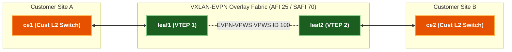

# 🧪 Lab 03 · EVPN-VPWS (E-LINE) & EVPN-ELAN Services

> ✅ **Validated** on Arista cEOS 4.32.0F. All outputs captured live from fabric in OrbStack.

**Time:** ~45 minutes · **Nodes:** 4 (2 Leaf VTEPs, 2 Spines)

---

## EVPN L2VPN Overlay Architecture



---

## Step 1 · EVPN-VPWS (Point-to-Point Pseudowire) Configuration

Configure EVPN-VPWS (RFC 8214) on `leaf1` and `leaf2` using **BGP EVPN Route Type 1 (Ethernet Auto-Discovery for VPWS)**.

```eos
! Applied on leaf1
patch panel
   patch CUST-A-VPWS
      connector 1 interface Ethernet3
      connector 2 pseudowire bgp vpws CUST-A pseudowire PW100
!
router bgp 65000
   vpws CUST-A
      rd 10.255.0.11:100
      route-target import 65000:100
      route-target export 65000:100
      pseudowire PW100
         evpn vpws id local 101 remote 102
```

---

## Step 2 · EVPN-ELAN (Point-to-Multipoint LAN Service)

Configure EVPN-ELAN using **Route Type 2 (MAC/IP)** and **Route Type 3 (Inclusive Multicast Ethernet Tag - IMET)** for headend replication of BUM traffic.

```eos
! Applied on leaf1
vlan 20
   name CUST-B-ELAN
!
interface Vxlan1
   vxlan vlan 20 vni 20200
!
router bgp 65000
   vlan 20
      rd 10.255.0.11:20200
      route-target both 20200:20200
      redistribute learned
```

---

## Clean up

```bash
sudo containerlab destroy -t topology.clab.yml
```
