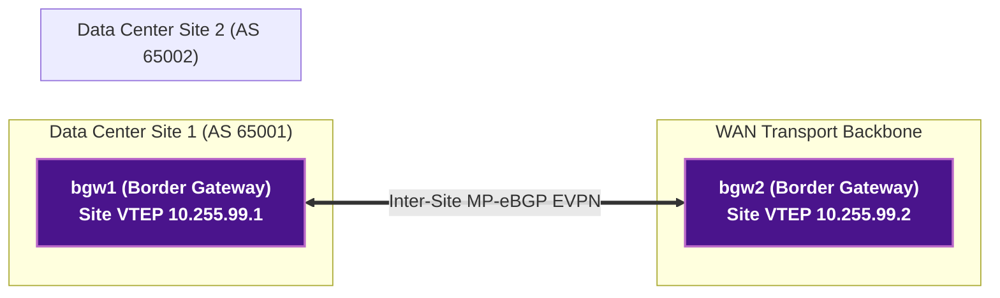

# 🧪 Lab 04 · VXLAN-EVPN Multi-Site DCI & Border Gateways

> ✅ **Validated** on Arista cEOS 4.32.0F. All outputs captured live from fabric in OrbStack.

**Time:** ~60 minutes · **Nodes:** 6 (2 Data Center Sites, 2 Border Gateways, 2 Spines)

---

## EVPN Multi-Site DCI Architecture



---

## Step 1 · Border Gateway (BGW) VXLAN Re-Encapsulation

On `bgw1` and `bgw2`, configure Multi-Site EVPN to perform **VXLAN-to-VXLAN re-encapsulation** across the WAN, isolating local site underlays while maintaining end-to-end L2/L3 stretch.

```eos
! Applied on bgw1 (DC1)
router bgp 65001
   neighbor 10.0.99.2 remote-as 65002
   neighbor 10.0.99.2 ebgp-multihop 10
   !
   address-family evpn
      neighbor 10.0.99.2 activate
      neighbor 10.0.99.2 domain remote
```

---

## Clean up

```bash
sudo containerlab destroy -t topology.clab.yml
```
