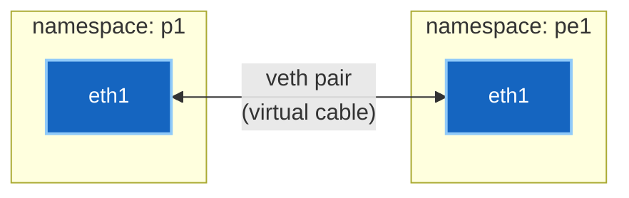

# 1 · Namespaces and veth pairs

How does one laptop run a twelve-router fabric with real, separate routing tables?
Two Linux features do almost all the work.

---

## The mental model

A **network namespace** is a private copy of the entire network stack: its own
interfaces, its own routing table, its own ARP cache, its own firewall rules.

Think of it as a sealed room. Inside, a process sees a complete computer's worth of
networking — and cannot see anything outside. Two namespaces can both have an
interface called `eth1`, both use `10.1.1.1`, and never collide, because neither
knows the other exists.

That's the trick. Twelve "routers" are twelve sealed rooms on one kernel.

A **veth pair** is the cable between rooms. It's created as two linked interfaces:
whatever goes in one end comes out the other. Put one end in each namespace and
you've cabled two routers together.



**That is what containerlab does.** It reads your `topology.clab.yml`, starts a
container per node (each with its own namespace), creates a veth pair per link, and
drops one end into each. Nothing more exotic than that.

---

## Seeing it on a running fabric

Every command below was run against the live `ceos-mpls-scratch` topology.

### Find the namespace

A container's namespace belongs to its main process, so start with the PID:

```bash
docker inspect -f '{{.State.Pid}}' clab-ceos-mpls-scratch-p1
```

```
30498
```

`nsenter` runs a command inside that process's namespace. `-n` means "the network
namespace specifically":

```bash
sudo nsenter -t 30498 -n ip -br addr show
```

```
lo               UNKNOWN        127.0.0.1/24 ::1/128
eth0@if41        UP             172.20.20.3/24 fe80::d4be:b1ff:fecc:3abe/64
cpu              UNKNOWN
fabric           UNKNOWN
arpsnoop         UNKNOWN
mirror0          UNKNOWN
```

`eth0` is containerlab's management network. The `cpu`, `fabric` and `arpsnoop`
interfaces are cEOS's own internal plumbing — the container is emulating switch
hardware, and those are part of the act.

### The data-plane links

```bash
sudo nsenter -t 30498 -n ip -br link show | grep -E '^eth[12]'
```

```
eth2@if40        UP             aa:c1:ab:05:1c:ec <BROADCAST,MULTICAST,UP,LOWER_UP>
eth1@if42        UP             aa:c1:ab:ef:12:a4 <BROADCAST,MULTICAST,UP,LOWER_UP>
```

Note the `@ifN` suffix — that's **the peer's interface index**. `eth1@if42` means
"my other end is interface number 42." Follow that number and you find the far end
of the cable.

### Proof the cable lands in the neighbour

```bash
sudo nsenter -t 30498 -n ip -d link show eth1
```

```
43: eth1@if42: <BROADCAST,MULTICAST,UP,LOWER_UP> mtu 1500 ...
    link/ether aa:c1:ab:ef:12:a4 brd ff:ff:ff:ff:ff:ff
    link-netns clab-ceos-mpls-scratch-pe1 promiscuity 0
    veth addrgenmode eui64 ...
```

Three things worth reading carefully:

- **`43: eth1@if42`** — this interface is index 43; its peer is index 42.
- **`link-netns clab-ceos-mpls-scratch-pe1`** — the peer lives in **pe1's
  namespace**. There is the cable, stated explicitly by the kernel.
- **`veth`** — the device type. Not emulated hardware; a kernel construct.

So `p1:eth1 ↔ pe1:eth1` in your topology file is, underneath, one veth pair with an
end in each namespace. The line in the YAML and the kernel object are the same
thing described twice.

!!! tip "This is the fastest way to verify cabling"
    When a lab has no adjacency and you suspect miswiring, `ip -d link show <intf>`
    and read `link-netns`. It tells you what the interface is *actually* connected
    to, not what the topology file claims. They occasionally differ.

---

## The routing table underneath

Here's the part that reframes everything. Look at p1's Linux routing table:

```bash
sudo nsenter -t 30498 -n ip route
```

```
blackhole 0.0.0.0/8 proto gated scope nowhere
default via 172.20.20.1 dev eth0 proto gated
2.2.2.2 via 10.1.1.2 dev eth1 proto gated metric 20
3.3.3.3 via 10.1.2.2 dev eth2 proto gated metric 20
10.1.1.0/24 dev eth1 proto kernel scope link src 10.1.1.1
10.1.2.0/24 dev eth2 proto kernel scope link src 10.1.2.1
```

Those `2.2.2.2` and `3.3.3.3` entries are **the OSPF routes from the lab** — the
same ones `show ip route` displays. Here they are as ordinary Linux kernel routes.

`proto gated` marks who installed them: the routing daemon, not the kernel. Compare
the connected routes marked `proto kernel`, which the kernel added itself when the
interfaces got addresses.

!!! note "What a NOS actually is"
    A network operating system is a **routing daemon that programs the kernel's
    forwarding table**. OSPF and BGP run in user space, compute best paths, and
    install the winners into the FIB — which is what actually forwards packets.

    `show ip route` is a formatted view of that table plus the daemon's own
    knowledge. Understanding this makes the whole stack less magical, and it's why
    Linux-based NOSes like SONiC and cRPD aren't a strange idea — they're the same
    architecture with the marketing removed.

---

## Doing it by hand

Two namespaces joined by a cable, from nothing — the whole idea in six commands:

```bash
sudo ip netns add r1
sudo ip netns add r2
sudo ip link add veth-r1 type veth peer name veth-r2
sudo ip link set veth-r1 netns r1
sudo ip link set veth-r2 netns r2
sudo ip netns exec r1 ip addr add 10.0.0.1/30 dev veth-r1
sudo ip netns exec r1 ip link set veth-r1 up
sudo ip netns exec r2 ip addr add 10.0.0.2/30 dev veth-r2
sudo ip netns exec r2 ip link set veth-r2 up
sudo ip netns exec r1 ping -c2 10.0.0.2
```

Clean up with `sudo ip netns del r1 r2` — deleting a namespace destroys everything
inside it, including the veth ends.

That is containerlab's core loop. It adds image management, config templating,
naming and lifecycle, but the wiring is these commands.

---

## What breaks

| Symptom | Cause |
|---|---|
| Interface missing in the container | veth end never moved into the namespace — topology or wiring error |
| `ip link` shows the interface, NOS doesn't | name mismatch — the NOS is looking for a different pattern |
| Interface exists but no traffic | far end down, or in the wrong namespace — check `link-netns` |
| Everything vanished after a restart | namespace was destroyed; veths went with it |

!!! warning "Never `docker restart` a lab node"
    The veth pairs were created by containerlab and placed into the container's
    namespace. Restarting destroys that namespace — and takes every veth end with
    it. The container comes back with no data-plane links, and no error explaining
    why.

    Destroy and redeploy the topology instead. This is covered further in
    [containers](03-containers.md).

---

**Next:** [Reading the Linux network stack →](02-inspecting.md) — the `ip` tooling
and `tcpdump`, in more depth.
