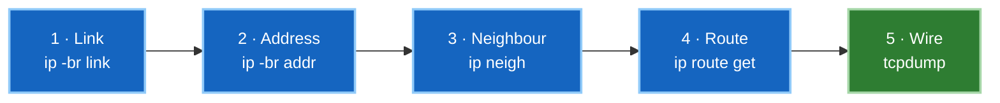

# 2 · Reading the Linux network stack

The `ip` command replaced `ifconfig`, `route` and `arp` years ago. If you learned
the old tools, the mapping is quick — and the new ones show things the old ones
can't.

All output below was captured from the live `ceos-mpls-scratch` fabric.

---

## Setting up

Every command runs inside a node's namespace, so define this once:

```bash
P1="sudo nsenter -t $(docker inspect -f '{{.State.Pid}}' clab-ceos-mpls-scratch-p1) -n"
$P1 ip -br addr show
```

The `-br` (brief) flag gives one line per interface and is worth reaching for by
default.

---

## Old tool → new tool

| Instead of | Use | Shows |
|---|---|---|
| `ifconfig` | `ip addr` | addresses |
| `ifconfig -a` | `ip -br link` | interfaces and state |
| `route -n` | `ip route` | routing table |
| `arp -a` | `ip neigh` | ARP / neighbour cache |
| `netstat -i` | `ip -s link` | interface counters |

`ifconfig` still exists on many systems but is unmaintained and can't display
namespaces, multiple addresses per interface, or policy routing. Use `ip`.

---

## Addresses and links

```bash
$P1 ip -br addr show eth1
```

```
eth1@if42        UP             10.1.1.1/24
```

Three facts in one line: the interface is **UP**, carries **10.1.1.1/24**, and its
veth peer is **interface index 42**.

`ip link` covers layer 2 (state, MAC, MTU); `ip addr` adds layer 3. The `-d` flag
adds device detail — that's where `link-netns` appears, as seen in
[namespaces](01-namespaces-veth.md).

---

## The routing table

```bash
$P1 ip route
```

```
default via 172.20.20.1 dev eth0 proto gated
2.2.2.2 via 10.1.1.2 dev eth1 proto gated metric 20
3.3.3.3 via 10.1.2.2 dev eth2 proto gated metric 20
10.1.1.0/24 dev eth1 proto kernel scope link src 10.1.1.1
```

Read each field:

- **`via <ip>`** — next hop. Absent means directly connected.
- **`dev <intf>`** — egress interface.
- **`proto`** — who installed it. `kernel` = automatic from an address; `gated` =
  a routing daemon (here, EOS's OSPF); `static` = manually configured.
- **`metric`** — tiebreaker between routes to the same prefix.

To ask what the kernel would *actually* do with a packet — including policy rules
and longest-prefix match — don't read the table, query it:

```bash
$P1 ip route get 2.2.2.2
```

That answers "which path would this take" directly, which is usually the real
question.

---

## The neighbour table

ARP for IPv4, NDP for IPv6, one table:

```bash
$P1 ip neigh
```

```
10.1.1.2 dev eth1 lladdr aa:c1:ab:9e:37:05 DELAY
172.20.20.1 dev eth0 lladdr 6a:87:18:46:f8:6b REACHABLE
10.1.2.2 dev eth2 lladdr aa:c1:ab:2e:55:ee REACHABLE
fe80::6887:18ff:fe46:f86b dev eth0 lladdr 6a:87:18:46:f8:6b router REACHABLE
```

The **state** matters more than people expect:

| State | Meaning |
|---|---|
| `REACHABLE` | confirmed recently — healthy |
| `STALE` | known, unconfirmed; fine, will re-verify on use |
| `DELAY` / `PROBE` | mid-verification |
| `FAILED` | resolution failed — **the interesting one** |
| `INCOMPLETE` | ARP sent, no reply yet |

`FAILED` or `INCOMPLETE` against a next hop means layer 2 is broken beneath a
layer 3 problem. That's a much more specific finding than "ping doesn't work" —
it says the packet never had a MAC address to go to.

---

## Counters

```bash
$P1 ip -s link show eth1
```

```
    RX:  bytes packets errors dropped  missed   mcast
        676082    7724      0       0       0       0
    TX:  bytes packets errors dropped carrier collsns
        672851    7695      0       2       0       0
```

Check **errors** and **dropped** before anything else. Both zero (or near it) means
the link is clean and the fault is higher up. Rising error counts point at MTU
problems, and rising drops at buffer or policy issues.

Comparing RX and TX across a link's two ends localises loss quickly: if one side's
TX climbs and the other's RX doesn't, the frames aren't arriving.

---

## tcpdump: seeing what the CLI won't show

The most valuable tool here, because it shows **what actually crossed the wire**
rather than what a daemon believes.

```bash
$P1 tcpdump -i eth1 -nn
```

Flags worth knowing:

| Flag | Does |
|---|---|
| `-nn` | no DNS or port-name lookups — faster, and no misleading names |
| `-i <intf>` | which interface |
| `-c <n>` | stop after n packets |
| `-e` | show ethernet headers (MACs, VLAN tags) |
| `-v` / `-vv` | more protocol detail |
| `-w file.pcap` | write to file for Wireshark |

Filters that earn their keep in these labs:

```bash
$P1 tcpdump -i eth1 -nn 'proto ospf'          # OSPF hellos and LSAs
$P1 tcpdump -i eth1 -nn 'tcp port 179'        # BGP
$P1 tcpdump -i eth1 -nn 'udp port 4789'       # VXLAN
$P1 tcpdump -i eth1 -nn 'tcp port 646'        # LDP
$P1 tcpdump -i eth1 -nn -e 'mpls'             # labelled traffic
$P1 tcpdump -i eth1 -nn 'icmp'                # your own pings
```

!!! tip "This settles arguments the CLI can't"
    When an adjacency won't form, `show` output tells you what each router
    *thinks*. tcpdump tells you what's *arriving*.

    If you see the neighbour's hellos on the wire but the protocol still reports no
    neighbour, the packets are fine and the mismatch is in their contents — timers,
    area, authentication, MTU. If you see nothing arriving, stop investigating the
    protocol; the problem is beneath it.

    This distinction alone saves more time than any other tool here.

---

## A troubleshooting order that works

Bottom-up, because a failure below makes everything above it look broken:



1. **Is the link up?** `ip -br link` — `LOWER_UP` means carrier present.
2. **Right address?** `ip -br addr` — wrong mask is a classic.
3. **Neighbour resolving?** `ip neigh` — `FAILED` means layer 2, stop here.
4. **Route exists?** `ip route get <dst>` — not just "is it in the table".
5. **Reaching the wire?** `tcpdump` — if you get here, you know the config is sane
   and the question is what's actually being sent.

Most faults resolve at step 1 or 3, which is why starting at step 5 wastes time.

---

**Next:** [Containers, and why cEOS behaves as it does →](03-containers.md) — where
the Linux layer explains three real bugs from this curriculum.
