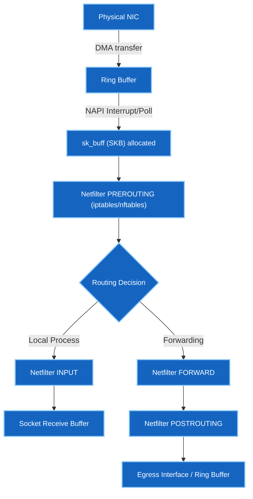

# 6 · Linux kernel networking & packet diagnostics

Hyperscale network infrastructure engineers (Google, Meta, AWS) manage Linux as a
router, host, and proxy. This module covers kernel-level packet flow, policy-based
routing, network namespaces, and deep packet diagnostics.

---

## The iproute2 suite — modern host networking

Legacy tools (`ifconfig`, `route`, `netstat`) have been obsolete for a decade.
Modern Linux uses `iproute2`.

```bash
ip link show                         # link status, MTU, MAC addresses
ip addr show dev eth0                # IP addresses and netmasks
ip route show                        # main routing table
ip -s link show dev eth0             # interface statistics (drops, errors, overrun)
```

### Policy-Based Routing (PBR) & Multiple Tables

Linux supports multiple routing tables evaluated using **routing rules**.

```bash
ip rule list                         # view rule database (RPDB)
```

```
0:    from all lookup local
32766: from all lookup main
32767: from all lookup default
```

Adding custom routing tables and rules (e.g., policy routing by source IP or TOS):

```bash
# Add route to custom table 100
ip route add 192.168.10.0/24 via 10.0.0.1 table 100

# Route traffic originating from 10.1.1.0/24 using table 100
ip rule add from 10.1.1.0/24 table 100

# Flush rule cache
ip route flush cache
```

!!! tip "Why PBR matters in Hyperscale"
    Multi-tenant clouds and dual-homed servers use routing rules to ensure response
    traffic exits via the same interface/gateway it entered, preventing asymmetric
    routing drops.

---

## Network Namespaces (`netns`) & Virtual Interfaces

Linux namespaces provide network isolation. Containers (Docker, containerlab) and
virtual routers build topology pipelines on top of `netns` and `veth` pairs.

```bash
ip netns add ns-leaf1                # create isolated network namespace
ip netns list                        # list active namespaces
```

### Connecting Namespaces with `veth` Pairs

A `veth` (virtual ethernet) device acts as a virtual patch cable with two ends.

```bash
# Create a veth pair connecting root host to ns-leaf1
ip link add veth-host type veth peer name veth-leaf1

# Move one end into the namespace
ip link set veth-leaf1 netns ns-leaf1

# Assign IPs and bring interfaces up
ip addr add 10.200.0.1/30 dev veth-host
ip link set veth-host up

ip netns exec ns-leaf1 ip addr add 10.200.0.2/30 dev veth-leaf1
ip netns exec ns-leaf1 ip link set veth-leaf1 up
ip netns exec ns-leaf1 ip link set lo up

# Test connectivity into namespace
ip netns exec ns-leaf1 ping -c 2 10.200.0.1
```

---

## Linux Kernel Packet Processing Path

When a packet arrives at a Linux NIC, it moves through kernel data structures:



### Packet Drop Diagnostics in Kernel

When packets drop inside Linux, inspect `/proc/net/` and `ethtool`:

```bash
ethtool -S eth0 | grep -i drop       # hardware/driver ring buffer drops
cat /proc/net/dev                    # interface packet counters and errors
cat /proc/net/snmp                   # TCP/UDP protocol-level retransmissions & drops
```

---

## Deep Packet Diagnostics with `tcpdump`

`tcpdump` is the primary CLI tool for inline packet inspection.

```bash
# Basic capture on interface
tcpdump -nn -i eth0 -c 10

# Capture port 80 or 443 without DNS resolution
tcpdump -nn -i eth0 'port 80 or port 443'
```

### TCP Flag Bitwise Filtering

Interview questions frequently test bitwise expression matching on TCP header flags:

| TCP Flag | Bit Position | Hex Value |
|---|---|---|
| FIN | Bit 0 | `0x01` |
| SYN | Bit 1 | `0x02` |
| RST | Bit 2 | `0x04` |
| PSH | Bit 3 | `0x08` |
| ACK | Bit 4 | `0x10` |
| URG | Bit 5 | `0x20` |

```bash
# Capture SYN-only packets (TCP handshake initiation)
tcpdump -nn -i eth0 'tcp[tcpflags] & tcp-syn != 0 and tcp[tcpflags] & tcp-ack == 0'

# Capture RST (Reset) packets to diagnose abrupt disconnections
tcpdump -nn -i eth0 'tcp[tcpflags] & tcp-rst != 0'

# Capture SYN-ACK packets
tcpdump -nn -i eth0 'tcp[tcpflags] & (tcp-syn|tcp-ack) == (tcp-syn|tcp-ack)'
```

---

## Socket States, Kernel Tuning & System Tracing

### Socket States (`ss`)

```bash
ss -tna                              # all TCP sockets, numerical addresses
ss -t -a state time-wait             # sockets in TIME_WAIT state
ss -t -a state close-wait            # sockets stuck in CLOSE_WAIT
```

- **`TIME_WAIT`**: Active closer waiting 2MSL (Maximum Segment Lifetime) to ensure remote endpoint received ACK and old duplicates die. Normal in high-volume web servers.
- **`CLOSE_WAIT`**: Passive closer waiting for local application to call `close()`. If high, **the application has a resource leak bug**.

### System Call Tracing (`strace`)

Trace network system calls (`socket`, `connect`, `sendto`, `recvfrom`, `bind`):

```bash
strace -f -e trace=network curl http://10.0.0.1
lsof -i :80                          # find processes holding port 80 sockets
```

---

**Next:** [Interview Questions →](interview-questions.md) — test your knowledge on Linux shell, text parsing, SSH, and kernel networking mechanics.
