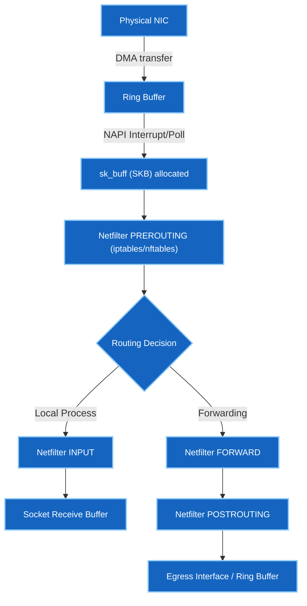

# ၆ · Linux Kernel Networking & Packet Diagnostics

Hyperscale ကွန်ရက်အခြေခံအဆောက်အအုံ အင်ဂျင်နီယာများ (Google, Meta, AWS) သည် Linux ကို router၊ host၊ နှင့် proxy အဖြစ် ကျယ်ပြန့်စွာ စီမံခန့်ခွဲကြပါသည်။ ဤသင်ခန်းစာသည် kernel-level packet စီးဆင်းမှုလမ်းကြောင်း၊ policy-based routing၊ network namespaces၊ နှင့် deep packet diagnostics များကို လွှမ်းခြုံထားပါသည်။

---

## iproute2 Suite — ခေတ်မီ Host Networking

ရှေးရိုး tools များဖြစ်သော (`ifconfig`, `route`, `netstat`) တို့သည် ဆယ်စုနှစ်တစ်ခုကျော် ကတည်းက ခေတ်မမီတော့ပါ။ ခေတ်မီ Linux သည် `iproute2` ကို အသုံးပြုပါသည်:

```bash
ip link show                         # Link status, MTU, MAC addresses များကို ကြည့်သည်
ip addr show dev eth0                # IP addresses နှင့် netmasks များကို ကြည့်သည်
ip route show                        # Main routing table ကို ကြည့်သည်
ip -s link show dev eth0             # Interface စာရင်းအင်းများ (drops, errors, overrun) ကို စစ်သည်
```

### Policy-Based Routing (PBR) နှင့် Routing Tables အများအပြား

Linux သည် **Routing Rules** များကို အသုံးပြု၍ သီးခြား routing tables များစွာကို စစ်ဆေးတွက်ချက်နိုင်စွမ်း ရှိပါသည်။

```bash
ip rule list                         # Routing Rule Database (RPDB) ကို ကြည့်သည်
```

```
0:    from all lookup local
32766: from all lookup main
32767: from all lookup default
```

Custom routing tables များနှင့် rules များ ထည့်သွင်းခြင်း (ဥပမာ Source IP သို့မဟုတ် TOS အလိုက် policy routing ပြုလုပ်ခြင်း):

```bash
# Custom table 100 ထဲသို့ route ထည့်သည်
ip route add 192.168.10.0/24 via 10.0.0.1 table 100

# 10.1.1.0/24 မှ လာသော traffic များကို table 100 သုံး၍ လမ်းကြောင်းလွှဲသည်
ip rule add from 10.1.1.0/24 table 100

# Rule cache ကို flush ရှင်းလင်းသည်
ip route flush cache
```

!!! tip "Hyperscale တွင် PBR သည် အဘယ်ကြောင့် အရေးပါသနည်း"
    Multi-tenant clouds များနှင့် dual-homed servers များသည် အသွားအပြန် traffic များကို ဝင်လာသော interface/gateway အတိုင်း ပြန်လည်ထွက်ခွာစေရန် routing rules များကို သုံးကြသည် — သို့မှသာ asymmetric routing ကြောင့် packet drop ဖြစ်ခြင်းကို ကာကွယ်ပေးနိုင်မည် ဖြစ်သည်။

---

## Network Namespaces (`netns`) နှင့် Virtual Interfaces

Linux namespaces သည် ကွန်ရက်ကို သီးခြားခွဲထုတ်ပေးပါသည်။ Containers (Docker, containerlab) များနှင့် virtual routers များသည် `netns` နှင့် `veth` pairs များပေါ်တွင် အခြေခံ၍ တည်ဆောက်ထားခြင်း ဖြစ်သည်။

```bash
ip netns add ns-leaf1                # သီးခြား network namespace အသစ် ဖန်တီးသည်
ip netns list                        # လက်ရှိ active namespaces များကို စာရင်းကြည့်သည်
```

### Namespaces များကို `veth` Pairs ဖြင့် ချိတ်ဆက်ခြင်း

`veth` (virtual ethernet) device သည် ထိပ်နှစ်ဖက်ပါရှိသော virtual patch cable ကဲ့သို့ အလုပ်လုပ်ပါသည်။

```bash
# Host နှင့် ns-leaf1 ကို ချိတ်ဆက်မည့် veth pair တစ်ခု ဆောက်သည်
ip link add veth-host type veth peer name veth-leaf1

# ထိပ်တစ်ဖက်ကို namespace အတွင်းသို့ ရွှေ့ပြောင်းသည်
ip link set veth-leaf1 netns ns-leaf1

# IP လိပ်စာများ သတ်မှတ်ပြီး interfaces များကို ဖွင့်သည်
ip addr add 10.200.0.1/30 dev veth-host
ip link set veth-host up

ip netns exec ns-leaf1 ip addr add 10.200.0.2/30 dev veth-leaf1
ip netns exec ns-leaf1 ip link set veth-leaf1 up
ip netns exec ns-leaf1 ip link set lo up

# Namespace အတွင်းသို့ ping ဖြင့် ဆက်သွယ်မှု စမ်းသပ်သည်
ip netns exec ns-leaf1 ping -c 2 10.200.0.1
```

---

## Linux Kernel Packet Processing စီးဆင်းမှု လမ်းကြောင်း

Packet တစ်ခုသည် Linux NIC သို့ ရောက်ရှိလာချိန်တွင် အောက်ပါ kernel data structures များကို ဖြတ်သန်းရပါသည်:



### Kernel အတွင်း Packet Drop စစ်ဆေးခြင်း

Linux အတွင်း packets များ drop ဖြစ်ပါက `/proc/net/` နှင့် `ethtool` ကို စစ်ဆေးပါ:

```bash
ethtool -S eth0 | grep -i drop       # Hardware/driver ring buffer drops များကို ကြည့်သည်
cat /proc/net/dev                    # Interface packet counters နှင့် errors များ
cat /proc/net/snmp                   # TCP/UDP protocol-level retransmissions & drops
```

---

## `tcpdump` ဖြင့် နက်ရှိုင်းစွာ Packet စစ်ဆေးခြင်း

`tcpdump` သည် ကွန်ရက်လိုင်းပေါ်မှ packets များကို တိုက်ရိုက် စစ်ဆေးရန် အဓိက CLI tool ဖြစ်ပါသည်:

```bash
# Interface ပေါ်မှ အခြေခံ capture ရယူခြင်း
tcpdump -nn -i eth0 -c 10

# DNS resolution မပါဘဲ Port 80 သို့မဟုတ် 443 ကို capture လုပ်ခြင်း
tcpdump -nn -i eth0 'port 80 or port 443'
```

### TCP Flag Bitwise စစ်ထုတ်ခြင်း (Filtering)

အင်တာဗျူးများတွင် TCP header flags များကို bitwise expression ဖြင့် matching စစ်ဆေးနည်းကို မကြာခဏ မေးလေ့ရှိပါသည်:

| TCP Flag | Bit Position | Hex Value |
|---|---|---|
| FIN | Bit 0 | `0x01` |
| SYN | Bit 1 | `0x02` |
| RST | Bit 2 | `0x04` |
| PSH | Bit 3 | `0x08` |
| ACK | Bit 4 | `0x10` |
| URG | Bit 5 | `0x20` |

```bash
# SYN-only packets များကိုသာ capture လုပ်ခြင်း (TCP handshake စတင်မှု)
tcpdump -nn -i eth0 'tcp[tcpflags] & tcp-syn != 0 and tcp[tcpflags] & tcp-ack == 0'

# ရုတ်တရက် ပြတ်တောက်မှုများကို ရှာဖွေရန် RST (Reset) packets များကို ဖမ်းယူခြင်း
tcpdump -nn -i eth0 'tcp[tcpflags] & tcp-rst != 0'

# SYN-ACK packets များကိုသာ capture လုပ်ခြင်း
tcpdump -nn -i eth0 'tcp[tcpflags] & (tcp-syn|tcp-ack) == (tcp-syn|tcp-ack)'
```

---

## Socket States၊ Kernel Tuning နှင့် System Tracing

### Socket States စစ်ဆေးခြင်း (`ss`)

```bash
ss -tna                              # TCP sockets အားလုံးကို numerical addresses ဖြင့် ပြသည်
ss -t -a state time-wait             # TIME_WAIT အခြေအနေရှိ sockets များ
ss -t -a state close-wait            # CLOSE_WAIT တွင် ရပ်တန့်နေသော sockets များ
```

- **`TIME_WAIT`**: ချိတ်ဆက်မှု အရင်စတင်ပိတ်သူက ACK ရောက်ရှိမှုကို သေချာစေရန် 2MSL (Maximum Segment Lifetime) ကြာအောင် စောင့်ဆိုင်းနေခြင်း ဖြစ်သည်။ Traffic များပြားသော web servers များတွင် ပုံမှန်သာ ဖြစ်သည်။
- **`CLOSE_WAIT`**: တစ်ဖက်က ပိတ်လိုက်ပြီးနောက် မိမိဘက်ရှိ local application က `close()` ခေါ်ယူရန် ပျက်ကွက်နေခြင်း ဖြစ်သည်။ အရေအတွက် များပြားပါက **application တွင် resource leak bug ရှိနေသည်** ဟု အဓိပ္ပာယ်ရသည်။

### System Call Tracing (`strace`)

Network system calls များကို trace ခြေရာခံခြင်း (`socket`, `connect`, `sendto`, `recvfrom`, `bind`):

```bash
strace -f -e trace=network curl http://10.0.0.1
lsof -i :80                          # Port 80 sockets များကို မည်သည့် process က ကိုင်ထားသည်ကို ရှာသည်
```

---

**ဆက်လက်လေ့လာရန်:** [Layer 1 Optics & Physical Infrastructure →](07-physical-layer.md)
