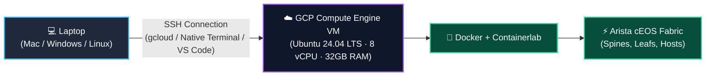

# Lab Setup on Google Cloud (GCP)

> If your laptop has limited RAM/CPU resources, or you want a 24/7 dedicated cloud environment accessible from any machine —  
> This guide walks you through building an Ubuntu instance on **Google Cloud Compute Engine**, connecting securely from your laptop, and deploying **Docker, Containerlab, and Arista cEOS** end-to-end.

---

## 🧠 Architecture Overview



No heavy virtualization software runs on your laptop; everything executes seamlessly inside the Google Cloud VM.

---

## 1. Prerequisites

1. **Google Cloud Platform (GCP) Account** — With billing enabled ([cloud.google.com](https://cloud.google.com)). Free trial credits ($300) work perfectly.
2. **GCP Project ID** — A dedicated project created for your labs.
3. **Connecting Tool** —
   - **`gcloud` CLI** installed on your laptop (instructions below), or
   - In-browser **Google Cloud Shell** (requires zero local installation).

---

## 2. Create the GCP VM Instance

You can build the VM using either the **Web Console (GUI)** or the **`gcloud` CLI**:

### Option A · Google Cloud Console (Web GUI)

1. Open **[console.cloud.google.com](https://console.cloud.google.com)** and select your project.
2. Navigate to **Navigation Menu (☰) → Compute Engine → VM instances**.
3. Click **Create Instance**.
4. Configure the following parameters:
   - **Name**: `netforge-lab`
   - **Region & Zone**: Choose the closest region (e.g. `asia-southeast1-b` for Singapore, `us-central1-a` for US).
   - **Machine Configuration**:
     - Series: **E2** (cost-effective) or **N2** (high performance).
     - Machine type: **`e2-standard-8`** (8 vCPU, 32 GB RAM) — comfortably runs 4 to 8 cEOS nodes.
   - **Boot Disk**:
     - Click **Change**.
     - Operating System: **Ubuntu**
     - Version: **Ubuntu 24.04 LTS (x86/64, amd64)**
     - Boot disk type: **Balanced persistent disk**
     - Size: **100 GB** (sized for container images and lab artifacts).
     - Click **Select**.
   - **Firewall**: Check *Allow HTTP traffic* and *Allow HTTPS traffic*.
5. Click **Create**. Within 30–45 seconds, your VM is up and running with an external IP.

---

### Option B · `gcloud` CLI (Command Line)

Run this single command from your laptop terminal or Cloud Shell:

```bash
# 1. Authenticate and configure defaults
gcloud auth login
gcloud config set project YOUR_PROJECT_ID
gcloud config set compute/zone asia-southeast1-b
gcloud config set compute/region asia-southeast1

# 2. Provision the VM
gcloud compute instances create netforge-lab \
  --zone=asia-southeast1-b \
  --machine-type=e2-standard-8 \
  --image-family=ubuntu-2404-lts-amd64 \
  --image-project=ubuntu-os-cloud \
  --boot-disk-size=100GB \
  --boot-disk-type=pd-balanced \
  --tags=netforge-lab
```

*(If you plan to run nested QEMU/KVM nodes in the future, use the N2 series with `--enable-nested-virtualization`).*

---

## 3. Connect from Laptop to GCP VM (4 Methods)

### Method 1 · `gcloud compute ssh` (Recommended & Easiest)
From your laptop terminal:
```bash
gcloud compute ssh netforge-lab --zone=asia-southeast1-b
```
> 💡 **Why it's best:** `gcloud` automatically generates an SSH keypair, pushes your public key to the project metadata, and connects you directly to the VM shell without manual key management.

---

### Method 2 · Native Terminal SSH using Standard SSH Keys
To use standard `ssh` from your macOS/Linux/WSL terminal:

1. Generate an SSH key on your laptop (if you haven't already):
```bash
ssh-keygen -t ed25519 -C "your-email@gmail.com"
```
2. Copy your public key:
```bash
cat ~/.ssh/id_ed25519.pub
```
3. In the GCP Console → **Compute Engine → VM instances** → Click `netforge-lab` → Click **Edit** → Under **SSH Keys**, click **Add Item**, paste the key, and click **Save**.
4. Retrieve the VM's external IP:
```bash
gcloud compute instances describe netforge-lab --format='get(networkInterfaces[0].accessConfigs[0].natIP)'
```
5. Connect directly:
```bash
ssh -i ~/.ssh/id_ed25519 <username>@<EXTERNAL_IP>
```

---

### Method 3 · Cloud Console In-Browser SSH (1-Click)
In the GCP Console under **Compute Engine → VM instances**, click the **SSH** button next to `netforge-lab`. A full terminal window opens directly in your browser.

---

### Method 4 · VS Code Remote-SSH
Edit configs and browse files with a full IDE experience:

1. Install the **Remote - SSH** extension in VS Code.
2. In your laptop's `~/.ssh/config`, add:
```ssh-config
Host netforge-gcp
    HostName <VM_EXTERNAL_IP>
    User <YOUR_USERNAME>
    IdentityFile ~/.ssh/id_ed25519
```
3. Click the Remote Window icon (`><`) in VS Code bottom-left → **Connect to Host → netforge-gcp**.

---

## 4. Install Docker, Containerlab, and cEOS on the GCP VM

Inside the GCP VM shell, install the required software:

### 4.1 Install Docker
```bash
curl -fsSL https://get.docker.com | sudo sh
sudo usermod -aG docker "$USER"
newgrp docker
docker run --rm hello-world     # Verifies: "Hello from Docker!"
```

### 4.2 Install Containerlab
```bash
bash -c "$(curl -sL https://get.containerlab.dev)"
containerlab version
```

### 4.3 Clone NetForge Labs
```bash
cd ~
git clone https://github.com/etherhtun/netforge-labs.git
cd netforge-labs
```

### 4.4 Import the Arista cEOS Image
1. Download `cEOS64-lab-4.32.0F.tar.xz` from [arista.com](https://www.arista.com) to your laptop.
2. Upload the file from your laptop to the GCP VM using `gcloud compute scp`:
```bash
# Run on your laptop:
gcloud compute scp ~/Downloads/cEOS64-lab-4.32.0F.tar.xz netforge-lab:~/ --zone=asia-southeast1-b
```
3. Import into Docker inside the VM:
```bash
# Run on the GCP VM:
docker import cEOS64-lab-4.32.0F.tar.xz ceos:4.32.0F
docker images | grep ceos
```
*(Because the GCP VM runs native x86_64 architecture, cEOS boots with zero emulation overhead!)*

---

## 5. Deploy Your First Lab on GCP

```bash
cd ~/netforge-labs/labs/wan-edge-lab
sudo containerlab deploy -t topology.clab.yml
```

Inspect the running topology:
```bash
sudo containerlab inspect -t topology.clab.yml
```

Log in to a switch CLI:
```bash
docker exec -it clab-wan-edge-lab-edge1 Cli
```

---

## 6. Access Web Dashboards (Grafana / Prometheus / Web Graph)

To access web interfaces like Grafana (port 3000) or Containerlab Graph (port 50080) from your laptop browser:

### Option 1 · GCP Firewall Rule:
```bash
gcloud compute firewall-rules create allow-netforge-web \
  --allow tcp:3000,tcp:9090,tcp:50080 \
  --target-tags=netforge-lab
```
*(Access via `http://<VM_EXTERNAL_IP>:3000`).*

### Option 2 · SSH Port Forwarding (Most Secure):
```bash
ssh -L 3000:localhost:3000 -L 50080:localhost:50080 user@<VM_EXTERNAL_IP>
```
*(Access securely via `http://localhost:3000` on your laptop browser).*

---

## 7. 💰 Save Costs: Stop the VM When Done

GCP charges for compute only while the instance is **RUNNING**. When finished for the day, shut it down:

```bash
# From inside the VM:
sudo poweroff
```

Or from your laptop:
```bash
gcloud compute instances stop netforge-lab --zone=asia-southeast1-b
```

To resume later:
```bash
gcloud compute instances start netforge-lab --zone=asia-southeast1-b
```

> 💡 **Cost note:** While stopped, compute billing drops to $0. You only pay standard persistent disk storage (~a few dollars/month for 100 GB). All your lab files, Docker images, and configurations are preserved.

---

## 8. Troubleshooting

| Symptom | Cause | Solution |
|---|---|---|
| `Permission denied (publickey)` on SSH | Key not registered in GCP metadata | Use `gcloud compute ssh` or re-add public key under VM Edit → SSH Keys |
| `docker: command not found` | Docker not installed or group not active | Run `newgrp docker` or log out and back in |
| Out of memory when booting cEOS | VM has insufficient RAM | Stop the VM and upgrade machine type to `e2-standard-8` (32 GB) |

---

### 🚀 Next Steps:
To learn the essential commands and topology structure for daily lab work, proceed to **[Page 3 · Docker & Containerlab CLI Guide →](containerlab.md)**.
