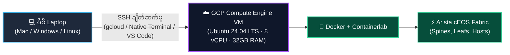

# Google Cloud (GCP) ပေါ်တွင် Lab စတင် တပ်ဆင်ခြင်း (Lab Setup on GCP)

> မိမိ Laptop တွင် RAM/CPU စွမ်းရည် ကန့်သတ်ချက်ရှိနေသူများ သို့မဟုတ် မည်သည့်နေရာမှမဆို အင်တာနက်ဖြင့် ၂၄ နာရီ ချိတ်ဆက်လေ့ကျင့်နိုင်မည့် Cloud Network Lab တစ်ခုကို လိုလားသူများအတွက် —  
> **Google Cloud Compute Engine** ပေါ်တွင် Ubuntu VM တစ်ခု တည်ဆောက်ပြီး၊ မိမိ Laptop မှ ချိတ်ဆက်ကာ **Docker, Containerlab နှင့် Arista cEOS** တို့ကို အစအဆုံး တပ်ဆင်မောင်းနှင်နည်း လမ်းညွှန်ဖြစ်ပါသည်။

---

## 🧠 နည်းပညာ ချိတ်ဆက်ပုံ အဆင့်ဆင့် (Architecture Overview)



သင်၏ Laptop ပေါ်တွင် မည်သည့် လေးလံသော virtualization software မှ run ထားရန် မလိုဘဲ၊ အရာအားလုံးသည် Google Cloud ၏ စွမ်းအားမြင့် VM ကြီးအတွင်း၌သာ လည်ပတ်နေမည် ဖြစ်ပါသည်။

---

## ၁။ ကြိုတင် လိုအပ်ချက်များ (Prerequisites)

1. **Google Cloud Platform (GCP) အကောင့်တစ်ခု** — Billing (ငွေပေးချေမှုစနစ်) ဖွင့်ထားသော အကောင့်ဖြစ်ရပါမည် ([cloud.google.com](https://cloud.google.com))။ (GCP မှ ပေးအပ်သော $300 အခမဲ့ credit ဖြင့်လည်း စမ်းသပ်နိုင်သည်)။
2. **GCP Project ID တစ်ခု** — မိမိ lab အတွက် သီးသန့် Project တစ်ခု ဖန်တီးထားရှိပါ။
3. **ချိတ်ဆက်မည့် နည်းလမ်းရွေးချယ်ခြင်း** —
   - မိမိ Laptop တွင် **`gcloud` CLI** ထည့်သွင်းထားရန် လိုအပ်သည် (အောက်တွင် ထည့်သွင်းနည်း ဖော်ပြထားသည်)၊ သို့မဟုတ်
   - မည်သည့် tool မှ မသွင်းဘဲ Browser အတွင်းရှိ **Google Cloud Shell** ကိုလည်း တိုက်ရိုက် သုံးနိုင်ပါသည်။

---

## ၂။ GCP VM Instance အသစ် တည်ဆောက်ခြင်း

VM ဆောက်လုပ်ရန်အတွက် **နည်းလမ်း (၂) မျိုး** ရှိပါသည် — မိမိနှစ်သက်ရာ နည်းလမ်းတစ်ခုခုကို ရွေးချယ်ဆောင်ရွက်ပါ:

### နည်းလမ်း က · Google Cloud Console (Web GUI) ဖြင့် ဆောက်လုပ်နည်း

၁။ Browser ဖြင့် **[console.cloud.google.com](https://console.cloud.google.com)** သို့ သွားရောက်ပြီး မိမိ Project ကို ရွေးချယ်ပါ။  
၂။ ဘယ်ဘက်အပေါ်ထောင့်ရှိ **Menu (☰) → Compute Engine → VM instances** သို့ သွားပါ။  
၃။ အပေါ်ရှိ **Create Instance** ခလုတ်ကို နှိပ်ပါ။  
၄။ အောက်ပါ သတ်မှတ်ချက်များကို ဖြည့်သွင်းပေးပါ:
   - **Name**: `netforge-lab`
   - **Region & Zone**: မိမိနှင့် အနီးဆုံးဒေသကို ရွေးပါ (ဥပမာ အရှေ့တောင်အာရှအတွက် `asia-southeast1-b` Singapore)။
   - **Machine Configuration**:
     - Series: **E2** (အသုံးများပြီး ကုန်ကျစရိတ် သက်သာသည်) သို့မဟုတ် **N2** (စွမ်းဆောင်ရည်မြင့်သည်)။
     - Machine type: **`e2-standard-8`** (8 vCPU, 32 GB Memory) — cEOS switch ၄ လုံးမှ ၈ လုံးအထိ ချောမောစွာ run နိုင်ပါသည်။
   - **Boot Disk (Operating System)**:
     - **Change** ခလုတ်ကို နှိပ်ပါ။
     - Operating System: **Ubuntu**
     - Version: **Ubuntu 24.04 LTS (x86/64, amd64)**
     - Boot disk type: **Balanced persistent disk**
     - Size: **100 GB** (Docker layers နှင့် switch images များအတွက် လုံလောက်သော ပမာဏ)။
     - **Select** ကို နှိပ်ပါ။
   - **Firewall**: *Allow HTTP traffic* နှင့် *Allow HTTPS traffic* ကို အမှန်ခြစ်ပေးပါ (နောက်ပိုင်း Web UI များ ကြည့်ရှုနိုင်ရန်)။  
၅။ အောက်ဆုံးရှိ **Create** ခလုတ်ကို နှိပ်ပါ။ စက္ကန့် ၃၀ အတွင်း သင်၏ VM စတင် လည်ပတ်လာပါမည်။

---

### နည်းလမ်း ခ · `gcloud` CLI Command ဖြင့် စက္ကန့်ပိုင်းအတွင်း ဆောက်လုပ်နည်း

မိမိ Laptop terminal (သို့မဟုတ် Google Cloud Shell) ပေါ်တွင် command တစ်ကြောင်းတည်းဖြင့် ချက်ချင်း ဖန်တီးနိုင်ပါသည်:

```bash
# ၁။ gcloud login ဝင်ပြီး project သတ်မှတ်ပါ
gcloud auth login
gcloud config set project YOUR_PROJECT_ID
gcloud config set compute/zone asia-southeast1-b
gcloud config set compute/region asia-southeast1

# ၂။ VM ကို ဖန်တီးပါ
gcloud compute instances create netforge-lab \
  --zone=asia-southeast1-b \
  --machine-type=e2-standard-8 \
  --image-family=ubuntu-2404-lts-amd64 \
  --image-project=ubuntu-os-cloud \
  --boot-disk-size=100GB \
  --boot-disk-type=pd-balanced \
  --tags=netforge-lab
```

*(အကယ်၍ အနာဂတ်တွင် QEMU/KVM VMs များကိုပါ run လိုပါက N2 series နှင့် `--enable-nested-virtualization` flag ကို တွဲသုံးနိုင်ပါသည်)*

---

## ၃။ မိမိ Laptop မှ GCP VM ဆီသို့ ချိတ်ဆက်နည်း (၄ မျိုး)

VM တက်လာပြီဆိုပါက မိမိ Laptop မှတစ်ဆင့် အဆိုပါ cloud စက်ထဲသို့ အောက်ပါ နည်းလမ်းများဖြင့် ဝင်ရောက်နိုင်ပါသည်:

### နည်းလမ်း ၁ · `gcloud compute ssh` ဖြင့် ဝင်ရောက်ခြင်း (အလွယ်ကူဆုံးနှင့် အကြံပြုချက်)
မိမိ Laptop Terminal တွင် အောက်ပါ command ကို ရိုက်နှိပ်ရုံသာ ဖြစ်သည်:
```bash
gcloud compute ssh netforge-lab --zone=asia-southeast1-b
```
> 💡 **အားသာချက်:** `gcloud` က SSH keys များကို အလိုအလျောက် generate လုပ်ပေးပြီး GCP VM ထံသို့ သင့်အစား လုံခြုံစွာ ပို့ဆောင်ပေးသဖြင့် မည်သည့် manual key setup မှ မလိုဘဲ ချက်ချင်း VM shell ထဲသို့ ရောက်ရှိသွားပါမည်။

---

### နည်းလမ်း ၂ · Laptop Terminal မှ Standard SSH Key ဖြင့် တိုက်ရိုက် ချိတ်ဆက်ခြင်း
မိမိ Laptop ၏ ပုံမှန် `ssh` command ဖြင့် ချိတ်လိုပါက:

၁။ Laptop ပေါ်တွင် SSH key အသစ် ထုတ်ပါ (မရှိသေးပါက):
```bash
ssh-keygen -t ed25519 -C "your-email@gmail.com"
```
၂။ မိမိ၏ Public Key စာသားကို ကူးယူပါ:
```bash
cat ~/.ssh/id_ed25519.pub
```
၃။ GCP Console → **Compute Engine → VM instances** → `netforge-lab` ကို နှိပ်ပါ → **Edit** ကို နှိပ်ပါ → **SSH Keys** အောက်တွင် **Add Item** ကို နှိပ်၍ အထက်ပါ public key ကို paste ချပြီး **Save** လုပ်ပါ။  
၄။ VM ၏ **External IP** ကို ရှာဖွေပါ:
```bash
gcloud compute instances describe netforge-lab --format='get(networkInterfaces[0].accessConfigs[0].natIP)'
```
၅။ မိမိ Laptop Terminal မှ တိုက်ရိုက် ဝင်ရောက်ပါ:
```bash
ssh -i ~/.ssh/id_ed25519 <username>@<EXTERNAL_IP>
```

---

### နည်းလမ်း ၃ · Cloud Console Web Browser SSH (၁-Click ဖြင့် ဝင်ရောက်ခြင်း)
မိမိ Laptop တွင် မည်သည့် software မှ မသွင်းထားသော်လည်း Google Cloud Console ရှိ VM instances စာရင်းသို့ သွားရောက်ကာ `netforge-lab` ဘေးရှိ **SSH** ခလုတ်လေးကို နှိပ်လိုက်ရုံဖြင့် Browser အတွင်း၌ terminal အပြည့်အစုံ ပွင့်လာပါမည်။

---

### နည်းလမ်း ၄ · VS Code Remote-SSH ဖြင့် ချိတ်ဆက်ခြင်း (Developer များအတွက် အကောင်းဆုံး)
VS Code ဖြင့် cloud VM ပေါ်ရှိ ဖိုင်များနှင့် lab script များကို မိမိစက်တွင်းရှိ ဖိုင်များကဲ့သို့ တိုက်ရိုက် ပြင်ဆင်အသုံးပြုနိုင်ပါသည်:

၁။ VS Code တွင် **Remote - SSH** Extension ကို Install လုပ်ပါ။  
၂။ မိမိ Laptop ၏ `~/.ssh/config` ဖိုင်ထဲတွင် အောက်ပါအတိုင်း ထည့်သွင်းပါ:
```ssh-config
Host netforge-gcp
    HostName <VM_EXTERNAL_IP>
    User <YOUR_USERNAME>
    IdentityFile ~/.ssh/id_ed25519
```
၃။ VS Code ၏ ဘယ်ဘက်အောက်ထောင့်ရှိ `><` (Open a Remote Window) ခလုတ်ကို နှိပ်ပြီး **Connect to Host → netforge-gcp** ကို ရွေးချယ်ပါ။

---

## ၄။ GCP VM အတွင်း Docker, Containerlab နှင့် cEOS တပ်ဆင်ခြင်း

ယခုအခါ သင်သည် GCP VM shell ထဲသို့ ရောက်ရှိနေပြီဖြစ်ရာ၊ NetForge Labs မောင်းနှင်ရန် လိုအပ်သည့် platform tools များကို ထည့်သွင်းပါမည်:

### ၄.၁ · Docker ကို Install ပြုလုပ်ခြင်း
```bash
curl -fsSL https://get.docker.com | sudo sh
sudo usermod -aG docker "$USER"
newgrp docker
docker run --rm hello-world     # "Hello from Docker!" ဟု ပေါ်ရမည်
```

### ၄.၂ · Containerlab ကို Install ပြုလုပ်ခြင်း
```bash
bash -c "$(curl -sL https://get.containerlab.dev)"
containerlab version
```

### ၄.၃ · NetForge Labs Repository ကို Clone လုပ်ခြင်း
```bash
cd ~
git clone https://github.com/etherhtun/netforge-labs.git
cd netforge-labs
```

### ၄.၄ · Arista cEOS Image ကို VM ပေါ်သို့ တင်သွင်းခြင်း (Import)
၁။ မိမိ Laptop ဖြင့် [arista.com](https://www.arista.com) မှ `cEOS64-lab-4.32.0F.tar.xz` ကို ဒေါင်းလုဒ်ရယူပါ။  
၂။ Laptop ပေါ်မှ အဆိုပါ image ဖိုင်ကို GCP VM ဆီသို့ `gcloud compute scp` ဖြင့် လှမ်းပို့ပါ:
```bash
# မိမိ Laptop Terminal တွင် ရိုက်ပါ:
gcloud compute scp ~/Downloads/cEOS64-lab-4.32.0F.tar.xz netforge-lab:~/ --zone=asia-southeast1-b
```
၃။ GCP VM အတွင်း Docker image အဖြစ် တိုက်ရိုက် import ပြုလုပ်ပါ:
```bash
# GCP VM Terminal တွင် ရိုက်ပါ:
docker import cEOS64-lab-4.32.0F.tar.xz ceos:4.32.0F
docker images | grep ceos
```
*(GCP VM သည် မူလကတည်းက x86_64/amd64 ဗိသုကာ စစ်စစ် ဖြစ်သောကြောင့် Apple Silicon ကဲ့သို့ Rosetta emulation မလိုဘဲ အလွန်မြန်ဆန်စွာ အလုပ်လုပ်ပါသည်)*

---

## ၅။ ပထမဆုံး Lab စတင် မောင်းနှင်ခြင်း (Deploy)

အားလုံး အသင့်ဖြစ်ပါက စမ်းသပ်မောင်းနှင်ရန် အောက်ပါအတိုင်း run ပါ:

```bash
cd ~/netforge-labs/labs/wan-edge-lab
sudo containerlab deploy -t topology.clab.yml
```

Lab တက်လာပါက အခြေအနေကို စစ်ဆေးပါ:
```bash
sudo containerlab inspect -t topology.clab.yml
```

Switch တစ်ခုခု၏ CLI ထဲသို့ ဝင်ရောက်စမ်းသပ်ရန်:
```bash
docker exec -it clab-wan-edge-lab-edge1 Cli
```

---

## ၆။ Web Dashboards များ ကြည့်ရှုရန် Firewall ဖွင့်နည်း (Grafana / Prometheus / Web Graph)

Telemetry labs များတွင် Grafana (Port 3000) သို့မဟုတ် Containerlab Web Graph (Port 50080) များကို မိမိ Laptop browser မှ လှမ်းကြည့်လိုပါက:

### နည်းလမ်း ၁ · GCP Firewall Rule ဖွင့်ပေးခြင်း:
```bash
gcloud compute firewall-rules create allow-netforge-web \
  --allow tcp:3000,tcp:9090,tcp:50080 \
  --target-tags=netforge-lab
```
*(ထို့နောက် Laptop Browser မှတစ်ဆင့် `http://<VM_EXTERNAL_IP>:3000` ဖြင့် တိုက်ရိုက် ကြည့်နိုင်ပါသည်)*

### နည်းလမ်း ၂ · SSH Port Forwarding ဖြင့် လုံခြုံစွာ လှမ်းကြည့်ခြင်း (အထူးအကြံပြုချက်):
Internet ပေါ်သို့ port များ ဖွင့်မထားလိုပါက မိမိ Laptop မှ SSH ဝင်စဉ် port forward တွဲလုပ်နိုင်ပါသည်:
```bash
ssh -L 3000:localhost:3000 -L 50080:localhost:50080 user@<VM_EXTERNAL_IP>
```
*(ထို့နောက် Laptop Browser တွင် `http://localhost:3000` ဟု ရိုက်နှိပ်ရုံဖြင့် လုံခြုံစွာ ရောက်ရှိမည် ဖြစ်သည်)*

---

## ၇။ 💰 အသုံးမပြုချိန်တွင် ပိုက်ဆံမကုန်စေရန် VM ကို ရပ်တန့်ခြင်း (Stop VM)

GCP Compute Engine သည် စက်လည်ပတ်နေချိန်တွင်သာ စက္ကန့်နှင့်အမျှ ကျသင့်ငွေ ကောက်ခံပါသည်။ တစ်နေ့တာ လေ့ကျင့်မှု ပြီးဆုံးပါက စက်ကို **Stop (ရပ်တန့်)** ထားပါ:

```bash
# VM အတွင်းမှ ရပ်တန့်ရန်:
sudo poweroff
```

သို့မဟုတ် မိမိ Laptop Terminal မှ လှမ်းပိတ်ရန်:
```bash
gcloud compute instances stop netforge-lab --zone=asia-southeast1-b
```

နောက်တစ်ကြိမ် ပြန်လည် လေ့ကျင့်လိုသည့်အခါ ပြန်ဖွင့်ရန်:
```bash
gcloud compute instances start netforge-lab --zone=asia-southeast1-b
```

> 💡 **ကုန်ကျစရိတ် ချွေတာမှု မှတ်ချက်:**  
> VM ကို Stop လုပ်ထားချိန်တွင် Compute (CPU/RAM) အတွက် ငွေလုံးဝ မကျသင့်တော့ပါ။ သင်၏ disk ထဲရှိ Docker images နှင့် configs များသည် မူလအတိုင်း ကျန်ရှိနေမည်ဖြစ်ပြီး၊ Disk သိုလှောင်ခ တစ်လလျှင် ဒေါ်လာအနည်းငယ်သာ ကျသင့်ပါမည်။

---

## ၈။ မကြာခဏ ကြုံတွေ့ရတတ်သော ပြဿနာများ (Troubleshooting)

| ပြဿနာ | အကြောင်းရင်း | ဖြေရှင်းနည်း |
|---|---|---|
| SSH ဝင်ရောက်ချိန်တွင် `Permission denied (publickey)` ပြခြင်း | SSH key သည် GCP VM metadata ထဲ မရောက်ရှိသေးခြင်း | `gcloud compute ssh` ကို သုံးပါ သို့မဟုတ် Console Edit ထဲတွင် public key ပြန်ထည့်ပါ |
| `docker: command not found` | Docker မသွင်းရသေးခြင်း သို့မဟုတ် user group မဝင်သေးခြင်း | `newgrp docker` ရိုက်ပါ သို့မဟုတ် logout/login ပြန်လုပ်ပါ |
| Switch import ပြီးနောက် boot တက်စဉ် memory error ပြခြင်း | VM ၏ RAM ပမာဏ မလုံလောက်ခြင်း | စက်ကို stop ပြီး machine type ကို `e2-standard-8` သို့မဟုတ် ပိုကြီးသော type သို့ ပြောင်းပါ |

---

### 🚀 ဆက်လက်လေ့လာရန်:
GCP VM ပေါ်တွင် lab များ မောင်းနှင်သည့်အခါ နေ့စဉ် အသုံးပြုရမည့် အဓိက commands များအကြောင်းကို **[စာမျက်နှာ ၃ · Docker & Containerlab CLI အခြေခံ လမ်းညွှန် →](containerlab.md)** တွင် ဆက်လက် လေ့လာနိုင်ပါသည်။
