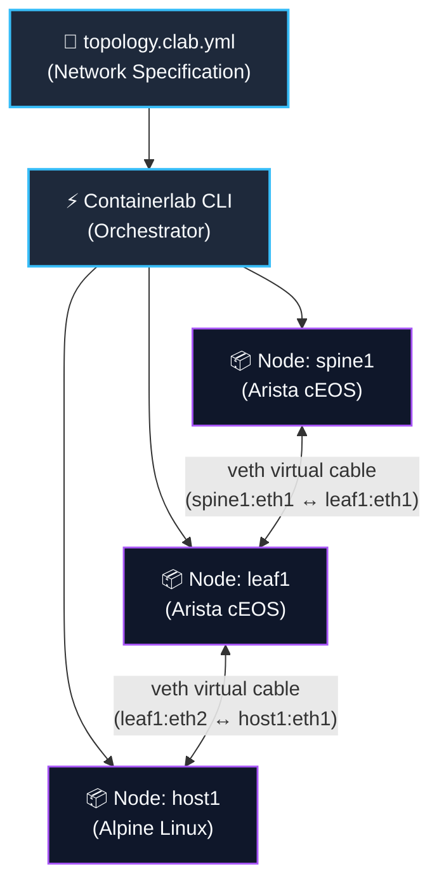

# Docker & Containerlab CLI Guide

> Every lab in NetForge Labs is powered by **Docker** and **Containerlab**.  
> This guide breaks down the structure of topology files (`topology.clab.yml`), how network fabrics are deployed and destroyed, and the essential CLI commands every network engineer needs for daily lab work.

---

## 🧠 Mental Model

For a network engineer, think of Docker and Containerlab working together as follows:

- **Docker (The Device Runtime)**: Creates and manages isolated Linux processes (containers) representing individual routers, switches, and hosts.
- **Containerlab (The Network Orchestrator)**: Reads your declarative topology YAML file, spins up the containers, and wires them together with virtual ethernet (veth) cable pairs.



---

## 📄 Anatomy of a Topology File (`topology.clab.yml`)

Every lab directory contains a `topology.clab.yml` definition structured into three simple sections:

```yaml
name: ceos-evpn                    # 1. Lab name

topology:
  nodes:                           # 2. Network nodes (Routers / Switches / Hosts)
    spine1:
      kind: arista_ceos            # Device kind
      image: ceos:4.32.0F          # Container image to boot
    leaf1:
      kind: arista_ceos
      image: ceos:4.32.0F
    host1:
      kind: linux                  # Standard Linux client host
      image: alpine:latest

  links:                           # 3. Inter-device wiring
    - endpoints: ["spine1:eth1", "leaf1:eth1"]
    - endpoints: ["leaf1:eth2", "host1:eth1"]
```

### Key Conventions:
1. **Container Naming**: Containerlab automatically formats container names as `clab-<lab_name>-<node_name>` (e.g. `clab-ceos-evpn-spine1`).
2. **Interface Naming**: Always use lowercase **`eth1`, `eth2`** in the topology file. Inside Arista EOS, they are mapped to `Ethernet1`, `Ethernet2`.

---

## ⚡ Essential Containerlab CLI Commands

### 1. Deploy the Fabric
```bash
# Standard deployment
sudo containerlab deploy -t topology.clab.yml

# Recommended on macOS Apple Silicon (prevents parallel boot-race)
sudo containerlab deploy -t topology.clab.yml --max-workers 1
```
*(Creates containers, assigns management IPs, and establishes veth link pairs in seconds).*

### 2. Inspect Running Labs
```bash
sudo containerlab inspect -t topology.clab.yml
```
*(Displays a clean tabular summary of container names, IPv4/IPv6 management addresses, and port mappings).*

### 3. Visual Web Topology (Graph)
```bash
sudo containerlab graph -t topology.clab.yml
```
*(Launches a local lightweight web server and provides an interactive browser-based visualization of your topology).*

### 4. Destroy & Clean Up
```bash
# Destroy current lab
sudo containerlab destroy -t topology.clab.yml

# Deep cleanup (also removes generated lab directory and node flash files)
sudo containerlab destroy -t topology.clab.yml --cleanup

# Destroy all leftover/orphaned containerlab deployments
sudo containerlab destroy --all
```

---

## 🐳 Essential Docker Commands for Network Engineers

Once Containerlab brings up the topology, use standard Docker commands to interact with the nodes:

### 1. Enter the Switch CLI
Directly enter the Arista EOS interactive CLI:
```bash
docker exec -it clab-ceos-evpn-leaf1 Cli
```
*(Once inside, run familiar commands: `leaf1> enable`, `show ip route`, `show interfaces status`).*

### 2. Run Single Commands from Outside
Execute a command directly without opening an interactive session:
```bash
docker exec clab-ceos-evpn-leaf1 Cli -c "show interfaces status"
```

### 3. Enter the Underlying Linux Shell
Because Arista EOS runs on top of Linux, you can inspect the Linux namespace directly:
```bash
docker exec -it clab-ceos-evpn-leaf1 bash
```

### 4. Check Running Containers
```bash
docker ps
```
*(Verify node status, uptime, and container names).*

### 5. Follow Container Startup Logs
```bash
docker logs -f clab-ceos-evpn-spine1
```

---

## 📋 Quick Reference Cheat Sheet

| Task | Command | Description |
|---|---|---|
| **Deploy Lab** | `sudo containerlab deploy -t <file.yml> --max-workers 1` | Recommended on macOS Apple Silicon |
| **Inspect Lab** | `sudo containerlab inspect -t <file.yml>` | View node IPs and port mappings |
| **Graph Topology** | `sudo containerlab graph -t <file.yml>` | Interactive browser diagram |
| **Destroy Lab** | `sudo containerlab destroy -t <file.yml>` | Tear down containers and veth links |
| **Destroy All** | `sudo containerlab destroy --all` | Wipe all orphaned labs |
| **Switch CLI** | `docker exec -it <container-name> Cli` | Open native Arista EOS prompt |
| **List Containers** | `docker ps` | View all active containers |

---

### 🚀 Next Steps:
To see how Linux Network Namespaces and virtual ethernet (veth) pairs work under the hood, proceed to **[Page 3 · How the Lab Works →](how-the-lab-works.md)**.
