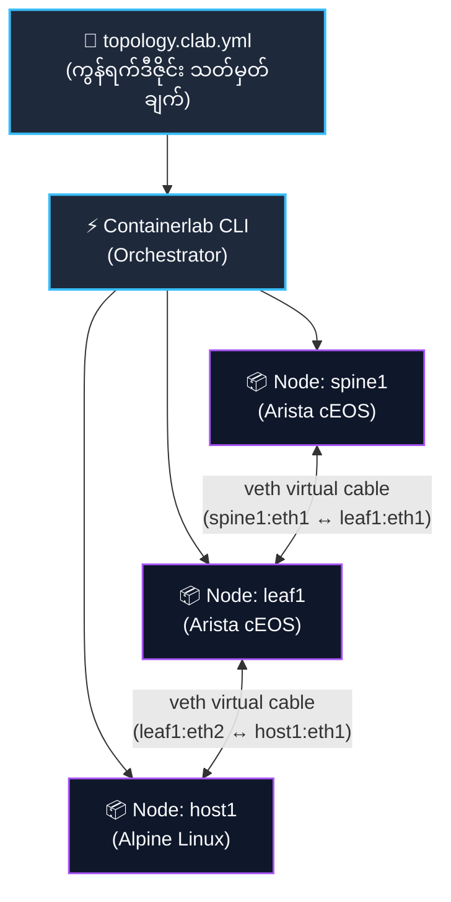

# Docker & Containerlab CLI အခြေခံလမ်းညွှန်

> NetForge Labs တွင် လက်တွေ့ စမ်းသပ်မှုတိုင်းကို **Docker** နှင့် **Containerlab** ဖြင့် မောင်းနှင်ထားပါသည်။  
> ဤလမ်းညွှန်သည် Topology ဖိုင်များ (`topology.clab.yml`) တည်ဆောက်ပုံ၊ ကွန်ရက်ခလုတ်များကို deploy / destroy လုပ်ပုံနှင့် အင်ဂျင်နီယာတစ်ယောက် နေ့စဉ် မဖြစ်မနေ သုံးရမည့် CLI commands များကို အစအဆုံး ရှင်းလင်းတင်ပြထားပါသည်။

---

## 🧠 အခြေခံ အယူအဆ (Mental Model)

ကွန်ရက်အင်ဂျင်နီယာတစ်ယောက်အတွက် Docker နှင့် Containerlab ၏ အခန်းကဏ္ဍကို အောက်ပါအတိုင်း နားလည်နိုင်ပါသည်:

- **Docker (စက်ပစ္စည်းတည်ဆောက်သူ)**: Router, Switch သို့မဟုတ် Host တစ်ခုချင်းစီကို သီးခြား isolated Linux process (container) တစ်ခုအဖြစ် ဖန်တီးပေးသည့် runtime အင်ဂျင် ဖြစ်သည်။
- **Containerlab (ကွန်ရက်ချိတ်ဆက်မောင်းနှင်သူ)**: သင် ရေးဆွဲထားသော topology YAML ဖိုင်ကို ဖတ်ရှုပြီး၊ Docker container များကို အလိုအလျောက် တည်ဆောက်ပေးကာ ၎င်းတို့အကြားသို့ virtual ethernet (veth) ကွန်ရက်ကြိုးများ ချိတ်ဆက်ပေးသည့် orchestration tool ဖြစ်သည်။



---

## 📄 Topology ဖိုင် (`topology.clab.yml`) တည်ဆောက်ပုံ အသေးစိတ်

NetForge Labs ၏ lab တိုင်းတွင် `topology.clab.yml` ဖိုင်တစ်ခုစီ ပါဝင်ပါသည်။ ၎င်းသည် ရိုးရှင်းသော အဓိက အပိုင်း (၃) ပိုင်းဖြင့် ဖွဲ့စည်းထားပါသည်:

```yaml
name: ceos-evpn                    # ၁။ Lab ၏ အမည်

topology:
  nodes:                           # ၂။ ပါဝင်မည့် Routers / Switches / Hosts များ
    spine1:
      kind: arista_ceos            # စက်အမျိုးအစား (kind)
      image: ceos:4.32.0F          # အသုံးပြုမည့် Docker image
    leaf1:
      kind: arista_ceos
      image: ceos:4.32.0F
    host1:
      kind: linux                  # ရိုးရိုး Linux client host
      image: alpine:latest

  links:                           # ၃။ စက်များအချင်းချင်း ကြိုးချိတ်ဆက်မှုများ
    - endpoints: ["spine1:eth1", "leaf1:eth1"]
    - endpoints: ["leaf1:eth2", "host1:eth1"]
```

### အဓိက သတိပြုဖွယ် အချက်များ:
1. **Container အမည်ပေးပုံ**: Containerlab သည် container အမည်များကို `clab-<lab_name>-<node_name>` အဖြစ် အလိုအလျောက် သတ်မှတ်ပါသည် (ဥပမာ `clab-ceos-evpn-spine1`)။
2. **Interface အမည်သတ်မှတ်မှု**: Topology ဖိုင်ထဲတွင် အမြဲတမ်း စာလုံးသေး **`eth1`, `eth2`** ဟုသာ ရေးရပါမည်။ (Arista switch OS ထဲတွင် ၎င်းတို့ကို `Ethernet1`, `Ethernet2` အဖြစ် အလိုအလျောက် ပြောင်းလဲမြင်တွေ့ရမည် ဖြစ်သည်)။

---

## ⚡ မဖြစ်မနေ သိထားရမည့် Containerlab CLI Commands

### ၁။ Lab စတင် ဖွင့်လှစ်ခြင်း (Deploy)
```bash
# သာမန် Deploy ပြုလုပ်ခြင်း
sudo containerlab deploy -t topology.clab.yml

# Apple Silicon (Mac) များတွင် Boot-Race မဖြစ်စေရန် စနစ်တကျ deploy ပြုလုပ်ခြင်း
sudo containerlab deploy -t topology.clab.yml --max-workers 1
```
*(Containers များ တည်ဆောက်ခြင်း၊ IP address များ ခွဲဝေခြင်းနှင့် ကြိုးများ ချိတ်ဆက်ခြင်းကို စက္ကန့်ပိုင်းအတွင်း အလိုအလျောက် ဆောင်ရွက်ပေးပါသည်)*

### ၂။ လက်ရှိ Lab အခြေအနေကို စစ်ဆေးခြင်း (Inspect)
```bash
sudo containerlab inspect -t topology.clab.yml
```
*(Node အားလုံး၏ Container Name၊ IPv4/IPv6 Management IP၊ သက်ဆိုင်ရာ Port Mappings များနှင့် အခြေအနေကို ဇယားကွက်ဖြင့် သေသပ်စွာ ပြသပေးပါသည်)*

### ၃။ Visual Web Topology ဖြင့် ပုံဆွဲကြည့်ရှုခြင်း (Graph)
```bash
sudo containerlab graph -t topology.clab.yml
```
*(သင့်စက်တွင်း၌ local web server တစ်ခု ဖွင့်ပေးပြီး၊ Browser မှတစ်ဆင့် ကွန်ရက် topology ချိတ်ဆက်ပုံ diagram ကို အပြန်အလှန် လှည့်ပတ်ကြည့်ရှုနိုင်ပါသည်)*

### ၄။ Lab ကို ပြန်လည်ဖျက်သိမ်းခြင်း (Destroy)
```bash
# လက်ရှိ lab တစ်ခုတည်းကို ဖျက်ရန်
sudo containerlab destroy -t topology.clab.yml

# ဖိုင်တွဲများနှင့် configuration cache များကိုပါ အပြီးရှင်းထုတ်ရန်
sudo containerlab destroy -t topology.clab.yml --cleanup

# စက်ထဲရှိ မေ့ကျန်နေသော lab အဟောင်းများအားလုံးကို အမြစ်ပြတ် ရှင်းထုတ်ရန်
sudo containerlab destroy --all
```

---

## 🐳 ကွန်ရက်အင်ဂျင်နီယာများ နေ့စဉ်သုံးရမည့် Docker Commands

Containerlab ဖြင့် lab တက်လာပြီးပါက၊ အောက်ပါ Docker command များဖြင့် switch များကို ထိန်းချုပ်မောင်းနှင်ရပါသည်:

### ၁။ Switch ထဲသို့ ဝင်ရောက်ခြင်း (CLI Access)
Arista cEOS switch CLI ထဲသို့ တိုက်ရိုက် ဝင်ရောက်ရန်:
```bash
docker exec -it clab-ceos-evpn-leaf1 Cli
```
*(ဝင်ရောက်ပြီးပါက ရင်းနှီးပြီးသားဖြစ်သော `leaf1> enable` မှတစ်ဆင့် `show ip route` စသည့် switch command များကို ပုံမှန်အတိုင်း စတင်အသုံးပြုနိုင်ပါသည်)*

### ၂။ Switch အား command တစ်ကြောင်းတည်း အပြင်မှ လှမ်းမေးခြင်း
Switch CLI ထဲ ဝင်မနေဘဲ Terminal မှ တိုက်ရိုက် output ထုတ်ယူလိုပါက:
```bash
docker exec clab-ceos-evpn-leaf1 Cli -c "show interfaces status"
```

### ၃။ Switch ၏ အတွင်းပိုင်း Linux Shell ထဲသို့ ဝင်ရောက်ခြင်း
Arista EOS သည် Linux OS ပေါ်တွင် တည်ဆောက်ထားသဖြင့် bash shell ကိုလည်း တိုက်ရိုက် လေ့လာနိုင်ပါသည်:
```bash
docker exec -it clab-ceos-evpn-leaf1 bash
```

### ၄။ လက်ရှိ လည်ပတ်နေသော Containers များကို စစ်ဆေးခြင်း
```bash
docker ps
```
*(စက်ပေါ်တွင် မည်သည့် switch များနှင့် host များ run နေသလဲ၊ အချိန် မည်မျှကြာမြင့်ပြီလဲ ဆိုသည်ကို ချက်ချင်း စစ်ဆေးနိုင်ပါသည်)*

### ၅။ Switch စတင်တက်လာသည့် Logs များကို တိုက်ရိုက် စောင့်ကြည့်ခြင်း
```bash
docker logs -f clab-ceos-evpn-spine1
```

---

## 📋 လက်စွဲ Command အကျဉ်းချုပ် (Quick Reference Cheat Sheet)

| လုပ်ဆောင်ချက် | အသုံးပြုရမည့် Command | မှတ်ချက် |
|---|---|---|
| **Lab Deploy လုပ်ရန်** | `sudo containerlab deploy -t <file.yml> --max-workers 1` | Mac ပေါ်တွင် `--max-workers 1` အမြဲတွဲသုံးပါ |
| **Lab အခြေအနေကြည့်ရန်** | `sudo containerlab inspect -t <file.yml>` | Mgmt IP နှင့် ports များကို ပြသသည် |
| **Topology ပုံကြည့်ရန်** | `sudo containerlab graph -t <file.yml>` | Browser တွင် visual diagram ပြသသည် |
| **Lab ဖျက်သိမ်းရန်** | `sudo containerlab destroy -t <file.yml>` | Container နှင့် ကြိုးများကို ရှင်းထုတ်သည် |
| **Lab အားလုံး ရှင်းထုတ်ရန်** | `sudo containerlab destroy --all` | ကျန်နေသော container ဟောင်းများ ရှင်းသည် |
| **Switch CLI ဝင်ရန်** | `docker exec -it <container-name> Cli` | Arista EOS prompt သို့ ရောက်ရှိမည် |
| **Container အခြေအနေစစ်ရန်** | `docker ps` | လည်ပတ်နေသော nodes အားလုံး ပြသသည် |

---

### 🚀 နောက်တစ်ဆင့် လေ့လာရန်:
Containerlab ၏ အောက်ခြေတွင် Linux Network Namespaces နှင့် Virtual Ethernet (veth) ကြိုးများ မည်သို့ အလုပ်လုပ်နေသလဲဆိုသည်ကို **[စာမျက်နှာ ၃ · Lab နည်းပညာ အလုပ်လုပ်ပုံ (How the Lab Works) →](how-the-lab-works.md)** တွင် ဆက်လက်လေ့လာနိုင်ပါသည်။
