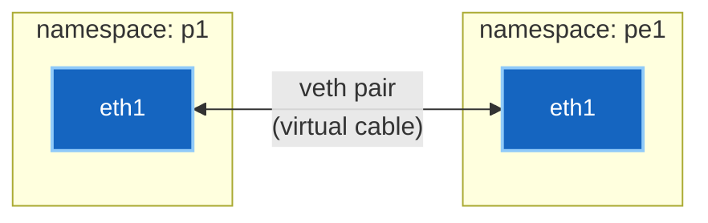

# Lab နည်းပညာ အလုပ်လုပ်ပုံ — Namespaces နှင့် veth Pairs

Laptop တစ်လုံးတည်းပေါ်တွင် သီးခြား routing tables များ ပါဝင်သော routers ၁၂ လုံးပါ fabric တစ်ခုကို မည်သို့ မောင်းနှင်လည်ပတ်နိုင်သနည်း။
အဓိကအားဖြင့် Linux ၏ စွမ်းဆောင်ချက် ၂ ခုက ဤအရာအားလုံးကို အလုပ်လုပ်စေခြင်း ဖြစ်ပါသည်။

---

## စိတ်ကူးပုံဖော်မှု မော်ဒယ် (The Mental Model)

**Network Namespace** ဆိုသည်မှာ Linux network stack တစ်ခုလုံး၏ သီးသန့်မိတ္တူ (private copy) တစ်ခုဖြစ်ပါသည်: ၎င်းတွင် ကိုယ်ပိုင် interfaces၊ ကိုယ်ပိုင် routing table၊ ကိုယ်ပိုင် ARP cache နှင့် ကိုယ်ပိုင် firewall rules များ ပါဝင်သည်။

၎င်းကို လုံခြုံစွာ ပိတ်ထားသော အခန်းတစ်ခန်းကဲ့သို့ မြင်ယောင်ကြည့်ပါ။ အတွင်းရှိ process တစ်ခုသည် ကွန်ပျူတာတစ်လုံးစာ networking အပြည့်အစုံကို မြင်တွေ့ရပြီး အပြင်ဘက်ရှိ မည်သည့်အရာကိုမျှ မမြင်နိုင်ပါ။ Namespaces နှစ်ခုစလုံးတွင် `eth1` ဟုခေါ်သော interface အသီးသီး ရှိနိုင်ပြီး နှစ်ခုစလုံးက `10.1.1.1` ကို အသုံးပြုနိုင်ကာ တစ်ခုနှင့်တစ်ခု တည်ရှိနေမှန်း မသိသောကြောင့် collision လုံးဝ မဖြစ်ပေါ်ပါ။

ဒါဟာ အဓိက လျှို့ဝှက်ချက် ဖြစ်ပါသည်။ "Routers" ၁၂ လုံးဆိုသည်မှာ Linux kernel တစ်ခုတည်းပေါ်ရှိ သီးခြားပိတ်ထားသော အခန်း ၁၂ ခန်းသာ ဖြစ်ပါသည်။

**veth Pair (Virtual Ethernet Pair)** ဆိုသည်မှာ အဆိုပါ အခန်းများကြား ချိတ်ဆက်ထားသော virtual network cable ဖြစ်ပါသည်။ ၎င်းကို အပြန်အလှန် ချိတ်ဆက်ထားသော interfaces နှစ်ခုအဖြစ် ဖန်တီးထားပါသည်: ခေါင်းတစ်ဖက်မှ ဝင်လာသော packet သည် အခြားတစ်ဖက်မှ ချက်ချင်း ပြန်ထွက်ပါသည်။ ထိပ်တစ်ဖက်စီကို namespace တစ်ခုစီထဲသို့ ထည့်သွင်းလိုက်ပါက routers နှစ်လုံးကို cable ဖြင့် ချိတ်ဆက်လိုက်သကဲ့သို့ ဖြစ်သွားပါသည်။



**ဒါဟာ containerlab လုပ်ဆောင်ပေးတဲ့ အလုပ်ဖြစ်ပါတယ်။** ၎င်းသည် သင်၏ `topology.clab.yml` ကို ဖတ်ရှုပြီး node တစ်ခုချင်းစီအတွက် container တစ်ခုစီ (ကိုယ်ပိုင် namespace ပါဝင်သည်) ကို စတင်ပေးကာ link တစ်ခုချင်းစီအတွက် veth pair တစ်ခုစီ တည်ဆောက်ပြီး ထိပ်တစ်ဖက်စီကို namespace များအတွင်းသို့ ထည့်သွင်းပေးပါသည်။

---

## လည်ပတ်နေသော Fabric ပေါ်တွင် လက်တွေ့ စစ်ဆေးကြည့်ရှုခြင်း

အောက်ပါ command များအားလုံးကို တိုက်ရိုက် run ထားသော `ceos-mpls-scratch` topology ပေါ်တွင် စမ်းသပ်ထားခြင်း ဖြစ်ပါသည်။

### Namespace ကို ရှာဖွေခြင်း

Container တစ်ခု၏ namespace သည် ၎င်း၏ main process ပေါ်တွင် တည်ရှိသောကြောင့် PID ကို ဦးစွာ ရယူပါ:

```bash
docker inspect -f '{{.State.Pid}}' clab-ceos-mpls-scratch-p1
```

```
30498
```

`nsenter` သည် အဆိုပါ process ၏ namespace အတွင်း command တစ်ခုကို run ပေးပါသည်။ `-n` ဆိုသည်မှာ "network namespace သီးသန့်" ကို ဆိုလိုပါသည်:

```bash
sudo nsenter -t 30498 -n ip -br addr show
```

```
lo               UNKNOWN        127.0.0.1/24 ::1/128
eth0@if41        UP             172.20.20.3/24 fe80::d4be:b1ff:fecc:3abe/64
cpu              UNKNOWN
fabric           UNKNOWN
arpsnoop         UNKNOWN
mirror0          UNKNOWN
```

`eth0` သည် containerlab ၏ management network ဖြစ်သည်။ `cpu`၊ `fabric` နှင့် `arpsnoop` interfaces များသည် cEOS switch hardware ကို emulate လုပ်ထားသည့် internal plumbing များ ဖြစ်ပါသည်။

### Data-Plane ချိတ်ဆက်မှု Links များ

```bash
sudo nsenter -t 30498 -n ip -br link show | grep -E '^eth[12]'
```

```
eth2@if40        UP             aa:c1:ab:05:1c:ec <BROADCAST,MULTICAST,UP,LOWER_UP>
eth1@if42        UP             aa:c1:ab:ef:12:a4 <BROADCAST,MULTICAST,UP,LOWER_UP>
```

`@ifN` suffix ကို သတိပြုပါ — ၎င်းသည် **တစ်ဖက်အစွန်းရှိ peer interface index** ဖြစ်သည်။ `eth1@if42` ဆိုသည်မှာ "ကျွန်ုပ်၏ အခြားတစ်ဖက်ခေါင်းသည် interface နံပါတ် 42 ဖြစ်သည်" ဟု ဆိုလိုခြင်း ဖြစ်သည်။

### Cable သည် အိမ်နီးချင်းစက်ဆီသို့ အမှန်တကယ် ရောက်ရှိကြောင်း သက်သေ

```bash
sudo nsenter -t 30498 -n ip -d link show eth1
```

```
43: eth1@if42: <BROADCAST,MULTICAST,UP,LOWER_UP> mtu 1500 ...
    link/ether aa:c1:ab:ef:12:a4 brd ff:ff:ff:ff:ff:ff
    link-netns clab-ceos-mpls-scratch-pe1 promiscuity 0
    veth addrgenmode eui64 ...
```

အဓိက အချက် ၃ ချက်:

- **`43: eth1@if42`** — ဤ interface သည် index 43 ဖြစ်ပြီး peer သည် index 42 ဖြစ်သည်။
- **`link-netns clab-ceos-mpls-scratch-pe1`** — အခြားတစ်ဖက်သည် **pe1 ၏ namespace** တွင် ရှိနေသည်။ Kernel ကိုယ်တိုင်က cable ချိတ်ဆက်မှုကို တိကျစွာ ပြသနေခြင်း ဖြစ်သည်။
- **`veth`** — Device type ဖြစ်သည်။ Hardware အတု မဟုတ်ဘဲ Linux kernel construct စစ်စစ် ဖြစ်သည်။

ထို့ကြောင့် topology ဖိုင်ထဲရှိ `p1:eth1 ↔ pe1:eth1` သည် လက်တွေ့တွင် ထိပ်တစ်ဖက်စီ namespace တစ်ခုစီ၌ တည်ရှိသော veth pair တစ်ခုသာ ဖြစ်ပါသည်။

!!! tip "ဒါဟာ Cabling အမှား ရှာဖွေဖို့ အမြန်ဆုံး နည်းလမ်းဖြစ်ပါတယ်"
    Lab တွင် adjacency မတက်ဘဲ ကြိုးမှားချိတ်မိသည်ဟု သံသယရှိပါက `ip -d link show <intf>` ကို run ပြီး `link-netns` ကို ကြည့်ပါ။ Topology ဖိုင်ထဲတွင် ရေးထားသည်ထက် interface သည် *လက်တွေ့ မည်သည့်နေရာသို့ ချိတ်ဆက်ထားသည်* ကို တိကျစွာ ပြသပေးပါမည်။

---

## အတွင်းပိုင်းရှိ Routing Table ဖွဲ့စည်းပုံ

p1 စက်၏ Linux routing table ကို ကြည့်ပါ:

```bash
sudo nsenter -t 30498 -n ip route
```

```
blackhole 0.0.0.0/8 proto gated scope nowhere
default via 172.20.20.1 dev eth0 proto gated
2.2.2.2 via 10.1.1.2 dev eth1 proto gated metric 20
3.3.3.3 via 10.1.2.2 dev eth2 proto gated metric 20
10.1.1.0/24 dev eth1 proto kernel scope link src 10.1.1.1
10.1.2.0/24 dev eth2 proto kernel scope link src 10.1.2.1
```

အဆိုပါ `2.2.2.2` နှင့် `3.3.3.3` entries များသည် **Lab မှ လေ့လာရသော OSPF routes များ** ဖြစ်သည် — `show ip route` တွင် တွေ့ရသော routes များနှင့် အတူတူပင် ဖြစ်ပါသည်။ ဤနေရာတွင် သာမန် Linux kernel routes အဖြစ် တည်ရှိနေသည်။

`proto gated` သည် ထည့်သွင်းပေးသူကို ဖော်ပြပါသည်: Kernel မဟုတ်ဘဲ Routing daemon က ထည့်သွင်းပေးခြင်း ဖြစ်သည်။ Interfaces များ IP ရရှိချိန်တွင် kernel က ထည့်ပေးသော `proto kernel` routes များနှင့် နှိုင်းယှဉ်ကြည့်နိုင်ပါသည်။

!!! note "NOS ဆိုတာ တကယ်တော့ ဘာလဲ"
    Network Operating System ဆိုသည်မှာ **Kernel ၏ forwarding table (FIB) ကို program ပြုလုပ်ပေးသော routing daemon တစ်ခု** ဖြစ်ပါသည်။ OSPF နှင့် BGP တို့သည် user space တွင် အလုပ်လုပ်ပြီး အကောင်းဆုံးလမ်းကြောင်းများကို တွက်ချက်ကာ အနိုင်ရသော လမ်းကြောင်းများကို packets များ အမှန်တကယ် ပို့ဆောင်ပေးသည့် FIB ထဲသို့ ထည့်သွင်းပေးခြင်း ဖြစ်သည်။

    `show ip route` ဆိုသည်မှာ အဆိုပါ routing table နှင့် daemon ၏ အချက်အလက်များကို လူဖတ်ရလွယ်အောင် ပုံစံထုတ်ပြထားခြင်းသာ ဖြစ်သည်။ ဤသဘောတရားကို နားလည်ပါက SONiC နှင့် cRPD ကဲ့သို့သော Linux အခြေပြု NOS များ အဘယ်ကြောင့် ခေတ်စားလာသည်ကို သဲကွဲစွာ သဘောပေါက်စေမည် ဖြစ်ပါသည်။

---

## လက်ဖြင့် ကိုယ်တိုင် စမ်းသပ်ကြည့်ခြင်း

သီးခြား namespaces နှစ်ခုကို cable တစ်ခုဖြင့် ချိတ်ဆက်ခြင်း — command ၆ ခုဖြင့် အခြေခံမှ စတင် စမ်းသပ်နိုင်သည်:

```bash
sudo ip netns add r1
sudo ip netns add r2
sudo ip link add veth-r1 type veth peer name veth-r2
sudo ip link set veth-r1 netns r1
sudo ip link set veth-r2 netns r2
sudo ip netns exec r1 ip addr add 10.0.0.1/30 dev veth-r1
sudo ip netns exec r1 ip link set veth-r1 up
sudo ip netns exec r2 ip addr add 10.0.0.2/30 dev veth-r2
sudo ip netns exec r2 ip link set veth-r2 up
sudo ip netns exec r1 ping -c2 10.0.0.2
```

စမ်းသပ်ပြီးပါက `sudo ip netns del r1 r2` ဖြင့် ပြန်ဖျက်နိုင်သည် — namespace ကို ဖျက်လိုက်ပါက အတွင်းရှိ veth ထိပ်များ အပါအဝင် အရာအားလုံး အလိုအလျောက် ပျက်ပြယ်သွားပါမည်။

---

## ချို့ယွင်းတတ်သော အခြေအနေများ

| ပြဿနာလက္ခဏာ | အကြောင်းရင်း |
|---|---|
| Container အတွင်း Interface ပျောက်ဆုံးနေခြင်း | veth ထိပ်ကို namespace အတွင်းသို့ မရွှေ့ပြောင်းနိုင်ခြင်း — topology သို့မဟုတ် wiring အမှား |
| `ip link` တွင် interface ပြသသော်လည်း NOS တွင် မပေါ်ခြင်း | Name mismatch — NOS က အခြား interface pattern ကို စောင့်ကြည့်နေခြင်း |
| Interface ရှိသော်လည်း traffic မသွားခြင်း | အခြားတစ်ဖက် down နေခြင်း သို့မဟုတ် namespace မှားယွင်းနေခြင်း — `link-netns` ကို စစ်ဆေးပါ |
| Restart ပြုလုပ်ပြီးနောက် အရာအားလုံး ပျောက်ဆုံးသွားခြင်း | Namespace ပျက်စီးသွားပြီး veths များပါ တစ်ပါတည်း ပျက်စီးသွားခြင်း |

!!! warning "Lab node တစ်ခုကို `docker restart` လုံးဝ မလုပ်ပါနှင့်"
    veth pairs များကို containerlab က ဖန်တီးပြီး container ၏ namespace အတွင်းသို့ ထည့်သွင်းပေးထားခြင်း ဖြစ်သည်။ Restart ပြုလုပ်ခြင်းသည် အဆိုပါ namespace ကို ဖျက်ဆီးပစ်လိုက်ပြီး veths များကိုပါ တစ်ပါတည်း ဖျက်ပစ်လိုက်ပါမည်။ Container ပြန်တက်လာချိန်တွင် data-plane links များ လုံးဝ ပါလာတော့မည် မဟုတ်ပါ။

    အမြဲတမ်း topology ကို destroy ပြုလုပ်ပြီး redeploy ပြန်လုပ်ပါ။

---

**ဆက်လက်လေ့လာရန်:** [Lab ပြဿနာ ဖြေရှင်းနည်းများ →](lab-troubleshooting.md)
