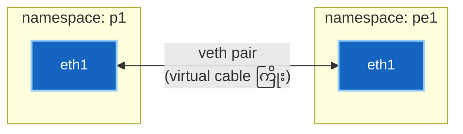

# Lab နည်းပညာ အလုပ်လုပ်ပုံ — Namespaces နှင့် veth Pairs

> Laptop တစ်လုံးတည်း သို့မဟုတ် Cloud VM တစ်ခုတည်းပေါ်တွင် သီးခြား routing tables များ အပြည့်အစုံ ကိုင်ဆောင်ထားသော routers ၁၂ လုံးပါ fabric ကြီးတစ်ခုလုံးကို မည်သို့ စွမ်းဆောင်ရည်ပြည့်ဝစွာ မောင်းနှင်လည်ပတ်နိုင်သနည်း။  
> အဖြေမှာ အလွန်ရိုးရှင်းပါသည် — **Linux Kernel ၏ အဓိက စွမ်းဆောင်ချက် (၂) ခု** က ဤအရာအားလုံးကို နောက်ကွယ်မှ အလုပ်လုပ်ပေးနေခြင်း ဖြစ်ပါသည်။

---

## 🧠 သဘောတရားကို စိတ်ကူးပုံဖော်ကြည့်ခြင်း (The Mental Model)

Linux တွင် ကွန်ရက် စက်ပစ္စည်းများကို virtual အဖြစ် ခွဲထုတ်ပေးသည့် အဓိက နည်းပညာ (၂) ခု ရှိပါသည်:

### ၁။ Network Namespace (သီးခြားလုံခြုံသော အခန်း)
**Network Namespace** ဆိုသည်မှာ Linux network stack တစ်ခုလုံး၏ သီးသန့်မိတ္တူ (private copy) တစ်ခု ဖြစ်ပါသည်။ ၎င်းတွင် ကိုယ်ပိုင် interfaces များ၊ ကိုယ်ပိုင် routing table၊ ကိုယ်ပိုင် ARP cache နှင့် ကိုယ်ပိုင် firewall rules များ ပါဝင်သည်။

၎င်းကို လုံခြုံစွာ ပိတ်ထားသော **အခန်းတစ်ခန်း** ကဲ့သို့ မြင်ယောင်ကြည့်ပါ:
- အခန်းတွင်းရှိ process (routing daemon) တစ်ခုသည် ကွန်ပျူတာတစ်လုံးစာ networking အပြည့်အစုံကို မြင်တွေ့ရပြီး အပြင်ဘက်ရှိ မည်သည့်အရာကိုမျှ မမြင်နိုင်ပါ။
- သီးခြား namespaces နှစ်ခုစလုံးတွင် `eth1` ဟုခေါ်သော interface အသီးသီး ရှိနိုင်ပြီး၊ နှစ်ခုစလုံးက `10.1.1.1` IP ကို တပြိုင်နက် သုံးနိုင်ကာ တစ်ခုနှင့်တစ်ခု တည်ရှိနေမှန်း မသိသောကြောင့် IP collision လုံးဝ မဖြစ်ပေါ်ပါ။

> 💡 **လျှို့ဝှက်ချက်:** "Routers" ၁၂ လုံးဆိုသည်မှာ စစ်မှန်သော Linux kernel တစ်ခုတည်းပေါ်တွင် သီးခြား ပိတ်ထားသော အခန်း ၁၂ ခန်းသာ ဖြစ်ပါသည်။

### ၂။ veth Pair (အခန်းများကြား ဆက်သွယ်ပေးသော ကွန်ရက်ကြိုး)
**veth Pair (Virtual Ethernet Pair)** ဆိုသည်မှာ အဆိုပါ အခန်းများအကြား ဆက်သွယ်ထားသည့် virtual network cable (ကွန်ရက်ကြိုး) ဖြစ်ပါသည်။ ၎င်းကို အစွန်းနှစ်ဖက် အပြန်အလှန် ချိတ်ဆက်ထားသော interfaces နှစ်ခုအဖြစ် ဖန်တီးထားပါသည်:
- ခေါင်းတစ်ဖက်မှ ဝင်လာသော data packet သည် အခြားတစ်ဖက်ခေါင်းမှ ချက်ချင်း ပြန်ထွက်ပါသည်။
- ကြိုးခေါင်းတစ်ဖက်စီကို namespace တစ်ခုစီထဲသို့ ထည့်သွင်းလိုက်ပါက routers နှစ်လုံးကို cable ကြိုးဖြင့် ချိတ်ဆက်လိုက်သကဲ့သို့ ဖြစ်သွားပါသည်။



**ဒါဟာ Containerlab လုပ်ဆောင်ပေးတဲ့ အဓိကအလုပ် ဖြစ်ပါတယ်။**  
၎င်းသည် သင်၏ `topology.clab.yml` ကို ဖတ်ရှုပြီး node တစ်ခုချင်းစီအတွက် container တစ်ခုစီ (ကိုယ်ပိုင် namespace ပါဝင်သည်) ကို ဖွင့်လှစ်ပေးကာ၊ link တစ်ခုချင်းစီအတွက် veth pair တစ်ခုစီ တည်ဆောက်ပြီး ထိပ်တစ်ဖက်စီကို သက်ဆိုင်ရာ namespace များအတွင်းသို့ ထည့်သွင်းတပ်ဆင်ပေးခြင်း ဖြစ်ပါသည်။

---

## 🔍 လည်ပတ်နေသော Fabric ပေါ်တွင် လက်တွေ့ စစ်ဆေးကြည့်ရှုခြင်း

အောက်ပါ command များကို လက်တွေ့ run ထားသော `ceos-mpls-scratch` topology ပေါ်တွင် စမ်းသပ်ပြသထားခြင်း ဖြစ်ပါသည်။

### အဆင့် ၁ · Container ၏ Namespace PID ကို ရှာဖွေခြင်း
Container တစ်ခု၏ namespace သည် ၎င်း၏ main process ပေါ်တွင် တည်ရှိသောကြောင့် process ID (PID) ကို ဦးစွာ စစ်ဆေးပါ:

```bash
docker inspect -f '{{.State.Pid}}' clab-ceos-mpls-scratch-p1
```
*(ဥပမာ PID `30498` ဟု ရရှိပါမည်)*

`nsenter` command သည် host ပေါ်မှနေ၍ အဆိုပါ process ၏ network namespace (`-n`) အတွင်းသို့ ဝင်ရောက်ပြီး command များကို တိုက်ရိုက် run ပေးနိုင်ပါသည်:

```bash
sudo nsenter -t 30498 -n ip -br addr show
```

Output:
```text
lo               UNKNOWN        127.0.0.1/24 ::1/128
eth0@if41        UP             172.20.20.3/24 fe80::d4be:b1ff:fecc:3abe/64
cpu              UNKNOWN
fabric           UNKNOWN
arpsnoop         UNKNOWN
mirror0          UNKNOWN
```
- `eth0` သည် containerlab ၏ management network ဖြစ်သည်။
- `cpu`၊ `fabric` နှင့် `arpsnoop` interfaces များသည် cEOS switch hardware architecture ကို emulate လုပ်ထားသည့် internal plumbing များ ဖြစ်ပါသည်။

---

### အဆင့် ၂ · Data-Plane ချိတ်ဆက်မှု Links များကို စစ်ဆေးခြင်း

```bash
sudo nsenter -t 30498 -n ip -br link show | grep -E '^eth[12]'
```

Output:
```text
eth2@if40        UP             aa:c1:ab:05:1c:ec <BROADCAST,MULTICAST,UP,LOWER_UP>
eth1@if42        UP             aa:c1:ab:ef:12:a4 <BROADCAST,MULTICAST,UP,LOWER_UP>
```

`@ifN` suffix ကို သတိပြုကြည့်ပါ — ၎င်းသည် **တစ်ဖက်အစွန်းရှိ peer interface index** ဖြစ်သည်။  
`eth1@if42` ဆိုသည်မှာ *"ကျွန်ုပ် interface ၏ အခြားတစ်ဖက် ကေဘယ်လ်ခေါင်းသည် interface နံပါတ် 42 ဖြစ်သည်"* ဟု ဆိုလိုခြင်း ဖြစ်သည်။

---

### အဆင့် ၃ · Cable သည် အိမ်နီးချင်း Switch ဆီသို့ အမှန်တကယ် ရောက်ရှိကြောင်း သက်သေ

```bash
sudo nsenter -t 30498 -n ip -d link show eth1
```

Output:
```text
43: eth1@if42: <BROADCAST,MULTICAST,UP,LOWER_UP> mtu 1500 ...
    link/ether aa:c1:ab:ef:12:a4 brd ff:ff:ff:ff:ff:ff
    link-netns clab-ceos-mpls-scratch-pe1 promiscuity 0
    veth addrgenmode eui64 ...
```

အဓိက သက်သေ (၃) ချက်:
1. **`43: eth1@if42`** — ဤ interface သည် index 43 ဖြစ်ပြီး တစ်ဖက်ခေါင်းသည် index 42 ဖြစ်သည်။
2. **`link-netns clab-ceos-mpls-scratch-pe1`** — အခြားတစ်ဖက်ခေါင်းသည် **pe1 switch ၏ namespace** ထဲသို့ ရောက်ရှိနေသည်။ Linux Kernel ကိုယ်တိုင်က ကေဘယ်လ်ကြိုး ချိတ်ဆက်မှုကို တိကျစွာ သက်သေပြနေခြင်း ဖြစ်သည်။
3. **`veth`** — Device type သည် virtual ethernet ဖြစ်ပြီး hardware အတု မဟုတ်ဘဲ Linux kernel construct စစ်စစ် ဖြစ်သည်။

!!! tip "Cabling ကြိုးချိတ်ဆက်မှု အမှား ရှာဖွေရန် အမြန်ဆုံး နည်းလမ်း"
    Lab တွင် routing adjacency မတက်ဘဲ ကြိုးမှားချိတ်မိသည်ဟု သံသယရှိပါက `ip -d link show <intf>` ကို run ပြီး `link-netns` ကို ကြည့်ပါ။ Topology ဖိုင်ထဲတွင် ရေးထားသည်ထက် interface သည် *လက်တွေ့ မည်သည့် switch သို့ ချိတ်ဆက်ထားသည်* ကို တိကျစွာ ပြသပေးပါမည်။

---

## 🧭 အတွင်းပိုင်းရှိ Routing Table ဖွဲ့စည်းပုံ

p1 switch ၏ အောက်ခြေ Linux routing table ကို ကြည့်ရှုပါ:

```bash
sudo nsenter -t 30498 -n ip route
```

Output:
```text
blackhole 0.0.0.0/8 proto gated scope nowhere
default via 172.20.20.1 dev eth0 proto gated
2.2.2.2 via 10.1.1.2 dev eth1 proto gated metric 20
3.3.3.3 via 10.1.2.2 dev eth2 proto gated metric 20
10.1.1.0/24 dev eth1 proto kernel scope link src 10.1.1.1
10.1.2.0/24 dev eth2 proto kernel scope link src 10.1.2.1
```

အဆိုပါ `2.2.2.2` နှင့် `3.3.3.3` entries များသည် **Lab မှ လေ့လာရသော OSPF routes များ** ဖြစ်သည် — EOS ထဲတွင် `show ip route` ရိုက်ကြည့်လျှင် မြင်ရသော routes များနှင့် အတူတူပင် ဖြစ်ပါသည်။ ဤနေရာတွင် သာမန် Linux kernel routes အဖြစ် တည်ရှိနေသည်။

`proto gated` ဆိုသည်မှာ မည်သူက ထည့်သွင်းပေးခဲ့သလဲကို ဖော်ပြခြင်းဖြစ်သည်: Linux kernel မဟုတ်ဘဲ Arista ၏ routing daemon က ထည့်သွင်းပေးခြင်း ဖြစ်သည်။ Interfaces များ IP ရရှိချိန်တွင် kernel က ထည့်ပေးသော `proto kernel` (connected routes) များနှင့် နှိုင်းယှဉ်ကြည့်နိုင်ပါသည်။

!!! note "NOS (Network Operating System) ဆိုတာ တကယ်တော့ ဘာလဲ"
    Network Operating System ဆိုသည်မှာ အခြေခံအားဖြင့် **Linux Kernel ၏ forwarding table (FIB) ကို program ပြုလုပ်ပေးသော routing daemons အစုအဝေးတစ်ခု** ဖြစ်ပါသည်။  
    OSPF နှင့် BGP တို့သည် user space တွင် အလုပ်လုပ်ပြီး အကောင်းဆုံး လမ်းကြောင်းများကို တွက်ချက်ကာ အနိုင်ရသော လမ်းကြောင်းများကို packets များ အမှန်တကယ် ပို့ဆောင်ပေးသည့် FIB (Forwarding Information Base) ထဲသို့ ထည့်သွင်းပေးခြင်း ဖြစ်သည်။
    
    `show ip route` ဆိုသည်မှာ အဆိုပါ kernel routing table နှင့် routing daemon ၏ အချက်အလက်များကို အင်ဂျင်နီယာများ ဖတ်ရှုရလွယ်အောင် ပုံစံထုတ်ပြထားခြင်းသာ ဖြစ်သည်။ ဤသဘောတရားကို နားလည်ပါက SONiC, FRRouting နှင့် cRPD ကဲ့သို့သော Linux အခြေပြု NOS များ အဘယ်ကြောင့် ခေတ်စားလာသည်ကို ရှင်းလင်းစွာ သဘောပေါက်စေမည် ဖြစ်ပါသည်။

---

## 🛠️ Linux Commands ၆ ကြောင်းဖြင့် Routers ၂ လုံး လက်တွေ့ ချိတ်ဆက်စမ်းသပ်ခြင်း

Containerlab မသုံးဘဲ Linux terminal တစ်ခုတည်းပေါ်တွင် router ၂ လုံး တည်ဆောက်ပြီး ping ခေါ်ကြည့်နိုင်သည့် အခြေခံ command ၆ ကြောင်း:

```bash
# ၁။ သီးခြား network namespaces (routers) ၂ ခု ဖန်တီးပါ
sudo ip netns add r1
sudo ip netns add r2

# ၂။ Virtual cable ကြိုးတစ်ချောင်း (veth pair) ဖန်တီးပါ
sudo ip link add veth-r1 type veth peer name veth-r2

# ၃။ ကြိုးခေါင်းတစ်ဖက်စီကို သက်ဆိုင်ရာ router အခန်းထဲ ထည့်ပါ
sudo ip link set veth-r1 netns r1
sudo ip link set veth-r2 netns r2

# ၄။ r1 တွင် IP သတ်မှတ်ပြီး interface ကို ဖွင့်ပါ
sudo ip netns exec r1 ip addr add 10.0.0.1/30 dev veth-r1
sudo ip netns exec r1 ip link set veth-r1 up

# ၅။ r2 တွင် IP သတ်မှတ်ပြီး interface ကို ဖွင့်ပါ
sudo ip netns exec r2 ip addr add 10.0.0.2/30 dev veth-r2
sudo ip netns exec r2 ip link set veth-r2 up

# ၆။ r1 မှနေ၍ r2 ဆီသို့ ping ခေါ်ကြည့်ပါ!
sudo ip netns exec r1 ping -c2 10.0.0.2
```

စမ်းသပ်ပြီးပါက အောက်ပါ command ဖြင့် ပြန်ဖျက်နိုင်ပါသည်:
```bash
sudo ip netns del r1 r2
```
*(Namespace ကို ဖျက်လိုက်ပါက အတွင်းရှိ veth ကြိုးခေါင်းများ အပါအဝင် အရာအားလုံး အလိုအလျောက် သန့်ရှင်းစွာ ပျက်ပြယ်သွားပါသည်)*

---

## ⚠️ မကြာခဏ ချို့ယွင်းတတ်သော အခြေအနေများ

| ပြဿနာလက္ခဏာ | အကြောင်းရင်း |
|---|---|
| Container အတွင်း Interface လုံးဝ ပျောက်ဆုံးနေခြင်း | veth ကြိုးခေါင်းကို namespace အတွင်းသို့ ရွှေ့ပြောင်းမပေးနိုင်ခြင်း — topology သို့မဟုတ် wiring အမှား |
| `ip link` တွင် interface ပြသသော်လည်း switch NOS ထဲတွင် မပေါ်ခြင်း | Name mismatch — switch OS က `eth1`, `eth2` စသည့် အမည် pattern ကိုသာ စောင့်ကြည့်နေခြင်း |
| Interface ရှိသော်လည်း traffic လုံးဝ မသွားခြင်း | အခြားတစ်ဖက် down နေခြင်း သို့မဟုတ် namespace မှားယွင်းချိတ်ဆက်မိခြင်း — `link-netns` ကို စစ်ဆေးပါ |
| Restart ပြုလုပ်ပြီးနောက် အရာအားလုံး ပျောက်ဆုံးသွားခြင်း | Namespace ပျက်စီးသွားပြီး veths များပါ တစ်ပါတည်း ပျက်စီးသွားခြင်း |

!!! warning "Lab node တစ်ခုကို `docker restart` လုံးဝ မလုပ်ပါနှင့်"
    veth pairs များကို Containerlab က ဖန်တီးပြီး container ၏ namespace အတွင်းသို့ ထည့်သွင်းပေးထားခြင်း ဖြစ်သည်။ Restart ပြုလုပ်ခြင်းသည် အဆိုပါ namespace ကို ဖျက်ဆီးပစ်လိုက်ပြီး veth ကြိုးများကိုပါ တစ်ပါတည်း ဖျက်ပစ်လိုက်ပါမည်။ Container ပြန်တက်လာချိန်တွင် data-plane links များ လုံးဝ ပါလာတော့မည် မဟုတ်ပါ။  
    အမြဲတမ်း topology ကို `destroy` ပြုလုပ်ပြီး `deploy` ပြန်လုပ်ပါ။

---

### 🚀 ဆက်လက်လေ့လာရန်:
Lab တွင်း ကြုံတွေ့ရတတ်သော စိတ်ရှုပ်ထွေးဖွယ် အမှားများနှင့် ဖြေရှင်းနည်းများကို **[စာမျက်နှာ ၅ · Lab Troubleshooting လမ်းညွှန် →](lab-troubleshooting.md)** တွင် ဆက်လက် လေ့လာနိုင်ပါသည်။
