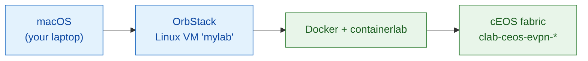

# Lab setup on macOS (OrbStack + containerlab + cEOS)

> Everything you need to run the [Course 2 cEOS lab](../courses/04-evpn/lab-01-pure-l2vni.md) on a Mac —
> **no cloud, no nested virtualization.** cEOS is a *container*, so a full 4-node
> VXLAN-EVPN fabric boots on your laptop in minutes.
>
> ✅ Validated on Apple Silicon (M-series) with OrbStack, cEOS 4.32.0F under Rosetta.

**The stack:** macOS → **OrbStack** (fast Docker + Linux VMs) → a Linux machine that
runs **Docker + containerlab** → your **cEOS** nodes. Everything below runs *inside
the Linux machine*, so your Mac stays clean.



---

## Prerequisites

- **macOS** — Apple Silicon (M-series) *or* Intel. cEOS is **amd64-only**; on Apple
  Silicon it runs under OrbStack's built-in **Rosetta** emulation (automatic — no
  toggle to flip).
- A **free Arista account** ([arista.com](https://www.arista.com)) to download the
  cEOS image (like Juniper's account for vJunos).
- ~8 GB free RAM for a 4-node fabric.

---

## 1. Install OrbStack

Download and install from **[orbstack.dev](https://orbstack.dev)**. OrbStack gives you
a Docker engine *and* lightweight Linux VMs, far lighter than Docker Desktop or a full
VM — and it does amd64 emulation automatically.

## 2. Create a Linux machine

containerlab manipulates Linux network namespaces, so it needs a real Linux host.
Create one in OrbStack (this is your lab box):

```bash
orb create ubuntu mylab
```
(or use the OrbStack app → **Machines → New**). Then enter it:
```bash
ssh orb            # drops you into the machine → rwh@mylab:~$
```
Everything from here runs **inside `mylab`**.

!!! tip "Your Mac files are already mounted"
    OrbStack mounts your macOS home into the Linux machine, so a file you download to
    `~/Downloads` on the Mac is visible inside `mylab` too — no `scp` needed.

## 3. Confirm Docker works

```bash
docker ps
```
You should get an empty table (not an error). OrbStack provides the Docker engine to
the machine automatically.

## 4. Get and import the cEOS image

1. On **arista.com** → **Support → Software Download → cEOS-lab**, grab a recent stable
   build, e.g. `cEOS64-lab-4.32.0F.tar.xz`.
2. Import it (from wherever it landed — your mounted Mac `~/Downloads` works):

```bash
docker import --platform linux/amd64 cEOS64-lab-4.32.0F.tar.xz ceos:4.32.0F
docker images | grep ceos
```

!!! warning "Apple Silicon: the `--platform linux/amd64` flag is mandatory"
    cEOS binaries are x86_64. `--platform linux/amd64` tags the image as amd64 so
    OrbStack runs it under Rosetta. **Skip it and you'll get `exec format error`** when
    the container starts. `.tar.xz` is fine — `docker import` decompresses it for you.

## 5. Install containerlab

```bash
bash -c "$(curl -sL https://get.containerlab.dev)"
containerlab version
```

## 6. Smoke test — one node (prove cEOS boots)

Before the full fabric, confirm a single cEOS node comes up on your Mac:

```bash
mkdir -p ~/ceos-lab && cd ~/ceos-lab
cat > smoke.clab.yml <<'EOF'
name: ceos-smoke
topology:
  nodes:
    ceos1:
      kind: arista_ceos
      image: ceos:4.32.0F
EOF
sudo containerlab deploy -t smoke.clab.yml
```
Wait ~1–2 min, then open the EOS CLI:
```bash
docker exec -it clab-ceos-smoke-ceos1 Cli
```
A **`ceos1>`** prompt + `show version` = cEOS runs on your Mac. 🎉 Tear it down:
```bash
sudo containerlab destroy -t smoke.clab.yml
```

## 7. Deploy the fabric

You're ready for the [Course 2 lab](../courses/04-evpn/lab-01-pure-l2vni.md). Drop in its `ceos-evpn.clab.yml`
and:
```bash
cd ~/ceos-lab
sudo containerlab deploy -t ceos-evpn.clab.yml
```
The full 2-spine × 2-leaf + 2-host fabric takes ~5–8 min to boot under emulation.
**Always health-check before configuring** (see the boot-race note below), then follow
the lab guide.

---

## Troubleshooting

| Symptom | Cause | Fix |
|---------|-------|-----|
| `docker: command not found` / can't connect | Docker context not set in the machine | It's usually automatic in OrbStack; re-enter with `ssh orb`, or check the OrbStack app is running |
| `exec format error` on container start | forgot `--platform linux/amd64` on import | Re-import with the flag |
| Node boots, `show interfaces Ethernet1 status` shows type **`Unknown`** | cEOS **boot-race** — EOS scanned before containerlab wired the veths (worse under emulation) | `containerlab destroy` + `deploy`, then health-check until all nodes show `connected / EbraTestPhyPort`. **Never `docker restart`** a clab node — it destroys the veths (`reload` is also unavailable — it's a container) |
| Fabric slow to boot | 4 emulated nodes booting at once | Normal — give it 5–8 min; watch with `watch -n 5 'docker ps --filter name=clab-ceos-evpn --format "table {{.Names}}\t{{.Status}}"'` |
| Can't `reload` a node | it's a container, not a box | Redeploy via containerlab; there's no in-box reboot |

**Health-check loop** (run before configuring):
```bash
for n in spine1 spine2 leaf1 leaf2; do
  echo "== $n =="; docker exec clab-ceos-evpn-$n Cli -c "show interfaces Ethernet1 status"
done
```
Every node must show a real interface type (**not** `Unknown`) before you start.

---

## Daily use

```bash
ssh orb                                              # enter the lab machine
cd ~/ceos-lab
sudo containerlab deploy  -t ceos-evpn.clab.yml      # bring the fabric up
sudo containerlab destroy -t ceos-evpn.clab.yml      # tear it down for the day
docker exec -it clab-ceos-evpn-leaf1 Cli             # jump into any node's CLI
```

Your Mac stays clean — the lab lives entirely inside the `mylab` machine, and you can
`destroy`/`deploy` as often as you like. Next: the [VXLAN-EVPN lab →](../courses/04-evpn/lab-01-pure-l2vni.md).
