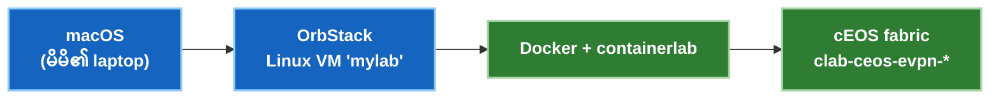

# macOS ပေါ်တွင် Lab စတင် တပ်ဆင်ခြင်း (OrbStack + containerlab + cEOS)

> Mac ကွန်ပျူတာပေါ်တွင် [EVPN cEOS lab](../courses/04-evpn/lab-01-pure-l2vni.md) ကို စမ်းသပ်မောင်းနှင်ရန် လိုအပ်သမျှအားလုံး —
> **Cloud မလို၊ nested virtualization မလိုပါ။** cEOS သည် *container* အဖြစ် အလုပ်လုပ်သောကြောင့် 4-node VXLAN-EVPN fabric တစ်ခုလုံးကို မိမိ laptop ပေါ်တွင် မိနစ်ပိုင်းအတွင်း တည်ဆောက်နိုင်ပါသည်။
>
> ✅ Apple Silicon (M-series) ပေါ်တွင် OrbStack နှင့် Rosetta အောက်ရှိ cEOS 4.32.0F ဖြင့် အောင်မြင်စွာ စမ်းသပ်အတည်ပြုပြီး ဖြစ်သည်။

**နည်းပညာ အဆင့်ဆင့် ချိတ်ဆက်ပုံ (The stack):** macOS → **OrbStack** (မြန်ဆန်ပေါ့ပါးသော Docker + Linux VMs) → **Docker + containerlab** run ထားသော Linux စက် → သင်၏ **cEOS** nodes များ။ အောက်ပါလုပ်ဆောင်ချက်အားလုံးသည် *Linux စက်အတွင်း၌သာ* အလုပ်လုပ်မည်ဖြစ်သဖြင့် သင်၏ Mac သည် သန့်ရှင်းနေမည်ဖြစ်ပါသည်။



---

## ကြိုတင် လိုအပ်ချက်များ (Prerequisites)

- **macOS** — Apple Silicon (M-series) *သို့မဟုတ်* Intel။ cEOS သည် **amd64-only** ဖြစ်ပြီး Apple Silicon ပေါ်တွင် OrbStack ၏ built-in **Rosetta** emulation ဖြင့် အလိုအလျောက် အလုပ်လုပ်ပါသည် (မည်သည့် setting မှ ပြင်စရာမလိုပါ)။
- cEOS image ကို ဒေါင်းလုဒ်ရယူရန် **အခမဲ့ Arista အကောင့်** ([arista.com](https://www.arista.com)) တစ်ခု လိုအပ်ပါသည်။
- 4-node fabric တစ်ခု run ရန် အနည်းဆုံး free RAM 8 GB ခန့် လိုအပ်ပါသည်။

---

## ၁။ OrbStack ကို Install ပြုလုပ်ခြင်း

**[orbstack.dev](https://orbstack.dev)** မှ download ရယူပြီး install ပြုလုပ်ပါ။ OrbStack သည် Docker engine အပြင် ပေါ့ပါးသော Linux VMs များကိုပါ ထောက်ပံ့ပေးပြီး Docker Desktop ထက် အလွန်ပေါ့ပါးမြန်ဆန်ကာ amd64 emulation ကို အလိုအလျောက် လုပ်ဆောင်ပေးပါသည်။

## ၂။ Linux စက်တစ်ခု ဖန်တီးခြင်း

containerlab သည် Linux network namespaces များကို စီမံကိုင်တွယ်ရသောကြောင့် တကယ့် Linux host တစ်ခု လိုအပ်ပါသည်။ OrbStack အတွင်း Linux စက်တစ်ခုကို ဖန်တီးပါ:

```bash
orb create ubuntu mylab
```
(သို့မဟုတ် OrbStack app → **Machines → New** မှလည်း ပြုလုပ်နိုင်ပါသည်)။ ထို့နောက် စက်ထဲသို့ ဝင်ရောက်ပါ:
```bash
ssh orb            # စက်ထဲသို့ တိုက်ရိုက် ရောက်ရှိသွားမည် → rwh@mylab:~$
```
ဤနေရာမှစ၍ အရာအားလုံးသည် **`mylab` အတွင်း၌သာ** အလုပ်လုပ်မည် ဖြစ်ပါသည်။

!!! tip "သင်၏ Mac ဖိုင်များကို ချိတ်ဆက်ထားပြီးဖြစ်ပါသည်"
    OrbStack သည် သင်၏ macOS home directory ကို Linux စက်အတွင်းသို့ အလိုအလျောက် mount ပြုလုပ်ပေးထားသဖြင့် Mac ၏ `~/Downloads` ထဲသို့ ဒေါင်းလုဒ်ဆွဲထားသော ဖိုင်များကို `mylab` ထဲတွင် တိုက်ရိုက် တွေ့မြင်နိုင်ပါသည် — `scp` ပြုလုပ်ရန် မလိုပါ။

## ၃။ Docker အလုပ်လုပ်မှု ရှိမရှိ စစ်ဆေးခြင်း

```bash
docker ps
```
အမှားပြချက်မရှိဘဲ ဇယားကွက်လွတ်တစ်ခု ပြသပါမည်။ OrbStack သည် အဆိုပါစက်အတွက် Docker engine ကို အလိုအလျောက် ထောက်ပံ့ပေးထားပါသည်။

## ၄။ cEOS Image ရယူပြီး Import ပြုလုပ်ခြင်း

၁။ **arista.com** → **Support → Software Download → cEOS-lab** သို့ သွားရောက်ပြီး နောက်ဆုံးထွက် stable build တစ်ခုခုကို ဒေါင်းလုဒ်ရယူပါ (ဥပမာ `cEOS64-lab-4.32.0F.tar.xz`)။
၂။ ၎င်းဖိုင်ကို Docker ထဲသို့ import လုပ်ပါ (Mac ပေါ်ရှိ `~/Downloads` ထဲမှ တိုက်ရိုက် import နိုင်သည်):

```bash
docker import --platform linux/amd64 cEOS64-lab-4.32.0F.tar.xz ceos:4.32.0F
docker images | grep ceos
```

!!! warning "Apple Silicon: `--platform linux/amd64` flag ထည့်သွင်းရန် မဖြစ်မနေ လိုအပ်ပါသည်"
    cEOS binaries များသည် x86_64 architecture ဖြစ်သည်။ `--platform linux/amd64` flag သည် image ကို amd64 အဖြစ် သတ်မှတ်ပေးပြီး OrbStack အား Rosetta အောက်တွင် run စေပါသည်။ **ဤ flag ကို မထည့်ပါက container စတင်ချိန်တွင် `exec format error` ဖြစ်ပေါ်ပါမည်။** `.tar.xz` ဖိုင်ကို `docker import` က အလိုအလျောက် ဖြည်ပေးပါမည်။

## ၅။ Containerlab ကို Install ပြုလုပ်ခြင်း

```bash
bash -c "$(curl -sL https://get.containerlab.dev)"
containerlab version
```

## ၆။ Smoke Test — Node တစ်ခု စမ်းသပ်မောင်းနှင်ခြင်း

Fabric တစ်ခုလုံး မစတင်မီ cEOS node တစ်ခု မိမိ Mac ပေါ်တွင် ကောင်းမွန်စွာ အလုပ်လုပ်နိုင်ကြောင်း စမ်းသပ်အတည်ပြုပါ:

```bash
mkdir -p ~/ceos-lab && cd ~/ceos-lab
cat > smoke.clab.yml <<'EOF'
name: ceos-smoke
topology:
  nodes:
    ceos1:
      kind: arista_ceos
      image: ceos:4.32.0F
EOF
sudo containerlab deploy -t smoke.clab.yml
```
၁–၂ မိနစ်ခန့် စောင့်ဆိုင်းပြီးနောက် EOS CLI ထဲသို့ ဝင်ရောက်ပါ:
```bash
docker exec -it clab-ceos-smoke-ceos1 Cli
```
**`ceos1>`** prompt ပေါ်လာပြီး `show version` ရိုက်နှိပ်နိုင်ပါက cEOS သည် သင်၏ Mac ပေါ်တွင် အောင်မြင်စွာ လည်ပတ်နေပြီဖြစ်ပါသည်။ 🎉 စမ်းသပ်ပြီးပါက ပြန်လည်ဖျက်သိမ်းပါ:
```bash
sudo containerlab destroy -t smoke.clab.yml
```

## ၇။ Fabric အပြည့်အစုံကို Deploy ပြုလုပ်ခြင်း

သင်သည် [Course 2 lab](../courses/04-evpn/lab-01-pure-l2vni.md) ကို စတင်ရန် အဆင်သင့်ဖြစ်ပါပြီ။ ၎င်း၏ `ceos-evpn.clab.yml` ကို အသုံးပြု၍ deploy လုပ်ပါ:
```bash
cd ~/ceos-lab
sudo containerlab deploy -t ceos-evpn.clab.yml
```
2-spine × 2-leaf + 2-host fabric အပြည့်အစုံသည် emulation အောက်တွင် boot တက်ရန် ၅–၈ မိနစ်ခန့် ကြာမြင့်နိုင်ပါသည်။
**မစတင်မီ health-check ကို အမြဲတမ်း စစ်ဆေးပါ** (အောက်ပါ boot-race မှတ်ချက်ကို ဖတ်ပါ)၊ ပြီးနောက် lab လမ်းညွှန်ချက်အတိုင်း လေ့ကျင့်နိုင်ပါသည်။

---

## ပြဿနာ ဖြေရှင်းနည်းများ (Troubleshooting)

| ပြဿနာလက္ခဏာ | ဖြစ်ရသည့်အကြောင်းရင်း | ဖြေရှင်းနည်း |
|---|---|---|
| `docker: command not found` / ချိတ်ဆက်မရခြင်း | Linux စက်အတွင်း Docker context မသတ်မှတ်ရသေးခြင်း | OrbStack တွင် အလိုအလျောက် ဖြစ်လေ့ရှိပြီး `ssh orb` ဖြင့် ပြန်ဝင်ပါ သို့မဟုတ် OrbStack app ဖွင့်ထားခြင်း ရှိမရှိ စစ်ဆေးပါ |
| Container စတင်ချိန်တွင် `exec format error` ပြခြင်း | Import လုပ်စဉ် `--platform linux/amd64` ထည့်ရန် မေ့သွားခြင်း | Flag ထည့်သွင်း၍ ပြန်လည် import လုပ်ပါ |
| Node တက်လာသော်လည်း `show interfaces Ethernet1 status` တွင် type **`Unknown`** ပြနေခြင်း | cEOS **boot-race** — containerlab က veths များကို မချိတ်ဆက်မီ EOS က interface များကို ကြိုတင် scan လုပ်လိုက်ခြင်းကြောင့် ဖြစ်သည် | `containerlab destroy` ပြုလုပ်ပြီး ပြန်လည် `deploy` လုပ်ပါ၊ ပြီးနောက် nodes အားလုံး `connected / EbraTestPhyPort` မပြမချင်း health-check စစ်ဆေးပါ။ **clab node များကို `docker restart` လုံးဝ မလုပ်ပါနှင့်** — ၎င်းသည် veths များကို ပျက်စီးစေပါသည် (`reload` သည်လည်း container ဖြစ်၍ မရပါ) |
| Fabric boot တက်ခြင်း အလွန်နှေးကွေးနေခြင်း | Emulated nodes ၄ ခု တစ်ပြိုင်နက် boot တက်နေခြင်းကြောင့် ဖြစ်သည် | ပုံမှန်သာဖြစ်ပါသည် — ၅–၈ မိနစ်ခန့် စောင့်ဆိုင်းပါ၊ အခြေအနေကို `watch -n 5 'docker ps --filter name=clab-ceos-evpn --format "table {{.Names}}\t{{.Status}}"'` ဖြင့် စောင့်ကြည့်နိုင်ပါသည် |
| Node တစ်ခုကို `reload` လုပ်၍ မရခြင်း | သီးခြား hardware စက်မဟုတ်ဘဲ container ဖြစ်နေခြင်းကြောင့် ဖြစ်သည် | Containerlab မှတစ်ဆင့် redeploy ပြုလုပ်ပါ |

**Health-check စစ်ဆေးရန် loop** (configuration မစတင်မီ run ရန်):
```bash
for n in spine1 spine2 leaf1 leaf2; do
  echo "== $n =="; docker exec clab-ceos-evpn-$n Cli -c "show interfaces Ethernet1 status"
done
```
Lab မစတင်မီ node တိုင်းသည် စစ်မှန်သော interface type ကို ပြသနေရမည်ဖြစ်ပြီး (**`Unknown` မဖြစ်ရပါ**)။

---

## နေ့စဉ် အသုံးပြုနည်း (Daily Use)

```bash
ssh orb                                              # lab စက်ထဲသို့ ဝင်ရောက်ပါ
cd ~/ceos-lab
sudo containerlab deploy  -t ceos-evpn.clab.yml      # fabric ကို စတင်ဖွင့်လှစ်ပါ
sudo containerlab destroy -t ceos-evpn.clab.yml      # တစ်နေ့တာပြီးဆုံးချိန်တွင် ပြန်လည်ဖျက်သိမ်းပါ
docker exec -it clab-ceos-evpn-leaf1 Cli             # ကြိုက်နှစ်သက်ရာ node ၏ CLI ထဲသို့ ဝင်ပါ
```

သင်၏ Mac သည် အမြဲသန့်ရှင်းနေမည် ဖြစ်သည် — lab သည် `mylab` စက်အတွင်း၌သာ တည်ရှိပြီး လိုအပ်သလို `destroy`/`deploy` ပြုလုပ်နိုင်ပါသည်။ ဆက်လက်လေ့လာရန်: [VXLAN-EVPN lab →](../courses/04-evpn/lab-01-pure-l2vni.md)။
