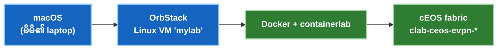

# macOS ပေါ်တွင် Lab စတင် တပ်ဆင်ခြင်း (OrbStack + containerlab + cEOS)

> Mac ကွန်ပျူတာပေါ်တွင် [EVPN cEOS lab](../courses/04-evpn/lab-01-pure-l2vni.md) ကို လက်တွေ့ စမ်းသပ်မောင်းနှင်ရန် လိုအပ်သည့် အဆင့်အားလုံး —
> **Cloud မလို၊ nested virtualization စနစ်ကြီးများ မလိုပါ။** cEOS သည် *container* အဖြစ် ပေါ့ပေါ့ပါးပါး အလုပ်လုပ်သောကြောင့် switch ၄ လုံးပါသည့် 4-node VXLAN-EVPN fabric တစ်ခုလုံးကို မိမိ laptop ပေါ်တွင် မိနစ်ပိုင်းအတွင်း အခမဲ့ တည်ဆောက်နိုင်ပါသည်။
>
> ✅ Apple Silicon (M1/M2/M3/M4) ပေါ်တွင် OrbStack နှင့် Rosetta 2 အောက်ရှိ cEOS 4.32.0F ဖြင့် အောင်မြင်စွာ စမ်းသပ်အတည်ပြုပြီး ဖြစ်သည်။

**နည်းပညာ အဆင့်ဆင့် ချိတ်ဆက်ဖွဲ့စည်းပုံ (The Stack):**  
macOS (မိမိ Laptop) → **OrbStack** (မြန်ဆန်ပေါ့ပါးသော Docker + Linux VMs) → **Docker + containerlab** ထည့်သွင်းထားသော Linux စက် (`mylab`) → ထိုစက်ထဲတွင် run ထားသော **cEOS** nodes များ။  
အောက်ပါ အဆင့်အားလုံးသည် *Linux စက်အတွင်း၌သာ* အလုပ်လုပ်မည်ဖြစ်သဖြင့် သင်၏ Mac OS ပင်မစနစ်တွင် ဖိုင်များ ရှုပ်ပွမနေဘဲ အမြဲသန့်ရှင်းနေမည် ဖြစ်ပါသည်။



---

## ကြိုတင် လိုအပ်ချက်များ (Prerequisites)

- **macOS ကွန်ပျူတာ** — Apple Silicon (M-series) သို့မဟုတ် Intel Mac။ cEOS သည် **amd64 (x86_64)** သီးသန့် ဖြစ်ပြီး၊ Apple Silicon ပေါ်တွင် OrbStack ၏ built-in **Rosetta** emulation ဖြင့် အလိုအလျောက် သွက်လက်စွာ အလုပ်လုပ်ပေးပါသည် (သီးသန့် setting ပြင်ဆင်ရန် မလိုပါ)။
- **အခမဲ့ Arista အကောင့်တစ်ခု** — cEOS image ကို ဒေါင်းလုဒ်ဆွဲရန် ([arista.com](https://www.arista.com)) တွင် အကောင့်တစ်ခု အခမဲ့ ဖွင့်ထားပါ။
- **လွတ်လပ်သော RAM ပမာဏ** — Node ၄ ခုပါ fabric တစ်ခု run ရန် အနည်းဆုံး free RAM 8 GB ခန့် ရှိလျှင် လုံလောက်ပါသည်။

---

## အဆင့် ၁ · OrbStack ကို Install ပြုလုပ်ခြင်း

**[orbstack.dev](https://orbstack.dev)** သို့ သွားရောက်ပြီး download ရယူကာ install ပြုလုပ်ပါ။  
OrbStack သည် Docker Desktop ထက် အဆပေါင်းများစွာ ပေါ့ပါးမြန်ဆန်ပြီး Linux VMs များကိုပါ လွယ်ကူစွာ ဖန်တီးပေးနိုင်သည့်အပြင် Apple Silicon ပေါ်တွင် amd64 software များကို အလိုအလျောက် သွက်လက်စွာ run ပေးနိုင်ပါသည်။

---

## အဆင့် ၂ · Linux စက်ငယ်တစ်ခု ဖန်တီးခြင်း

containerlab သည် Linux network namespaces များကို စီမံကိုင်တွယ်ရသောကြောင့် စစ်မှန်သော Linux host တစ်ခု လိုအပ်ပါသည်။ OrbStack ထဲတွင် `mylab` ဟု အမည်ပေးထားသော Linux စက်ငယ်တစ်ခုကို ဖန်တီးပါ:

```bash
orb create ubuntu mylab
```
*(သို့မဟုတ် OrbStack desktop app ၏ **Machines → New** မှလည်း ဖန်တီးနိုင်ပါသည်)*

ဖန်တီးပြီးပါက အဆိုပါစက်ထဲသို့ ဝင်ရောက်ပါ:
```bash
ssh orb            # စက်ထဲသို့ ချက်ချင်း ရောက်ရှိသွားမည် → rwh@mylab:~$
```
ဤနေရာမှစတင်၍ အောက်ပါအဆင့်များ အားလုံးကို **`mylab` Linux စက်အတွင်း၌သာ** ရိုက်နှိပ်လုပ်ဆောင်ရမည် ဖြစ်ပါသည်။

!!! tip "Mac ပေါ်ရှိ ဖိုင်များကို အလိုအလျောက် ချိတ်ဆက်ပေးထားပြီးဖြစ်သည်"
    OrbStack သည် သင်၏ macOS Home directory ကို Linux စက်အတွင်းသို့ အလိုအလျောက် mount လုပ်ပေးထားပါသည်။ ထို့ကြောင့် Mac ၏ `~/Downloads` ထဲသို့ ဒေါင်းလုဒ်ဆွဲလိုက်သော မည်သည့်ဖိုင်ကိုမဆို `mylab` ထဲမှ တိုက်ရိုက် တွေ့မြင်အသုံးပြုနိုင်ပါသည် — `scp` ဖြင့် ဖိုင်ကူးယူရန် မလိုပါ။

---

## အဆင့် ၃ · Docker အလုပ်လုပ်မှု ရှိမရှိ စစ်ဆေးခြင်း

```bash
docker ps
```
မည်သည့် error မှ မပြဘဲ ဇယားကွက်လွတ်တစ်ခု ပြသပါက Docker အသင့်ဖြစ်နေပါပြီ။ (OrbStack သည် ၎င်းစက်အတွင်း Docker engine ကို အလိုအလျောက် ချိတ်ဆက်ပေးထားပြီး ဖြစ်ပါသည်)။

---

## အဆင့် ၄ · cEOS Image ရယူပြီး Import ပြုလုပ်ခြင်း

၁။ Browser ဖြင့် **arista.com** → **Support → Software Download → cEOS-lab** သို့ သွားရောက်ပြီး နောက်ဆုံးထွက် stable build တစ်ခုခုကို ဒေါင်းလုဒ်ဆွဲပါ (ဥပမာ `cEOS64-lab-4.32.0F.tar.xz`)။  
၂။ ဒေါင်းလုဒ်ရရှိလာသော ဖိုင်ကို Docker ထဲသို့ အောက်ပါ command ဖြင့် import လုပ်ပါ (Mac ပေါ်ရှိ `~/Downloads` ထဲမှ တိုက်ရိုက် လှမ်းယူနိုင်ပါသည်):

```bash
docker import --platform linux/amd64 cEOS64-lab-4.32.0F.tar.xz ceos:4.32.0F
docker images | grep ceos
```

!!! warning "Apple Silicon (M1/M2/M3/M4) သုံးစွဲသူများအတွက် အထူးသတိပြုရန်"
    cEOS binary များသည် x86_64 (amd64) ဗိသုကာဖြင့် တည်ဆောက်ထားခြင်း ဖြစ်သည်။ ထို့ကြောင့် `--platform linux/amd64` flag သည် **မဖြစ်မနေ ထည့်သွင်းရမည်** ဖြစ်ပြီး၊ OrbStack အား Rosetta စနစ်ဖြင့် အလုပ်လုပ်စေရန် ညွှန်ကြားပေးခြင်း ဖြစ်သည်။  
    **ဤ flag ကို ချန်လှပ်ခဲ့ပါက container စတင်ချိန်တွင် `exec format error` ဆိုပြီး အလုပ်မလုပ်ဘဲ ဖြစ်သွားပါမည်။** ဒေါင်းလုဒ်ဆွဲထားသော `.tar.xz` ဖိုင်ကို `docker import` က အလိုအလျောက် ဖြည်ပေးသွားပါမည်။

---

## အဆင့် ၅ · Containerlab ကို Install ပြုလုပ်ခြင်း

အောက်ပါ script ဖြင့် containerlab ကို အလွယ်တကူ install ပြုလုပ်ပါ:

```bash
bash -c "$(curl -sL https://get.containerlab.dev)"
containerlab version
```

---

## အဆင့် ၆ · Smoke Test — Switch တစ်လုံး အရင် စမ်းသပ်မောင်းနှင်ခြင်း

ခက်ခဲရှုပ်ထွေးသော network fabric အပြည့်အစုံကို မစတင်မီ၊ cEOS switch တစ်လုံးတည်း မိမိစက်ပေါ်တွင် အမှန်တကယ် boot တက်မတက် အတည်ပြုရန် အောက်ပါအတိုင်း စမ်းသပ်ပါ:

```bash
mkdir -p ~/ceos-lab && cd ~/ceos-lab
cat > smoke.clab.yml <<'EOF'
name: ceos-smoke
topology:
  nodes:
    ceos1:
      kind: arista_ceos
      image: ceos:4.32.0F
EOF
sudo containerlab deploy -t smoke.clab.yml
```

၁ မိနစ် မှ ၂ မိနစ်ခန့် စောင့်ဆိုင်းပြီးနောက် Arista EOS switch CLI ထဲသို့ ဝင်ရောက်စစ်ဆေးပါ:
```bash
docker exec -it clab-ceos-smoke-ceos1 Cli
```

Terminal တွင် **`ceos1>`** ဟု prompt ပေါ်လာပြီး `show version` ဟု ရိုက်နှိပ်စစ်ဆေးနိုင်ပါက Arista cEOS သည် သင်၏ Mac ပေါ်တွင် ၁၀၀% အောင်မြင်စွာ လည်ပတ်နေပြီဖြစ်ကြောင်း သက်သေပြလိုက်နိုင်ပါပြီ။ 🎉  
စမ်းသပ်ပြီးပါက စက်မလေးစေရန် အောက်ပါ command ဖြင့် ပြန်လည်ဖျက်သိမ်းပါ:
```bash
sudo containerlab destroy -t smoke.clab.yml
```

---

## အဆင့် ၇ · Fabric အပြည့်အစုံကို စတင် မောင်းနှင်ခြင်း (Deploy)

ယခုအခါ သင်သည် [EVPN Lab](../courses/04-evpn/lab-01-pure-l2vni.md) ကဲ့သို့သော lab အပြည့်အစုံကို စတင်ရန် အဆင်သင့် ဖြစ်နေပါပြီ။ သက်ဆိုင်ရာ `ceos-evpn.clab.yml` topology ဖိုင်ကို အသုံးပြု၍ deploy လုပ်နိုင်ပါသည်:

```bash
cd ~/ceos-lab
sudo containerlab deploy -t ceos-evpn.clab.yml
```

Spine ၂ လုံး၊ Leaf ၂ လုံးနှင့် Host ၂ လုံးပါဝင်သော fabric အပြည့်အစုံသည် Rosetta emulation အောက်တွင် boot အပြည့်အဝတက်ရန် ၅ မိနစ် မှ ၈ မိနစ်ခန့် ကြာမြင့်နိုင်ပါသည်။  
**စနစ်အတွင်း config များ မစတင်မီ ကျန်းမာရေး (Health-check) ကို အမြဲတမ်း စစ်ဆေးပါ** (အောက်ပါ boot-race မှတ်ချက်ကို ဖတ်ပါ)၊ ထို့နောက် lab လမ်းညွှန်ချက်များအတိုင်း လက်တွေ့ ဆက်လက်လေ့ကျင့်နိုင်ပါသည်။

---

## မကြာခဏ ကြုံတွေ့ရတတ်သော ပြဿနာများနှင့် ဖြေရှင်းနည်းများ (Troubleshooting)

| ပြဿနာလက္ခဏာ | ဖြစ်ရသည့် အကြောင်းရင်း | ဖြေရှင်းနည်း |
|---|---|---|
| `docker: command not found` သို့မဟုတ် ချိတ်ဆက်မရခြင်း | Linux စက်အတွင်း Docker context ချိတ်ဆက်မှု မရရှိသေးခြင်း | OrbStack တွင် အလိုအလျောက် ချိတ်ဆက်ပေးလေ့ရှိပြီး `ssh orb` ဖြင့် စက်ထဲ ပြန်လည်ဝင်ရောက်ပါ၊ သို့မဟုတ် OrbStack app ပွင့်နေခြင်း ရှိမရှိ စစ်ဆေးပါ |
| Container စတင်ချိန်တွင် `exec format error` ဖြစ်ပေါ်ခြင်း | Image import ပြုလုပ်စဉ် `--platform linux/amd64` ထည့်ရန် ကျန်ခဲ့ခြင်း | Flag ကို ထည့်သွင်း၍ image ကို ပြန်လည် import လုပ်ပါ |
| Node တက်လာသော်လည်း `show interfaces Ethernet1 status` တွင် type သည် **`Unknown`** ဖြစ်နေခြင်း | cEOS ၏ **Boot-Race** ပြဿနာ — containerlab က virtual cables (veths) များကို မချိတ်ဆက်မီ EOS က interface များကို စောလျင်စွာ scan ဖတ်လိုက်ခြင်းကြောင့် ဖြစ်သည် (emulation အောက်တွင် ပိုကြုံရတတ်သည်) | `containerlab destroy` လုပ်ပြီး ပြန်လည် `deploy` လုပ်ပါ၊ ထို့နောက် nodes အားလုံး `connected / EbraTestPhyPort` မပြမချင်း health-check စစ်ဆေးပါ။ **clab node များကို `docker restart` လုံးဝ မလုပ်ပါနှင့်** — ၎င်းသည် veth ကြိုးများကို ပျက်စီးစေပါသည် (`reload` သည်လည်း container ဖြစ်၍ ပြုလုပ်၍ မရပါ) |
| Fabric စတင်ချိန်တွင် အလွန်နှေးကွေးနေခြင်း | Emulated nodes ၄ ခု တစ်ပြိုင်နက် boot တက်နေရခြင်းကြောင့် ဖြစ်သည် | ပုံမှန်သာဖြစ်ပါသည် — ၅ မိနစ်ခန့် စိတ်ရှည်စွာ စောင့်ဆိုင်းပါ၊ အခြေအနေကို `watch -n 5 'docker ps --filter name=clab-ceos-evpn --format "table {{.Names}}\t{{.Status}}"'` ဖြင့် စောင့်ကြည့်နိုင်ပါသည် |
| Node တစ်ခုကို `reload` လုပ်၍ မရခြင်း | သီးခြား hardware switch မဟုတ်ဘဲ container ဖြစ်နေခြင်းကြောင့် ဖြစ်သည် | Switch reboot ပြုလုပ်လိုပါက Containerlab မှတစ်ဆင့်သာ redeploy ပြုလုပ်ပေးရပါမည် |

**ကျန်းမာရေး စစ်ဆေးရန် အလိုအလျောက် Loop** (config မချမီ အမြဲ run ပါ):
```bash
for n in spine1 spine2 leaf1 leaf2; do
  echo "== $n =="; docker exec clab-ceos-evpn-$n Cli -c "show interfaces Ethernet1 status"
done
```
Node တိုင်းသည် အမှန်တကယ် ချိတ်ဆက်ထားသော interface type ကို ပြသနေရမည်ဖြစ်ပြီး (**`Unknown` လုံးဝ မဖြစ်ရပါ**):

---

## နေ့စဉ် အသုံးပြုပုံ အလေ့အကျင့် (Daily Workflow)

```bash
ssh orb                                              # lab စက်ငယ်ထဲသို့ ဝင်ရောက်ပါ
cd ~/ceos-lab
sudo containerlab deploy  -t ceos-evpn.clab.yml      # fabric ကို စတင်ဖွင့်လှစ်ပါ
docker exec -it clab-ceos-evpn-leaf1 Cli             # ကြိုက်နှစ်သက်ရာ node ၏ switch CLI ထဲသို့ ဝင်ရောက်ပါ
sudo containerlab destroy -t ceos-evpn.clab.yml      # တစ်နေ့တာ လေ့ကျင့်မှု ပြီးဆုံးချိန်တွင် ပြန်လည်ဖျက်သိမ်းပါ
```

သင်၏ Mac ကွန်ပျူတာသည် အမြဲသန့်ရှင်းပေါ့ပါးနေမည်ဖြစ်သည် — lab သည် `mylab` စက်အတွင်း၌သာ သီးသန့်တည်ရှိပြီး စိတ်ကြိုက် `deploy` / `destroy` ပြုလုပ်နိုင်ပါသည်။  
နောက်တစ်ဆင့် လေ့လာရန်: **[VXLAN-EVPN Lab သို့ ဆက်လက်တက်လှမ်းပါ →](../courses/04-evpn/lab-01-pure-l2vni.md)**
