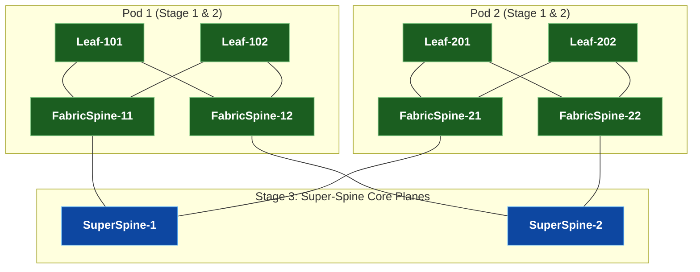
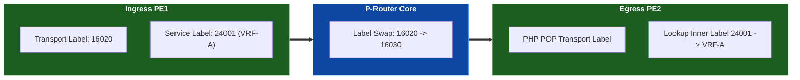
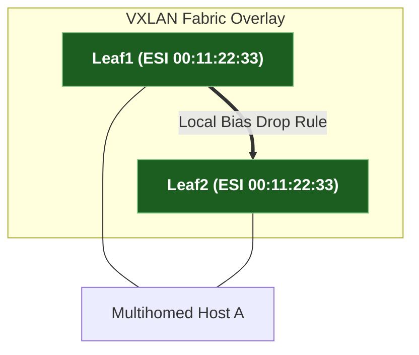

# 🎯 Hyperscale System Design & Technical Interview Masterclass

> 🚀 **Direct, No-Fluff Engineering Drills**: Deep-dive protocol mechanisms, packet walk breakdowns, failure mode analyses, and architectural trade-offs asked by **Google, Meta, Apple, and Amazon** for Senior & Staff Network Infrastructure Engineers.

---

## 🏛️ Module 1 · 5-Stage Clos (Fat-Tree) Fabric Architecture

### ❓ Interview Question: How do hyperscalers scale data center fabrics beyond 2-tier Spine-Leaf limits?
**Technical Answer:**
A 2-tier Spine-Leaf topology is bounded by the fixed ASIC port-density of Spine switches (e.g. 64 ports of 400G). When all 64 ports are connected to Leafs, adding another Leaf requires oversubscribing the fabric.

Hyperscalers (Google Jupiter, Meta F4/F16) deploy a **5-Stage Clos (Fat-Tree)** fabric:
1. **Stage 1 (ToR / Leaf)**: Connects dual-homed servers.
2. **Stage 2 (Fabric Switch / Pod Spine)**: Aggregates ToRs within a single Pod.
3. **Stage 3 (Super-Spine / Core Switch)**: Interconnects independent Pods via parallel non-blocking planes.



> 💡 **Production Edge Case**: In 5-Stage Clos networks, ECMP hashing at Stage 1 and Stage 2 must use 5-tuple flow hashing (`Src IP, Dst IP, Src Port, Dst Port, Protocol`) to prevent elephant flow collision on core links.

---

## 🌐 Module 2 · BGP Control Plane Architecture: eBGP (RFC 7938) vs. iBGP

### ❓ Interview Question: Why do hyperscale data centers use eBGP instead of iBGP + Route Reflectors?
**Technical Answer:**

| Architectural Criteria | eBGP Data Center Design (RFC 7938) | iBGP + Route Reflectors |
|---|---|---|
| **Loop Prevention** | Deterministic `AS-PATH` prepending & filtering | Requires full-mesh or Route Reflectors (`cluster-id`) |
| **Path Selection** | Shortest `AS-PATH` + equal-cost BGP ECMP | Dependent on `LOCAL_PREF` & IGP tie-breakers |
| **Failure Isolation** | Session flaps are isolated locally to peer ASNs | Route Reflector flaps propagate updates fabric-wide |
| **ASN Allocation** | Private 2-Byte (`64512-65534`) or 4-Byte ASNs per tier | Single AS number fabric-wide |

> 📌 **BGP 10-Step Path Selection Tie-Breaker Order**:
> 1. Highest `WEIGHT` (Cisco/Arista local) $\rightarrow$ 2. Highest `LOCAL_PREF` $\rightarrow$ 3. Locally Originated Routes $\rightarrow$ 4. Shortest `AS-PATH` $\rightarrow$ 5. Lowest `ORIGIN` (`IGP < EGP < Incomplete`) $\rightarrow$ 6. Lowest `MED` $\rightarrow$ 7. Prefer eBGP over iBGP $\rightarrow$ 8. Lowest IGP Metric to Next-Hop $\rightarrow$ 9. Oldest Route $\rightarrow$ 10. Lowest BGP Router-ID.

---

## 🏷️ Module 3 · MPLS & Service Provider L3VPNs

### ❓ Interview Question: Explain the packet walk and 2-label stack lookup in MPLS L3VPN Option B vs Option C.
**Technical Answer:**



- **MPLS Label Stack**:
  - **Outer Transport Label (LDP / SR-MPLS)**: Swapped at every intermediate P-router node to reach the BGP Next-Hop PE.
  - **Inner Service Label (MP-BGP VPNv4)**: Preserved end-to-end to identify the target customer VRF at the egress PE.
- **Inter-AS Option B vs Option C**:
  - **Option B (ASBR-to-ASBR MP-eBGP)**: ASBRs exchange MP-BGP VPNv4 routes directly. ASBRs swap inner VPN labels on the border link without exposing internal core loopbacks.
  - **Option C (Multi-Hop MP-eBGP PE-to-PE)**: PEs exchange VPNv4 routes directly across AS boundaries via BGP IPv4 + Label (`SAFI 4`), keeping ASBRs 100% state-free regarding customer VRFs.

---

## ⚡ Module 4 · Segment Routing (SR-MPLS) & Sub-50ms Ti-LFA FRR

### ❓ Interview Question: How does Ti-LFA guarantee sub-50ms fast reroute and zero micro-loops?
**Technical Answer:**


1. **Pre-Computed Backup Path**: The local router pre-computes an explicit Segment Routing SID label stack targeting the Post-Convergence $P$-node and $Q$-node **before** any link failure occurs.
2. **Sub-50ms Hardware Switchover**: Upon physical link drop or BFD signal, the ingress ASIC immediately swaps forwarding pointers to the pre-programmed Ti-LFA label stack without waiting for IGP convergence.
3. **Micro-Loop Avoidance**: Because the backup path uses explicit Segment SIDs, traffic is forced along the post-convergence path, completely avoiding transient IGP micro-loops.

---

## 🌉 Module 5 · VXLAN-EVPN Datacenter Fabrics & ESI Multihoming

### ❓ Interview Question: How does EVPN ESI All-Active Multihoming prevent Layer 2 loops without an MLAG Peer-Link?
**Technical Answer:**



1. **Designated Forwarder (DF) Election (Route Type 4)**: Multihomed leaves exchange Route Type 4 ES routes and elect a single DF per VNI. Only the DF forwards BUM (Broadcast, Unknown Unicast, Multicast) traffic onto the ESI link.
2. **Split-Horizon Filtering (Local Bias)**: When a leaf receives BUM traffic from the VXLAN overlay sent by another multihomed leaf, it inspects the ESI label. If the egress interface belongs to the same ESI, the leaf **drops the packet locally**.
3. **MAC Aliasing (Route Type 1)**: Non-DF leaves announce Auto-Discovery Route Type 1 per ESI, enabling remote VTEPs to perform 50/50 ECMP load balancing across both multihomed switches for unicast traffic.

> 📌 **EVPN Route Types Reference**:
> - **Route Type 1**: Ethernet Auto-Discovery (MAC Aliasing & Fast Convergence)
> - **Route Type 2**: MAC / IP Advertisement (Host Reachability)
> - **Route Type 3**: Inclusive Multicast Ethernet Tag (IMET / VXLAN Tunnel Setup)
> - **Route Type 4**: Ethernet Segment Route (ESI DF Election)
> - **Route Type 5**: IP Prefix Route (Routed Overlay Subnets)

---

## 🛠️ Module 6 · NetDevOps, Automated Testing & CI/CD Pipelines

### ❓ Interview Question: How does Batfish static analysis catch network outages before pushing code to production?
**Technical Answer:**
Pushing a syntax-valid configuration can still cause a major outage if an ACL blocks traffic or a routing policy leaks prefixes.

**Batfish** parses vendor configuration files (`.cfg`), builds an offline mathematical model of the control and data plane (Abstract Syntax Tree / AST), and queries network behavior **BEFORE code deployment**:
- Checks unused ACL rules and syntax warnings.
- Simulates end-to-end packet reachability offline without booting physical devices.
- Asserts that no internal infrastructure routes leak to external peers.

---

## 🌍 Module 7 · Enterprise WAN Edge & Dual-ISP Traffic Engineering

### ❓ Interview Question: How do you control inbound and outbound traffic flows across Dual-ISP links?
**Technical Answer:**

```mermaid
graph TD
    ISP_A["Primary ISP A (AS 65100)"] <-->|eBGP | EDGE1["wan-edge1 (LOCAL_PREF 200)"]
    ISP_B["Backup ISP B (AS 65200)"] <-->|eBGP (AS-PATH Prepend 65000 65000)| EDGE2["wan-edge2 (LOCAL_PREF 100)"]
    EDGE1 <-->|iBGP| EDGE2

    classDef isp fill:#0d47a1,stroke:#64b5f6,color:#ffffff,font-weight:bold;
    classDef edge fill:#1b5e20,stroke:#81c784,color:#ffffff,font-weight:bold;
    class ISP_A,ISP_B isp;
    class EDGE1,EDGE2 edge;
```

- **Outbound Traffic Control (`LOCAL_PREF`)**: Configure `LOCAL_PREF 200` on Primary ISP A and `LOCAL_PREF 100` on Backup ISP B across internal iBGP edge sessions. Higher `LOCAL_PREF` dictates outbound path preference.
- **Inbound Traffic Control (AS-PATH Prepending & Communities)**: Prepend local ASN multiple times (`65000 65000 65000`) towards Backup ISP B, forcing external Autonomous Systems to select the shorter `AS-PATH` through Primary ISP A.

---

## 📊 Module 8 · Streaming Telemetry (gNMI) & Observability

### ❓ Interview Question: Why does gNMI streaming telemetry replace legacy SNMP polling?
**Technical Answer:**
- **Push vs. Pull**: SNMP polls devices every 300 seconds over UDP, missing micro-burst link drops. gNMI streams real-time updates over HTTP/2 gRPC `Subscribe` RPCs with sub-second resolution.
- **Data Modeling**: SNMP relies on vendor-specific MIB OID trees (`1.3.6.1.2...`). gNMI uses structured, human-readable **OpenConfig YANG schemas** (`openconfig-interfaces:interfaces/interface/state/counters`).

---

## 🔒 Module 9 · Network Security & Datacenter Segmentation

### ❓ Interview Question: How does Control Plane Policing (CoPP) protect routing engine CPUs?
**Technical Answer:**
Control Plane Policing (CoPP) classifies incoming packets destined to the CPU via `class-map` rules and applies hardware rate-limiters (`policy-map`) at the switch ASIC level before packets ever reach the routing protocol daemon. This prevents BGP/OSPF SYN floods or ICMP rate spikes from overloading the CPU.

---

## 🌐 Module 10 · IPv6 Transition & BGP Unnumbered (RFC 5549)

### ❓ Interview Question: What is BGP Unnumbered (RFC 5549) and why is it used in IPv6 data center underlays?
**Technical Answer:**
Standard BGP requires configuring IPv4/IPv6 IP addresses on every point-to-point interface. **BGP Unnumbered (RFC 5549 / RFC 8950)** establishes eBGP sessions over IPv6 Link-Local addresses (`fe80::/10`) auto-generated via EUI-64. Extended Next-Hop encoding allows advertising both IPv4 and IPv6 prefixes over IPv6 link-local transport without assigning IP subnets to inter-switch cables.
