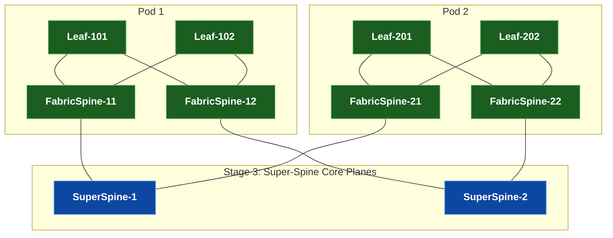
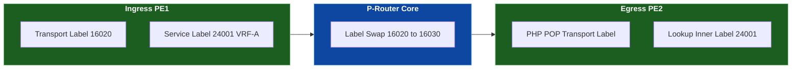
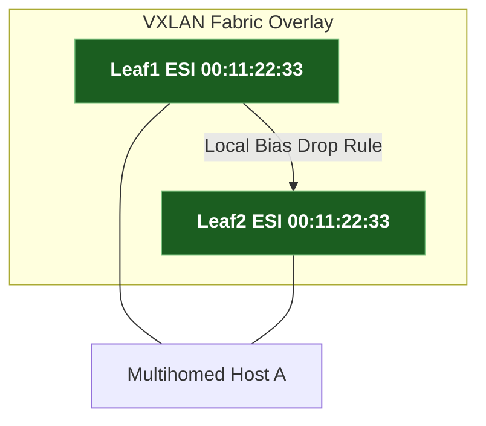
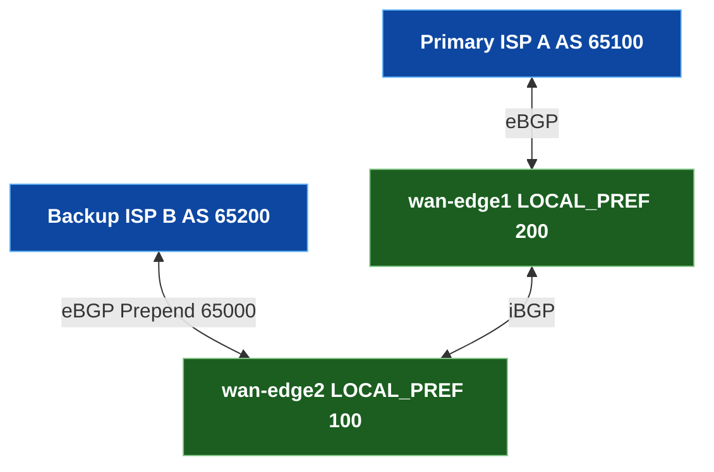

# 🎯 Hyperscale စနစ်ဒီဇိုင်းနှင့် နည်းပညာ အင်တာဗျူး Masterclass {: #hyperscale-system-design-interview-masterclass }

> 🚀 **တိကျပြတ်သားသော အင်ဂျင်နီယာ လေ့ကျင့်ခန်းများ**: **Google, Meta, Apple, နှင့် Amazon** ကဲ့သို့သော ကုမ္ပဏီကြီးများမှ Senior & Staff Network Infrastructure Engineers များအတွက် မေးမြန်းလေ့ရှိသည့် protocol လုပ်ဆောင်ချက်များ၊ packet walk ခွဲခြမ်းစိတ်ဖြာမှုများ၊ failure mode ဆန်းစစ်ချက်များနှင့် architectural trade-offs များကို အသေးစိတ်လေ့လာမှု။

---

## 🏛️ အခန်း ၁ · 5-Stage Clos (Fat-Tree) Fabric ဗိသုကာ {: #module-1-5-stage-clos-fabric-architecture }

### ❓ အင်တာဗျူး မေးခွန်း: Hyperscalers များသည် 2-tier Spine-Leaf ကန့်သတ်ချက်များထက် ကျော်လွန်၍ Data Center Fabric များကို မည်သို့ စကေးချဲ့ကြသနည်း။ {: #interview-question-module-1 }
**နည်းပညာဆိုင်ရာ အဖြေ:**
2-tier Spine-Leaf topology တစ်ခုသည် Spine switch များ၏ ပုံသေ ASIC port-density ဖြင့် ကန့်သတ်ထားသည် (ဥပမာ 400G port ၆၄ ခု)။ Port ၆၄ ခုလုံးကို Leaf များနှင့် ချိတ်ဆက်ပြီးပါက အခြား Leaf တစ်ခု ထပ်ပေါင်းထည့်ရန်အတွက် fabric ကို oversubscribe လုပ်ရန် လိုအပ်လာမည်ဖြစ်သည်။

Hyperscalers များ (Google Jupiter, Meta F4/F16) သည် **5-Stage Clos (Fat-Tree)** fabric ကို အသုံးပြုကြပါသည်:
1. **Stage 1 (ToR / Leaf)**: Dual-homed server များကို ချိတ်ဆက်သည်။
2. **Stage 2 (Fabric Switch / Pod Spine)**: Pod တစ်ခုတည်းအတွင်းရှိ ToR များကို စုစည်းပေးသည်။
3. **Stage 3 (Super-Spine / Core Switch)**: သီးခြား Pod များကို parallel non-blocking plane များမှတစ်ဆင့် အချင်းချင်း ချိတ်ဆက်ပေးသည်။

> 💡 **ထုတ်လုပ်မှု ပတ်ဝန်းကျင် အတွေ့အကြုံ (Edge Case)**: 5-Stage Clos ကွန်ရက်များတွင် Stage 1 နှင့် Stage 2 ရှိ ECMP hashing သည် core link များပေါ်တွင် elephant flow တိုက်မိခြင်းကို ကာကွယ်ရန် 5-tuple flow hashing (`Src IP, Dst IP, Src Port, Dst Port, Protocol`) ကို မဖြစ်မနေ အသုံးပြုရမည်ဖြစ်သည်။

---

## 🌐 အခန်း ၂ · BGP Control Plane ဗိသုကာ: eBGP (RFC 7938) vs. iBGP {: #module-2-bgp-control-plane-architecture }

### ❓ အင်တာဗျူး မေးခွန်း: Hyperscale Data Center များသည် iBGP + Route Reflectors အစား eBGP ကို အဘယ်ကြောင့် အသုံးပြုကြသနည်း။ {: #interview-question-module-2 }
**နည်းပညာဆိုင်ရာ အဖြေ:**

| ဗိသုကာဆိုင်ရာ သတ်မှတ်ချက်များ | eBGP Data Center Design (RFC 7938) | iBGP + Route Reflectors |
|---|---|---|
| **Loop Prevention** | တိကျပြတ်သားသော `AS-PATH` prepending & filtering | Full-mesh သို့မဟုတ် Route Reflectors (`cluster-id`) လိုအပ်သည် |
| **Path Selection** | ပိုတိုသော `AS-PATH` + တူညီသောစရိတ်မျှ BGP ECMP | `LOCAL_PREF` နှင့် IGP tie-breakers များအပေါ် မှီခိုသည် |
| **Failure Isolation** | Session flap များကို peer ASN များထံတွင် local အတိုင်း သီးခြားခွဲထုတ်ထားသည် | Route Reflector flap များသည် fabric တစ်ခုလုံးသို့ update များ ပျံ့နှံ့စေသည် |
| **ASN Allocation** | Tier တစ်ခုစီအတွက် Private 2-Byte (`64512-65534`) သို့မဟုတ် 4-Byte ASNs သုံးသည် | Fabric တစ်ခုလုံးအတွက် AS နံပါတ်တစ်ခုတည်း သုံးသည် |

> 📌 **BGP အဆင့် ၁၀ ဆင့် အကောင်းဆုံးလမ်းကြောင်း ရွေးချယ်မှု စည်းမျဉ်း (Tie-Breaker Order)**:
> 1. အမြင့်ဆုံး `WEIGHT` (Cisco/Arista local) → 2. အမြင့်ဆုံး `LOCAL_PREF` → 3. မိမိထံမှ စတင်ထုတ်လွှင့်သော Route များ (Locally Originated) → 4. အတိုဆုံး `AS-PATH` → 5. အနိမ့်ဆုံး `ORIGIN` (`IGP < EGP < Incomplete`) → 6. အနိမ့်ဆုံး `MED` → 7. iBGP ထက် eBGP ကို ဦးစားပေးခြင်း → 8. Next-Hop ဆီသို့ အနိမ့်ဆုံး IGP Metric → 9. အသက်အရင့်ဆုံး Route (Oldest Route) → 10. အနိမ့်ဆုံး BGP Router-ID။

---

## 🏷️ အခန်း ၃ · MPLS နှင့် Service Provider L3VPNs {: #module-3-mpls-service-provider-l3vpns }

### ❓ အင်တာဗျူး မေးခွန်း: MPLS L3VPN Option B နှင့် Option C တို့တွင် packet walk နှင့် 2-label stack lookup ပြုလုပ်ပုံကို ရှင်းပြပါ။ {: #interview-question-module-3 }
**နည်းပညာဆိုင်ရာ အဖြေ:**

- **MPLS Label Stack**:
  - **Outer Transport Label (LDP / SR-MPLS)**: BGP Next-Hop PE ဆီသို့ ရောက်ရှိရန် ကြားခံ P-router node တိုင်းတွင် swap လုပ်ပေးသည်။
  - **Inner Service Label (MP-BGP VPNv4)**: Egress PE တွင် သက်ဆိုင်ရာ customer VRF ကို ခွဲခြားသိရှိနိုင်ရန် အစအဆုံး မပျက်မစီး ထိန်းသိမ်းထားသည်။
- **Inter-AS Option B နှင့် Option C နှိုင်းယှဉ်ချက်**:
  - **Option B (ASBR-to-ASBR MP-eBGP)**: ASBR များသည် MP-BGP VPNv4 route များကို တိုက်ရိုက်ဖလှယ်ကြသည်။ ASBR များသည် အတွင်းပိုင်း core loopback များကို မဖော်ပြဘဲ border link ပေါ်တွင် အတွင်းပိုင်း VPN label များကို swap ပြုလုပ်ပေးသည်။
  - **Option C (Multi-Hop MP-eBGP PE-to-PE)**: PE များသည် BGP IPv4 + Label (`SAFI 4`) မှတစ်ဆင့် AS နယ်စပ်များကို ဖြတ်၍ VPNv4 route များကို တိုက်ရိုက်ဖလှယ်ကြသဖြင့် ASBR များသည် customer VRF များနှင့် ပတ်သက်၍ 100% state-free ဖြစ်စေသည်။

---

## ⚡ အခန်း ၄ · Segment Routing (SR-MPLS) နှင့် Sub-50ms Ti-LFA FRR {: #module-4-segment-routing-sub-50ms-ti-lfa-frr }

### ❓ အင်တာဗျူး မေးခွန်း: Ti-LFA သည် sub-50ms fast reroute နှင့် zero micro-loops ကို မည်သို့ အာမခံချက် ပေးသနည်း။ {: #interview-question-module-4 }
**နည်းပညာဆိုင်ရာ အဖြေ:**

1. **ကြိုတင်တွက်ချက်ထားသော အရန်လမ်းကြောင်း (Pre-Computed Backup Path)**: Local router သည် link ချို့ယွင်းမှု မဖြစ်ပွားမီ **ကြိုတင်၍** Post-Convergence $P$-node နှင့် $Q$-node ဆီသို့ ဦးတည်သော Segment Routing SID label stack တစ်ခုကို ကြိုတင်တွက်ချက်ထားသည်။
2. **Sub-50ms Hardware Switchover**: ရုပ်ပိုင်းဆိုင်ရာ link ပြတ်တောက်ခြင်း သို့မဟုတ် BFD အချက်ပြ signal ရရှိသည်နှင့် တပြိုင်နက် ingress ASIC သည် IGP convergence ကို စောင့်ဆိုင်းခြင်းမရှိဘဲ ကြိုတင် program ထည့်သွင်းထားသော Ti-LFA label stack သို့ forwarding pointer များကို ချက်ချင်း လွှဲပြောင်းပေးသည်။
3. **Micro-Loop ကင်းဝေးခြင်း**: အရန်လမ်းကြောင်းသည် explicit Segment SIDs များကို အသုံးပြုထားသောကြောင့် traffic ကို post-convergence လမ်းကြောင်းအတိုင်း မဖြစ်မနေ စီးဆင်းစေပြီး ယာယီ IGP micro-loops များကို လုံးဝ ရှောင်ရှားစေသည်။

---

## 🌉 အခန်း ၅ · VXLAN-EVPN Datacenter Fabrics နှင့် ESI Multihoming {: #module-5-vxlan-evpn-datacenter-fabrics }

### ❓ အင်တာဗျူး မေးခွန်း: EVPN ESI All-Active Multihoming သည် MLAG Peer-Link မပါဘဲ Layer 2 loop များကို မည်သို့ ကာကွယ်သနည်း။ {: #interview-question-module-5 }
**နည်းပညာဆိုင်ရာ အဖြေ:**

1. **Designated Forwarder (DF) Election (Route Type 4)**: Multihomed leaf များသည် Route Type 4 ES route များကို ဖလှယ်ပြီး VNI တစ်ခုစီအတွက် DF တစ်ခုတည်းကို ရွေးချယ်သည်။ DF သာလျှင် ESI link ပေါ်သို့ BUM (Broadcast, Unknown Unicast, Multicast) traffic ကို forward လုပ်ခွင့်ရှိသည်။
2. **Split-Horizon Filtering (Local Bias)**: Leaf တစ်ခုသည် အခြား multihomed leaf တစ်ခုမှ ပေးပို့လိုက်သော VXLAN overlay ထံမှ BUM traffic ကို လက်ခံရရှိသောအခါ ESI label ကို စစ်ဆေးသည်။ အကယ်၍ ထွက်ပေါက် interface သည် တူညီသော ESI ပိုင် ဖြစ်နေပါက leaf သည် **packet ကို local အတိုင်း drop ပစ်လိုက်သည်**။
3. **MAC Aliasing (Route Type 1)**: Non-DF leaf များသည် ESI တစ်ခုချင်းစီအလိုက် Auto-Discovery Route Type 1 ကို ကြေညာပေးသောကြောင့် remote VTEP များသည် unicast traffic အတွက် multihomed switch နှစ်ခုလုံးတစ်လျှောက် 50/50 ECMP load balancing ကို လုပ်ဆောင်နိုင်စေသည်။

> 📌 **EVPN Route အမျိုးအစားများ အကိုးအကား**:
> - **Route Type 1**: Ethernet Auto-Discovery (MAC Aliasing & Fast Convergence)
> - **Route Type 2**: MAC / IP Advertisement (Host Reachability)
> - **Route Type 3**: Inclusive Multicast Ethernet Tag (IMET / VXLAN Tunnel Setup)
> - **Route Type 4**: Ethernet Segment Route (ESI DF Election)
> - **Route Type 5**: IP Prefix Route (Routed Overlay Subnets)

---

## 🛠️ အခန်း ၆ · NetDevOps၊ Automated Testing နှင့် CI/CD Pipelines {: #module-6-netdevops-automated-testing }

### ❓ အင်တာဗျူး မေးခွန်း: Batfish static analysis သည် production သို့ code မ push မီ ကွန်ရက်ပြတ်တောက်မှုများကို မည်သို့ ကြိုတင်ဖမ်းဆီးပေးသနည်း။ {: #interview-question-module-6 }
**နည်းပညာဆိုင်ရာ အဖြေ:**
Syntax မှန်ကန်သော configuration တစ်ခုကို push လုပ်သော်လည်း ACL က traffic ကို ပိတ်ပင်လိုက်ခြင်း သို့မဟုတ် routing policy က prefix များကို leak ဖြစ်စေခြင်းတို့ကြောင့် ကြီးမားသော outage ဖြစ်ပွားနိုင်သည်။

**Batfish** သည် vendor configuration ဖိုင်များကို (`.cfg`) ဖတ်ရှုပြီး control plane နှင့် data plane ၏ offline သင်္ချာဆိုင်ရာ ပုံစံတူ (Abstract Syntax Tree / AST) ကို တည်ဆောက်ကာ **code မ deploy မီ** ကွန်ရက်၏ အပြုအမူကို ကြိုတင် query စစ်ဆေးပေးပါသည်:
- အသုံးမပြုသော ACL စည်းမျဉ်းများနှင့် syntax သတိပေးချက်များကို စစ်ဆေးသည်။
- ရုပ်ပိုင်းဆိုင်ရာ စက်များကို boot တက်စရာမလိုဘဲ အစအဆုံး packet reachability ကို offline simulate ပြုလုပ်သည်။
- မည်သည့် internal infrastructure route မှ ပြင်ပ peer များထံသို့ leak မဖြစ်ကြောင်း သေချာစေသည်။

---

## 🌍 အခန်း ၇ · Enterprise WAN Edge နှင့် Dual-ISP Traffic Engineering {: #module-7-enterprise-wan-edge-dual-isp }

### ❓ အင်တာဗျူး မေးခွန်း: Dual-ISP link များတစ်လျှောက် အဝင်နှင့် အထွက် traffic စီးဆင်းမှုများကို သင်မည်သို့ ထိန်းချုပ်မည်နည်း။ {: #interview-question-module-7 }
**နည်းပညာဆိုင်ရာ အဖြေ:**

- **အထွက်လမ်းကြောင်း ထိန်းချုပ်ခြင်း (`LOCAL_PREF`)**: Internal iBGP edge session များတစ်လျှောက် Primary ISP A ပေါ်တွင် `LOCAL_PREF 200` နှင့် Backup ISP B ပေါ်တွင် `LOCAL_PREF 100` ကို သတ်မှတ်ပါ။ ပိုကြီးသော `LOCAL_PREF` သည် အထွက်လမ်းကြောင်း ဦးစားပေးကို ဆုံးဖြတ်သည်။
- **အဝင်လမ်းကြောင်း ထိန်းချုပ်ခြင်း (AS-PATH Prepending & Communities)**: Backup ISP B ဘက်သို့ local ASN ကို အကြိမ်ကြိမ် ရှေ့တွင် ထပ်ပေါင်းဖြည့်စွက် (prepend) ကြေညာပေးပါ (`65000 65000 65000`)။ ၎င်းသည် ပြင်ပ Autonomous Systems များအား Primary ISP A မှတစ်ဆင့် ပိုမိုတိုတောင်းသော `AS-PATH` ကို ရွေးချယ်စေရန် ဖိအားပေးသည်။

---

## 📊 အခန်း ၈ · Streaming Telemetry (gNMI) နှင့် Observability {: #module-8-streaming-telemetry-observability }

### ❓ အင်တာဗျူး မေးခွန်း: gNMI streaming telemetry သည် ရှေးဟောင်း SNMP polling ကို အဘယ်ကြောင့် အစားထိုးသနည်း။ {: #interview-question-module-8 }
**နည်းပညာဆိုင်ရာ အဖြေ:**
- **Push vs. Pull**: SNMP သည် စက်ပစ္စည်းများကို UDP ပေါ်တွင် စက္ကန့် ၃၀၀ တိုင်း poll လုပ်သဖြင့် micro-burst link drop များကို မသိရှိနိုင်ပါ။ gNMI သည် HTTP/2 gRPC `Subscribe` RPCs ပေါ်မှတစ်ဆင့် စက္ကန့်ပိုင်းအတွင်း တိုက်ရိုက် real-time update များကို စဉ်ဆက်မပြတ် ပို့ဆောင်ပေးသည်။
- **Data Modeling**: SNMP သည် vendor အလိုက် သီးသန့်ဖြစ်သော MIB OID tree များ (`1.3.6.1.2...`) အပေါ်တွင် မှီခိုသည်။ gNMI သည် စနစ်ကျပြီး လူဖတ်ရှုနိုင်သော **OpenConfig YANG schemas** ကို အသုံးပြုသည် (`openconfig-interfaces:interfaces/interface/state/counters`)။

---

## 🔒 အခန်း ၉ · Network Security နှင့် Datacenter Segmentation {: #module-9-network-security-datacenter-segmentation }

### ❓ အင်တာဗျူး မေးခွန်း: Control Plane Policing (CoPP) သည် routing engine CPU များကို မည်သို့ ကာကွယ်ပေးသနည်း။ {: #interview-question-module-9 }
**နည်းပညာဆိုင်ရာ အဖြေ:**
Control Plane Policing (CoPP) သည် CPU သို့ ဦးတည်လာသော အဝင် packet များကို `class-map` စည်းမျဉ်းများဖြင့် အမျိုးအစားခွဲခြားပြီး routing protocol daemon ထံသို့ packet များ မရောက်မီ switch ASIC အဆင့်တွင် hardware rate-limiters (`policy-map`) ဖြင့် အကန့်အသတ်ပြုလုပ်ပေးသည်။ ၎င်းသည် BGP/OSPF SYN floods သို့မဟုတ် ICMP rate spikes များကြောင့် CPU overload မဖြစ်စေရန် ကာကွယ်ပေးသည်။

---

## 🌐 အခန်း ၁၀ · IPv6 Transition နှင့် BGP Unnumbered (RFC 5549) {: #module-10-ipv6-transition-bgp-unnumbered }

### ❓ အင်တာဗျူး မေးခွန်း: BGP Unnumbered (RFC 5549) ဆိုသည်မှာ အဘယ်နည်း၊ ၎င်းကို IPv6 data center underlays များတွင် အဘယ်ကြောင့် အသုံးပြုသနည်း။ {: #interview-question-module-10 }
**နည်းပညာဆိုင်ရာ အဖြေ:**
စံနှုန်းမီ BGP သည် point-to-point interface တိုင်းပေါ်တွင် IPv4/IPv6 IP address များကို သတ်မှတ်ပေးရန် လိုအပ်သည်။ **BGP Unnumbered (RFC 5549 / RFC 8950)** သည် EUI-64 မှတစ်ဆင့် အလိုအလျောက် ထုတ်ပေးသော IPv6 Link-Local address များ (`fe80::/10`) ပေါ်တွင် eBGP session များကို တည်ဆောက်ပေးသည်။ Extended Next-Hop encoding သည် switch အချင်းချင်း ချိတ်ဆက်သော cable များပေါ်တွင် IP subnet များ မပေးရဘဲ IPv6 link-local transport ပေါ်မှတစ်ဆင့် IPv4 ရော IPv6 prefix များကိုပါ တစ်ပြိုင်နက် ကြေညာနိုင်စေပါသည်။
