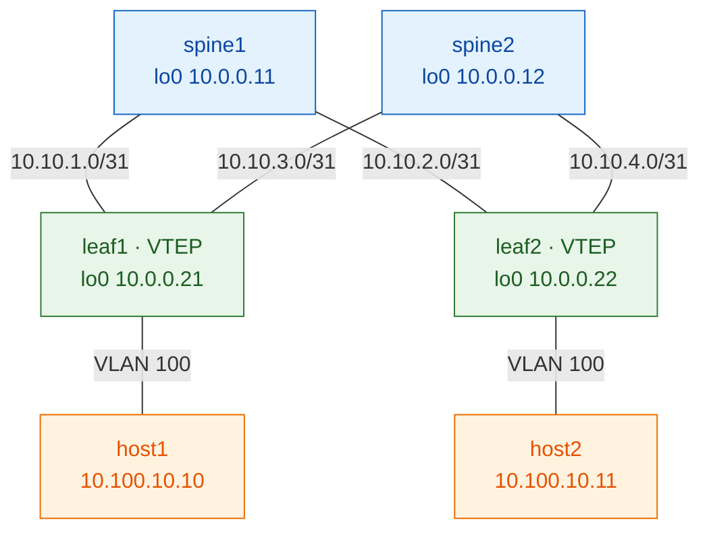

# Lab 01 — OSPF underlay + iBGP-EVPN (full mesh)

> **Complete, self-contained guide.** Build a working VXLAN-EVPN fabric from bare
> vJunos switches, one layer at a time. Read [the Study track](../study/index.md)
> first for the theory; this lab is the hands-on part.
>
> ✅ Validated end-to-end on vJunos-switch 23.2R1.14.

This is the **foundational** lab. It uses the simplest overlay — a full mesh
between the two leaves — so you can see EVPN in its clearest form. (The
[production version](lab-02-rr.md) swaps that for spine
route-reflectors.)

---

## What you'll build

| Layer    | Choice |
|----------|--------|
| Underlay | OSPF, single area 0 |
| Overlay  | iBGP-EVPN, AS 65000, **leaf-to-leaf full mesh** (spines carry no EVPN) |
| Services | one L2VNI: VLAN 100 → VNI 10100, two hosts in one subnet |



**Addresses** (full plan in [common/ipplan.md](../reference/ipplan.md)):

| Device | lo0 (router-id / VTEP) | to spine1 | to spine2 |
|--------|------------------------|-----------|-----------|
| spine1 | 10.0.0.11 | — | — |
| spine2 | 10.0.0.12 | — | — |
| leaf1  | 10.0.0.21 | 10.10.1.1/31 | 10.10.3.1/31 |
| leaf2  | 10.0.0.22 | 10.10.2.1/31 | 10.10.4.1/31 |

> **Interfaces:** vJunos-switch uses `ge-0/0/N`. containerlab `eth1→ge-0/0/0`,
> `eth2→ge-0/0/1`, `eth3→ge-0/0/2` (a +1 offset). **Login:** `admin` / `admin@123`.

---

## Before you start

- Host set up (GCP + containerlab + vJunos image) — see
  [Host Setup](../host-setup/00-gcp-instance.md).
- This lab runs on its own fabric (`clab-evpn-fullmesh-*`).

**⚠️ Pre-flight — only ONE lab at a time.** A 2×2 vJunos fabric needs ~16 GB RAM;
two at once starve the host and boot `unhealthy`. **Before deploying, check
nothing else is running:**
```bash
docker ps --format '{{.Names}}' | grep '^clab-' || echo "clean — nothing running"
```
If anything shows, wipe it first:
```bash
sudo docker rm -f $(docker ps -aq --filter name=clab-)     # force-remove all clab containers
```
(`deploy.sh` and `reset.sh` also **refuse to start** if another fabric is up, so
you can't hit this by accident — but checking first is good habit.)

## How to run it

```bash
./scripts/deploy.sh 01-ospf-ibgp        # boot the fabric (~5-8 min/node)

# then EITHER build it all at once:
./scripts/apply.sh 01-ospf-ibgp all

# OR learn by hand — type each step below yourself, or one step at a time:
./scripts/apply.sh 01-ospf-ibgp 02      # e.g. just Step 2
```

**Check the fabric is ready** (vJunos takes ~5–8 min/node to boot):
```bash
docker ps --filter "name=clab-evpn-fullmesh" --format "table {{.Names}}\t{{.Status}}"
```
| STATUS shows | Meaning |
|--------------|---------|
| `Up … (health: starting)` | still booting — wait |
| `Up … (healthy)` | ✅ ready — safe to `apply.sh` |

Wait until all four switches read **`(healthy)`** (the two hosts just show `Up`).
Watch it live: `watch -n 5 'docker ps --filter "name=clab-evpn-fullmesh" --format "table {{.Names}}\t{{.Status}}"'`.
Or just log in to confirm: `ssh admin@clab-evpn-fullmesh-leaf1` (password `admin@123`).

> `apply.sh` **waits for each node's CLI on its own**, so you can run it right
> after deploy — it holds until nodes are ready (up to ~2 min/node).

Wipe or redo:
```bash
./scripts/destroy.sh 01-ospf-ibgp       # wipe (no redeploy)
./scripts/reset.sh   01-ospf-ibgp       # wipe + redeploy clean
```

To do it by hand: `ssh admin@clab-evpn-fullmesh-leaf1` (password `admin@123`),
`configure`, paste the step's block, `commit`.

---

## 📋 Command cheat-sheet (copy-paste)

Everything runs from the **clab host** (`~/netforge-labs`) unless marked *Junos CLI*.

**Reusable helper** — paste once into your shell, then check any node without logging in:
```bash
jrun() { sshpass -p 'admin@123' ssh -o StrictHostKeyChecking=no \
         -o UserKnownHostsFile=/dev/null -o LogLevel=ERROR \
         admin@clab-evpn-fullmesh-"$1" "${@:2}"; }
# usage:  jrun leaf1 "show bgp summary"
```

**Deploy & check the fabric**
```bash
./scripts/deploy.sh 01-ospf-ibgp                             # boot the fabric (~5-8 min/node)
docker ps --filter name=clab-evpn-fullmesh \
  --format "table {{.Names}}\t{{.Status}}"                   # all 4 switches must read (healthy)
```

**Build the config**
```bash
./scripts/apply.sh 01-ospf-ibgp all       # ⭐ build every step 01→05 in order (recommended)
./scripts/apply.sh 01-ospf-ibgp 01        # a single step (only if 01..N-1 are already applied)
./scripts/apply.sh 01-ospf-ibgp 01-03     # a range of steps, in order
```

**Iterate without a reboot** — wipe config to baseline and rebuild (seconds, not minutes):
```bash
./scripts/clean.sh 01-ospf-ibgp           # wipe lab config, keep mgmt/SSH — NO reboot
./scripts/apply.sh 01-ospf-ibgp all       # then rebuild from scratch
```

**Verify from the host** (no login needed, via the `jrun` helper):
```bash
jrun leaf1 "show ospf neighbor"           # underlay: both spines Full
jrun leaf1 "show bgp summary"             # overlay: peer 10.0.0.22 Establ
jrun leaf1 "show route table bgp.evpn.0"  # EVPN routes (Type-3 then Type-2)
jrun leaf1 "show ethernet-switching vxlan-tunnel-end-point remote"   # tunnel up
```

**Hosts + final proof** (host commands run on the clab host, not Junos):
```bash
docker exec clab-evpn-fullmesh-host1 sh -c "ip addr add 10.100.10.10/24 dev eth1; ip link set eth1 up"
docker exec clab-evpn-fullmesh-host2 sh -c "ip addr add 10.100.10.11/24 dev eth1; ip link set eth1 up"
docker exec clab-evpn-fullmesh-host1 ping -c3 10.100.10.11           # 🎉 0% loss = done
```

**Tear down**
```bash
./scripts/destroy.sh 01-ospf-ibgp         # wipe containers (no redeploy)
./scripts/reset.sh   01-ospf-ibgp         # destroy + redeploy clean (slow — last resort)
```

> **⚠️ Steps are cumulative — build bottom-up.** Each step depends on the one below
> it (`01 fabric → 02 OSPF → 03 iBGP → 04 L2VNI → 05 access`). On a freshly-cleaned
> fabric you must apply **01 through N in order** — jumping straight to a later step
> commits config onto an empty box that silently can't work. When unsure, just run
> **`apply.sh 01-ospf-ibgp all`**.

---

# The build

Do the steps in order. Each one follows the same rhythm — **Apply → Verify → ✅ DONE**
— and you must pass the check before moving to the next.

```
lo0 reachable (ping) → BGP Establ → Type-3 + tunnel → Type-2 → host ping
       Step 2            Step 3        Step 4/5         Step 5    Step 5
```

## Step 1 — Fabric: interfaces & loopbacks

**Why:** every switch needs its fabric-link `/31` IPs and a `/32` loopback. On a
leaf, `lo0` is the router-id, the BGP peering address, **and** the VXLAN tunnel
source — the single most important address on the box.

**spine1**
```
set interfaces ge-0/0/0 unit 0 family inet address 10.10.1.0/31
set interfaces ge-0/0/1 unit 0 family inet address 10.10.2.0/31
set interfaces lo0 unit 0 family inet address 10.0.0.11/32
set routing-options router-id 10.0.0.11
```
**spine2**
```
set interfaces ge-0/0/0 unit 0 family inet address 10.10.3.0/31
set interfaces ge-0/0/1 unit 0 family inet address 10.10.4.0/31
set interfaces lo0 unit 0 family inet address 10.0.0.12/32
set routing-options router-id 10.0.0.12
```
**leaf1**
```
set interfaces ge-0/0/0 unit 0 family inet address 10.10.1.1/31
set interfaces ge-0/0/1 unit 0 family inet address 10.10.3.1/31
set interfaces lo0 unit 0 family inet address 10.0.0.21/32
set routing-options router-id 10.0.0.21
```
**leaf2**
```
set interfaces ge-0/0/0 unit 0 family inet address 10.10.2.1/31
set interfaces ge-0/0/1 unit 0 family inet address 10.10.4.1/31
set interfaces lo0 unit 0 family inet address 10.0.0.22/32
set routing-options router-id 10.0.0.22
```
**Apply:** `./scripts/apply.sh 01-ospf-ibgp 01`  ·  or paste the four blocks above by hand.

**Verify** (from the host):
```bash
jrun leaf1 "show interfaces terse | match ge-"   # fabric links admin/link up
jrun leaf1 "ping 10.10.1.0 count 3"              # directly-connected /31 replies
```

!!! success "Step 1 — DONE ✅"
    Fabric links up, loopbacks present, `/31` ping replies. **→ Step 2**

## Step 2 — Underlay: OSPF

**Why:** the underlay's one job is to make every loopback reachable from every
other, over both spines (ECMP). Loopbacks are advertised *passive* (announced,
but no neighbour to form there); fabric links are point-to-point.

**Identical on all four switches:**
```
set protocols ospf area 0 interface lo0.0 passive
set protocols ospf area 0 interface ge-0/0/0.0 interface-type p2p
set protocols ospf area 0 interface ge-0/0/1.0 interface-type p2p
```
**Apply:** `./scripts/apply.sh 01-ospf-ibgp 02`  ·  the same three lines on all four switches.

**Verify** (from the host):
```bash
jrun leaf1 "show ospf neighbor"                         # both spines in state Full
jrun leaf1 "ping 10.0.0.22 source 10.0.0.21 count 3"    # leaf-to-leaf loopback, ttl=63 (one spine hop)
```

!!! success "Step 2 — DONE ✅"
    Loopback-to-loopback ping works. **→ Step 3.** *If it fails, stop — nothing above works without the underlay.*

## Step 3 — Overlay: iBGP-EVPN (full mesh)

**Why:** the overlay is a BGP session carrying the `evpn` family, so leaves learn
each other's hosts without flooding. In full mesh the **leaves peer directly with
each other** (one session for two leaves); the **spines run no EVPN**.

**leaf1**
```
set routing-options autonomous-system 65000
set protocols bgp group overlay type internal
set protocols bgp group overlay local-address 10.0.0.21
set protocols bgp group overlay family evpn signaling
set protocols bgp group overlay neighbor 10.0.0.22
```
**leaf2** — mirror: `local-address 10.0.0.22`, `neighbor 10.0.0.21`.
**Apply:** `./scripts/apply.sh 01-ospf-ibgp 03`  ·  leaf1 above; leaf2 mirrors it.

**Verify** (from the host):
```bash
jrun leaf1 "show bgp summary"    # peer 10.0.0.22 = Establ; bgp.evpn.0 present (0 routes is correct — no VXLAN yet)
```
> The `License key missing; requires 'bgp'` warning is a benign vJunos-eval message.

!!! success "Step 3 — DONE ✅"
    The EVPN session to the other leaf is **Establ**. **→ Step 4**

## Step 4 — EVPN + VXLAN glue

**Why:** this turns on the VTEP. `protocols evpn` picks VXLAN + which VNIs;
`switch-options` sets the tunnel source (`lo0.0`), the RD (unique per leaf) and RT
(shared per VNI); and a VLAN→VNI mapping bridges VLAN 100 onto VNI 10100.
Leaves only — spines are not VTEPs.

**leaf1** (leaf2 mirrors, RD `10.0.0.22:1`)
```
set protocols evpn encapsulation vxlan
set protocols evpn extended-vni-list all
set switch-options vtep-source-interface lo0.0
set switch-options route-distinguisher 10.0.0.21:1
set switch-options vrf-target target:65000:1
set vlans v100 vlan-id 100
set vlans v100 vxlan vni 10100
```
**Apply:** `./scripts/apply.sh 01-ospf-ibgp 04`  ·  leaf1 above; leaf2 mirrors (RD `10.0.0.22:1`).

**⚠️ Expect NO routes yet.** `show route table bgp.evpn.0` is still empty — this is
correct. **Junos only advertises a VNI once its VLAN has an up member interface**
(unlike Cisco). It lights up in Step 5.

**Verify** (from the host):
```bash
jrun leaf1 "show configuration vlans"    # v100 → vni 10100 present
jrun leaf1 "show bgp summary"            # now lists the default-switch.evpn.0 table
```

!!! success "Step 4 — DONE ✅"
    EVPN/VXLAN instance configured (VLAN 100 → VNI 10100), even with 0 routes. **→ Step 5**

## Step 5 — Services: attach hosts & prove it

**Why:** put the host ports into VLAN 100. The moment the port is up, the leaf
advertises its **Type-3 (IMET)** route, the VXLAN tunnel forms, and once hosts
talk, **Type-2 (MAC/IP)** routes teach both leaves where each host is.

**5a — access ports, leaf1 and leaf2 (same):**
```
set interfaces ge-0/0/2 unit 0 family ethernet-switching interface-mode access
set interfaces ge-0/0/2 unit 0 family ethernet-switching vlan members v100
```
**Apply 5a:** `./scripts/apply.sh 01-ospf-ibgp 05`  ·  or paste the two lines above on both leaves.

**Verify 5a** (from the host):
```bash
jrun leaf1 "show route table bgp.evpn.0"                            # two Type-3 (3:) routes appear
jrun leaf1 "show ethernet-switching vxlan-tunnel-end-point remote"  # tunnel to the other leaf
```

**5b — give the hosts their IPs** (clab host shell, **not** Junos):
```bash
docker exec clab-evpn-fullmesh-host1 sh -c "ip addr add 10.100.10.10/24 dev eth1; ip link set eth1 up"
docker exec clab-evpn-fullmesh-host2 sh -c "ip addr add 10.100.10.11/24 dev eth1; ip link set eth1 up"
docker exec clab-evpn-fullmesh-host1 ping -c3 10.100.10.11
```

!!! success "Step 5 — DONE ✅ · the finish line 🎉"
    `host1 → host2` ping returns **0% packet loss** across the VXLAN fabric.
    Once traffic flows, `jrun leaf1 "show route table bgp.evpn.0"` also shows the **Type-2 (`2:`)** MAC/IP routes.

---

## ✅ Full checklist — deploy to ping

Work top to bottom. Each item lists the command that proves it — don't move on
until it passes. (`jrun` is the helper from the cheat-sheet above.)

**Fabric up**
- [ ] All 4 switches `(healthy)` — `docker ps --filter name=clab-evpn-fullmesh --format "table {{.Names}}\t{{.Status}}"`

**Step 1 · interfaces & loopbacks**
- [ ] Fabric links up/up — `jrun leaf1 "show interfaces terse | match ge-"`
- [ ] Directly-connected /31 replies — `jrun leaf1 "ping 10.10.1.0 count 3"`

**Step 2 · OSPF underlay**
- [ ] Both spines `Full` — `jrun leaf1 "show ospf neighbor"`
- [ ] Leaf-to-leaf loopback ping, ttl=63 — `jrun leaf1 "ping 10.0.0.22 source 10.0.0.21 count 3"`

**Step 3 · iBGP-EVPN overlay**
- [ ] Peer `10.0.0.22` **Establ** — `jrun leaf1 "show bgp summary"` *(0 routes here is correct)*

**Step 4 · EVPN + VXLAN glue**
- [ ] `default-switch.evpn.0` table appears — `jrun leaf1 "show bgp summary"`
- [ ] VLAN/switch-options present — `jrun leaf1 "show configuration vlans"` *(still no routes — correct)*

**Step 5 · services + proof**
- [ ] Two Type-3 (`3:`) routes — `jrun leaf1 "show route table bgp.evpn.0"`
- [ ] Tunnel to other leaf — `jrun leaf1 "show ethernet-switching vxlan-tunnel-end-point remote"`
- [ ] Remote host MAC via `vtep.xxxx` — `jrun leaf1 "show ethernet-switching table"`
- [ ] **host1 → host2 ping, 0% loss** — `docker exec clab-evpn-fullmesh-host1 ping -c3 10.100.10.11` 🎉

## Break-it exercises

Predict the symptom, break it, find the `show` that exposes it, then fix it.

1. **Underlay link:** `deactivate interfaces ge-0/0/0` on leaf1 → loopback stays
   reachable via the other spine (`show route 10.0.0.22`). Reactivate.
2. **BGP source:** point `local-address` at the wrong IP → session never
   Establishes (`show bgp summary`). Restore.
3. **VNI mismatch:** set leaf2's VLAN 100 to `vni 10199` → tunnel/host ping breaks
   (`show evpn database`). Restore to 10100.
4. **VTEP source:** `delete switch-options vtep-source-interface` on leaf1 →
   Type-3 withdrawn, tunnel drops. Restore `lo0.0`.

## Lessons from the live build

- Interfaces are **`ge-0/0/N`**; clab `ethN` → `ge-0/0/(N-1)`.
- `family inet` commits clean on `ge-` ports (no `ethernet-switching` to delete).
- ⭐ **Junos originates Type-3 only when the VLAN has an up member** — biggest
  difference vs Cisco; the tunnel appears at Step 5, not Step 4.
- Management (`fxp0`) is on `10.0.0.0/24`, overlapping the loopbacks but isolated
  in the `mgmt_junos` instance — harmless.
- "OSPF instance is not running" right after commit is just timing — wait ~30 s.

## Troubleshooting

| Symptom | Cause | Fix |
|---------|-------|-----|
| `apply.sh` says **`container not found`** on every node | Wrong lab folder — the running fabric is `evpn-fullmesh` (lab 01), you ran a different lab's name | Use `01-ospf-ibgp` (it matches `clab-evpn-fullmesh-*`) |
| A step **`committed`** but nothing works | Steps applied out of order — config landed on an empty fabric | Rebuild bottom-up: `apply.sh 01-ospf-ibgp all` |
| `clean.sh` shows **`syntax error, expecting <identifier>`** on one node | A command got garbled over that node's slow pty (harmless if the node was already clean) | Re-run `clean.sh`, or confirm the node is baseline: `jrun spine1 "show configuration \| display set \| match routing-instances"` — only `mgmt_junos` lines = already clean |
| Commits take **30–90 s** or `apply` reports `FAILED` | Contention while all 4 nodes boot/converge at once | Wait until the fabric is idle (`top` → low load, `0.0 st` steal), then re-run; iterate with `clean.sh`, not `reset.sh` |
| `gcloud: SERVFAIL` / `command not found` | You typed `gcloud` **inside** the VM or a device CLI | Run `gcloud` only from your **laptop** or **Cloud Shell**, never inside the VM |
| Lost SSH after a config wipe | An old wholesale `delete` removed the mgmt instance | Already fixed in `clean.sh` (it deletes only named lab hierarchies); if stuck, recover via console/telnet |
| `show bgp summary` warns `License key missing` | Benign vJunos-eval message | Ignore |

**Golden rule for iterating:** boot the fabric **once** with `deploy.sh`, then loop
`clean.sh` → `apply.sh` as often as you like. Reach for `reset.sh` (slow reboot)
only when a node is genuinely wedged.
