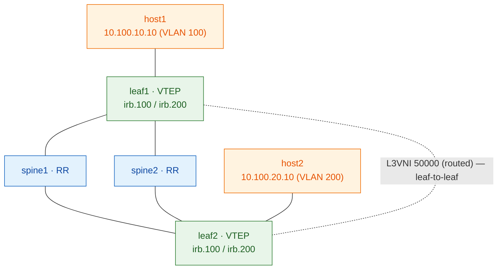

# Lab 03 — Anycast gateway + L3VNI (inter-subnet routing)

> **Complete, self-contained guide.** Builds on the route-reflector fabric and
> adds a **second subnet** plus **inter-subnet routing** — an anycast gateway on
> every leaf and a Layer-3 VNI carrying routed traffic between VTEPs. Pairs with
> **[Session 4](../sessions/04-l3vni-anycast.md)** (the theory).
>
> ⚠️ **DRAFT — pending live validation.** The anycast-IRB / L3VNI config here
> follows the standard Junos symmetric-IRB pattern but has **not yet been run on a
> live vJunos fabric**. Treat the exact syntax as a strong draft; validate on the
> box and we'll mark it ✅.

---

## What you'll build

Two subnets, routed to each other across the fabric via an L3VNI, with a gateway
that lives on every leaf.

| Item | Value |
|------|-------|
| VLAN 100 → L2VNI | 10100, subnet `10.100.10.0/24`, anycast GW `10.100.10.1` |
| VLAN 200 → L2VNI | 10200, subnet `10.100.20.0/24`, anycast GW `10.100.20.1` |
| Tenant VRF | `TENANT` → **L3VNI 50000** |
| Overlay | iBGP-EVPN, spines = route reflectors (from Lab 02) |
| host1 | `10.100.10.10/24` gw `.1` — leaf1, VLAN 100 |
| host2 | `10.100.20.10/24` gw `.1` — leaf2, VLAN 200 |

Fabric: `clab-evpn-l3vni-*`. **Login:** `admin` / `admin@123`.



## Before you start

**⚠️ Only ONE lab at a time** (RAM). Check nothing else runs, wipe if it does:
```bash
docker ps --format '{{.Names}}' | grep '^clab-' || echo "clean"
sudo docker rm -f $(docker ps -aq --filter name=clab-)   # if needed
```

## How to run it

```bash
./scripts/deploy.sh 03-l3vni-anycast
./scripts/apply.sh  03-l3vni-anycast all
```
Ready check: `docker ps --filter "name=clab-evpn-l3vni" --format "table {{.Names}}\t{{.Status}}"`
(wait for all four switches `(healthy)`).

---

# The build

Steps 1–3 (fabric, OSPF underlay, RR overlay) are identical to Lab 02 — see
[Lab 02](lab-02-rr.md) if you want the detail. The new work is **Step 4**.

## Step 4 — L2VNIs + anycast IRBs + L3VNI (leaves only)
**Why:** add a second L2VNI (VLAN 200), give each VLAN an **anycast gateway** (an
IRB with the same `virtual-gateway-address` on every leaf), and route between them
through a tenant **VRF mapped to L3VNI 50000** (symmetric IRB, Type-5).

**leaf1** (leaf2 mirrors with unique `.3` IRB addresses and RD `10.0.0.22`):
```
set protocols evpn encapsulation vxlan
set protocols evpn extended-vni-list all
set switch-options vtep-source-interface lo0.0
set switch-options route-distinguisher 10.0.0.21:1
set switch-options vrf-target target:65000:1
set vlans v100 vlan-id 100
set vlans v100 l3-interface irb.100
set vlans v100 vxlan vni 10100
set vlans v200 vlan-id 200
set vlans v200 l3-interface irb.200
set vlans v200 vxlan vni 10200
set interfaces irb unit 100 family inet address 10.100.10.2/24 virtual-gateway-address 10.100.10.1
set interfaces irb unit 200 family inet address 10.100.20.2/24 virtual-gateway-address 10.100.20.1
set routing-instances TENANT instance-type vrf
set routing-instances TENANT interface irb.100
set routing-instances TENANT interface irb.200
set routing-instances TENANT route-distinguisher 10.0.0.21:100
set routing-instances TENANT vrf-target target:65000:5000
set routing-instances TENANT protocols evpn ip-prefix-routes advertise direct-nexthop
set routing-instances TENANT protocols evpn ip-prefix-routes encapsulation vxlan
set routing-instances TENANT protocols evpn ip-prefix-routes vni 50000
```
> The `.2` (leaf1) / `.3` (leaf2) addresses are unique per leaf; the
> `virtual-gateway-address` (`.1`) is the **shared anycast gateway** hosts point at.

## Step 5 — access ports (different VLAN per leaf)
```
# leaf1 — host1 in VLAN 100
set interfaces ge-0/0/2 unit 0 family ethernet-switching interface-mode access
set interfaces ge-0/0/2 unit 0 family ethernet-switching vlan members v100
# leaf2 — host2 in VLAN 200
set interfaces ge-0/0/2 unit 0 family ethernet-switching interface-mode access
set interfaces ge-0/0/2 unit 0 family ethernet-switching vlan members v200
```

## Host setup (clab host shell)
```bash
docker exec clab-evpn-l3vni-host1 sh -c "ip addr add 10.100.10.10/24 dev eth1; ip link set eth1 up; ip route replace default via 10.100.10.1"
docker exec clab-evpn-l3vni-host2 sh -c "ip addr add 10.100.20.10/24 dev eth1; ip link set eth1 up; ip route replace default via 10.100.20.1"
```

---

## Verify

**Type-5 routes carry the subnets** (leaf1):
```
show route table TENANT.evpn.0
   → 5:10.0.0.22:100::0::10.100.20.0::24/248   (leaf2 advertising VLAN 200's subnet)
```
**The tenant VRF learned the remote subnet:**
```
show route table TENANT.inet.0 10.100.20.0/24   → via L3VNI toward leaf2
```
**⭐ The payoff — inter-subnet ping** (different subnet, different leaf):
```bash
docker exec clab-evpn-l3vni-host1 ping -c3 10.100.20.10
```
`ttl` decrements by 1+ (it was **routed**, not bridged) = the L3VNI worked. 🎉

## Break-it

1. **Remove the L3VNI** on leaf2: `delete routing-instances TENANT protocols evpn ip-prefix-routes vni 50000` → inter-subnet routing breaks, intra-subnet still fine.
2. **Change one leaf's `virtual-gateway-address`** → hosts on that leaf lose the local anycast gateway.

## If it doesn't work (validation notes)

Because this config is a draft, likely spots to check on the live box:
- Does the L3VNI need to be in `switch-options extended-vni-list` too? (add `50000` if so)
- `virtual-gateway-address` behaviour / whether a `virtual-gateway-v4-mac` is needed
- Whether `vrf-table-label` or `no-vrf-advertise` is required on the VRF
- Confirm `show evpn instance` shows both the default-switch and TENANT instances

Paste `show route table TENANT.evpn.0` and any commit errors and we'll lock it in.
