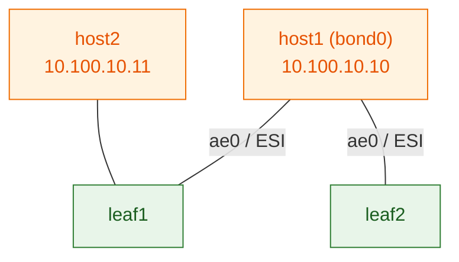

# Lab 05 — ESI multihoming (all-active dual-homing)

> **Complete, self-contained guide.** host1 is dual-homed to **both** leaves as an
> LACP bond / Ethernet Segment — all-active, survives a leaf failure. Pairs with
> **[Session 6](../sessions/06-esi-multihoming.md)**.
>
> ⚠️ **DRAFT — pending live validation.** LACP bonds + ESI have many moving parts;
> treat the config as a strong draft until run on vJunos.

---

## What you'll build

- **host1** dual-homed: `leaf1:ge-0/0/2` **and** `leaf2:ge-0/0/2` bonded (ESI,
  all-active). Both leaves share the **same ESI + LACP system-id**.
- **host2** single-homed on `leaf1:ge-0/0/3` — used to test reaching host1.
- Both hosts in VLAN 100 / L2VNI 10100, subnet `10.100.10.0/24`.
- Fabric: `clab-evpn-esi-*`. Login `admin`/`admin@123`.



## Run it
```bash
./scripts/deploy.sh 05-esi && ./scripts/apply.sh 05-esi all
```

Host setup — **host1 forms an LACP bond** across its two uplinks:
```bash
docker exec clab-evpn-esi-host1 sh -c '
  ip link add bond0 type bond
  echo 802.3ad > /sys/class/net/bond0/bonding/mode
  echo fast > /sys/class/net/bond0/bonding/lacp_rate
  echo 100 > /sys/class/net/bond0/bonding/miimon
  ip link set eth1 down; ip link set eth2 down
  ip link set eth1 master bond0; ip link set eth2 master bond0
  ip link set eth1 up; ip link set eth2 up; ip link set bond0 up
  ip addr add 10.100.10.10/24 dev bond0
'
docker exec clab-evpn-esi-host2 sh -c "ip addr add 10.100.10.11/24 dev eth1; ip link set eth1 up"
```

---

## The build

Steps 1–4 (fabric, OSPF, RR overlay, L2VNI 10100) = same as [Lab 02](lab-02-rr.md).
**Step 5** is the Ethernet Segment — **identical on both leaves** (that's the trick):

```
set chassis aggregated-devices ethernet device-count 1
set interfaces ge-0/0/2 ether-options 802.3ad ae0
set interfaces ae0 esi 00:11:22:33:44:55:66:77:88:99          # SAME on both leaves
set interfaces ae0 esi all-active
set interfaces ae0 aggregated-ether-options lacp active
set interfaces ae0 aggregated-ether-options lacp system-id 00:00:5e:00:53:01   # SAME on both
set interfaces ae0 unit 0 family ethernet-switching interface-mode access
set interfaces ae0 unit 0 family ethernet-switching vlan members v100
```
leaf1 additionally has host2 on `ge-0/0/3` (a normal access port in v100).

---

## Verify

**The Ethernet Segment + DF election** (both leaves should agree):
```
show evpn ethernet-segment
   → ESI 00:11:...:99, Mode all-active, one leaf elected DF
```
**The host bond is up:**
```bash
docker exec clab-evpn-esi-host1 cat /proc/net/bonding/bond0 | head -5
   → "Bonding Mode: IEEE 802.3ad", both slaves up
```
**Connectivity + the redundancy test** — start a continuous ping, then fail a link:
```bash
docker exec clab-evpn-esi-host2 ping 10.100.10.10          # start pinging host1
# in another terminal, fail one of host1's uplinks on leaf1:
#   leaf1#  deactivate interfaces ge-0/0/2 ; commit
# → the ping keeps going (traffic shifts to leaf2). 🎉  Reactivate to restore.
```

## Break-it
1. **Fail one uplink** (above) → host1 stays reachable via the other leaf; watch the
   Type-1 per-ES withdrawal move traffic in <1s.
2. **Mismatch the ESI** on one leaf → the ports are no longer one segment; the bond
   / DF misbehaves. Shows the ESI must be identical on both leaves.

## Validation notes (draft)
Likely spots to check live: `set chassis aggregated-devices ethernet device-count`
must be ≥1 for `ae0` to exist; the host bond mode/lacp_rate via sysfs (Alpine's `ip`
doesn't reliably set bond mode); DF election timing; whether `show evpn
ethernet-segment` resolves on both leaves. Paste that output + any commit errors
and we'll finalize.
