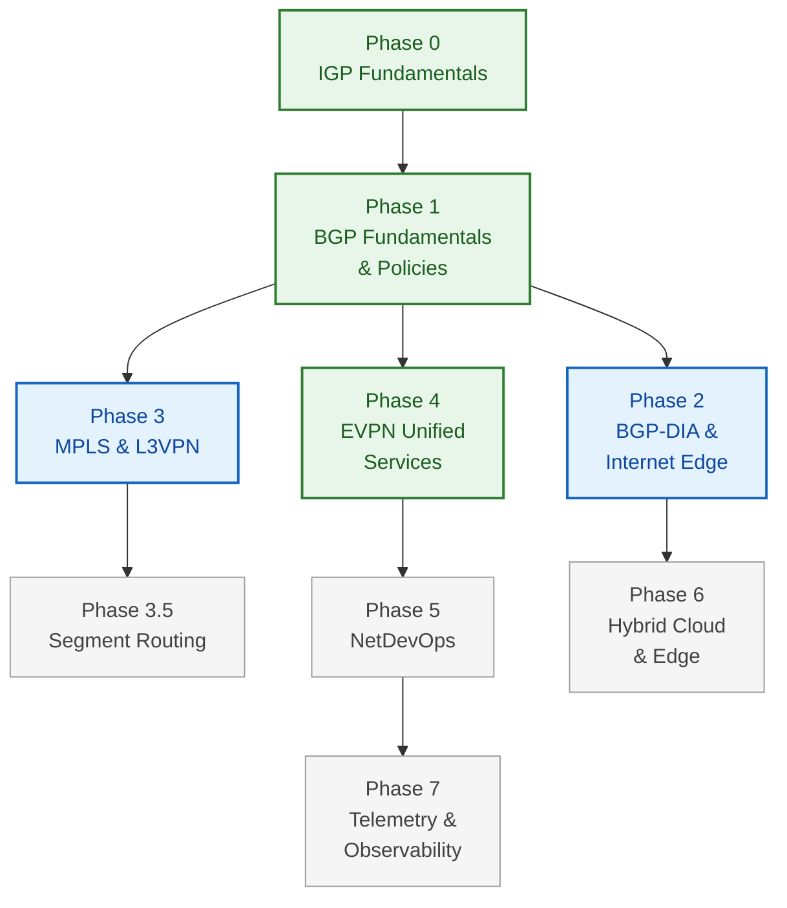

# Curriculum Roadmap

NetForge is built in **phases**, from the routing foundations up to operating a
network in production. Each phase is a standalone course with its own sessions and
labs — but they're ordered so each one builds on the last.

Everything runs in **containers on your own laptop**. No cloud bill, no hardware.

---

## The path

---

## Phases

| Phase | Course | Focus | Status |
|---|---|---|---|
| **–** | [Foundations · Linux](courses/linux-foundations/index.md) | Shell, text processing, SSH, systemd/logs, git, kernel networking & packet diagnostics | 🟢 **Available** — prerequisite |
| **0** | [IGP Fundamentals](courses/00-igp-fundamentals/index.md) | OSPFv2/v3, IS-IS (dual-stack IPv4/IPv6) | 🟢 **Available** — reading track |
| **1** | [BGP Fundamentals & Policies](courses/01-bgp/index.md) | eBGP, iBGP, route reflectors, advanced path selection | 🟢 **4 labs live** |
| **2** | BGP-DIA & Internet Edge | Multi-homing, RPKI, peering, NAT / CGNAT | 📋 Planned |
| **3** | MPLS & L3VPN | LDP, RSVP-TE, L3VPN (Options A, B, C) | 🔬 LDP validated live |
| **3.5** | Segment Routing | SR-MPLS, SR-PCE, Ti-LFA. Steering FAANG traffic without core state | 🔬 Platform probe done |
| **4** | EVPN Unified Services | EVPN-VPWS, EVPN-ELAN, VXLAN-EVPN DCI | 🟢 **Partly live** |
| **5** | Network Automation & NetDevOps | Infrastructure as Code: Python, NetBox, Ansible, CI/CD pipelines | 📋 Planned |
| **6** | Hybrid Cloud & Edge | AWS TGW, BGP over DirectConnect, IPSec / SD-WAN | 📋 Planned |
| **7** | Telemetry & Observability | Streaming telemetry: OpenConfig, gNMI, Prometheus, Grafana | 📋 Planned |

**Available now:** [Linux Foundations](courses/linux-foundations/index.md) (prerequisite) ·
[IGP Fundamentals](courses/00-igp-fundamentals/index.md) (Phase 0, reading track) ·
[eBGP + iBGP](courses/01-bgp/lab-01-ebgp-ibgp.md) (Phase 1, Lab 01) ·
[MPLS + LDP](courses/03-mpls-l3vpn/lab-01-mpls-ldp.md) (Phase 3, Lab 01) · [VXLAN-EVPN on Arista cEOS](courses/04-evpn/lab-01-vxlan-evpn.md) — the validated core of
Phase 4 — plus [VXLAN-EVPN on Juniper](archive/juniper-vxlan-evpn/index.md) as a written reference
course.

---

## Where to start

- **New to routing?** Phase 0 → 1 → 2. That's the enterprise path.
- **Data-centre focus?** Phase 1, then jump to
  [Phase 4 (VXLAN-EVPN)](courses/04-evpn/lab-01-vxlan-evpn.md) — it's live today.
- **Service-provider focus?** Phase 1 → 3 → 3.5.
- **Already know the protocols?** Phase 5 and 7 are where the job actually is.

Phase 0 is deliberately light. OSPF and IS-IS are well covered everywhere; we cover
what you need for the labs and move on to the parts that are harder to find.

---

## Platform

Everything is built on **Arista cEOS** — a container, so a full fabric boots on a
laptop in minutes. Start with the [macOS lab setup](getting-started/lab-setup-macos.md).

We verify what the platform can actually do *before* writing a course. Current
findings for the MPLS and Segment Routing phases:

| Capability | cEOS 4.32.0F |
|---|---|
| MPLS + LDP | ✅ supported |
| BGP VPNv4 / VPNv6, VRF with RD/RT | ✅ supported |
| IS-IS / OSPF Segment Routing (SR-MPLS) | ✅ supported |
| EVPN-VPWS | ✅ supported |
| SRv6 | ❌ not available — will use a second NOS |

### Live LDP test — result

We built a 3-node fabric (`pe1 — p1 — pe2`) and ran OSPF + LDP for real. What we
found:

- **LDP sessions reach `oper`** on both peers, with label bindings exchanged
  correctly in both directions.
- **MPLS forwarding entries are programmed with resolved adjacencies** — next-hop
  MAC, VLAN, egress interface. That's genuine forwarding state, not just the CLI
  accepting a command.

!!! note "What is still open"
    A loopback-to-loopback ping passed, but `traceroute` showed **plain IP hops with
    no label stack** — which is expected, not a fault. LDP *builds* the path; only a
    service (L3VPN, pseudowire) steers traffic onto it.

    So labelled **transit** is not yet proven. The conclusive test is a minimal
    L3VPN, where the label is mandatory — and that's Phase 3's opening lab anyway.
    Phase 3 will be built lab-first and this page updated with the outcome.

---

## How courses are built

Every course follows the same rhythm, so once you've done one you know how to read
them all:

**Mental model → why → mechanism → build → verify → break it → interview.**

Labs are gated: each step has a verification command and a **✅ DONE when…**
condition, so you never build on top of something that silently didn't work.

!!! warning "Draft vs validated"
    A lab is marked **⚠️ DRAFT** until its configuration has been run end to end on a
    live fabric, and **✅ Validated** only after. Every `show` output you see in a
    validated course was captured from a real run — not written from memory.
