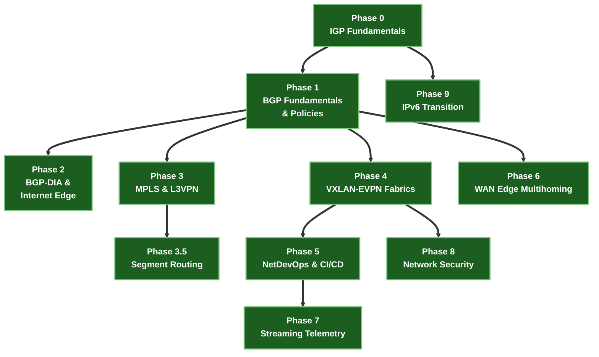

# Curriculum Roadmap

NetForge Labs is built in **phases**, from routing underlay foundations up to operating high-scale service provider, data center, and enterprise WAN fabrics in production. Each phase is a standalone course with executable containerlab topologies, single-source step configs, and automated verifiers.

Everything runs in **containers on your own laptop**. No cloud bills, no hardware, and 0% background idle load.

---

## 🏛️ Curriculum Path & Phase Dependencies

---

## 📋 Course Status & Lab Matrix

| Phase | Course | Focus & Core Architecture | Status |
|---|---|---|---|
| **–** | [Foundations · Linux & Networking](courses/linux-foundations/index.md) | Shell, text processing, SSH, systemd/logs, git, kernel networking | 🟢 **Available** — prerequisite |
| **0** | [IGP Fundamentals](courses/00-igp-fundamentals/index.md) | OSPFv2/v3, IS-IS Wide Metrics (RFC 5305) | 🟢 **Available** — reading track |
| **1** | [BGP Fundamentals & Policies](courses/01-bgp/index.md) | eBGP, iBGP, Route Reflectors, 10-Step Path Selection | 🟢 **4 labs live** |
| **2** | [BGP-DIA & Internet Edge](courses/02-bgp-dia/index.md) | Multi-homing, BGP Communities, RPKI, IXP Peering, BFD, CGNAT | 🟢 **4 labs live** |
| **3** | [MPLS & L3VPN](courses/03-mpls-l3vpn/index.md) | LDP, PHP (Label 3), L3VPN Options A/B/C, MPLS L2VPN VPWS/VPLS | 🟢 **5 labs live** |
| **3.5** | [Segment Routing](courses/035-segment-routing/index.md) | SR-MPLS, SRGB (16000–23999), Node SIDs, Ti-LFA Sub-50ms FRR, SR-PCE | 🟢 **3 labs live** |
| **4** | [VXLAN-EVPN Datacenter Fabrics](courses/04-evpn/index.md) | Pure L2VNI, Symmetric IRB, ESI All-Active, EVPN-VPWS/ELAN, DCI | 🟢 **5 labs live** |
| **5** | [Network Automation & CI/CD](courses/05-netdevops/index.md) | Jinja2/YAML, PyATS, Batfish Static Analysis, gNMI, GitHub Actions CI/CD | 🟢 **5 labs live** |
| **6** | [Enterprise WAN Edge](courses/06-hybrid-cloud/index.md) | Dual-ISP eBGP Multihoming, AS-PATH Prepending, BFD, RPKI ROV | 🟢 **4 labs live** |
| **7** | [Streaming Telemetry](courses/07-telemetry/index.md) | gNMI gRPC Streams, OpenConfig YANG, Prometheus, Grafana | 🟢 **5 labs live** |
| **8** | [Network Security](courses/08-security/index.md) | Control Plane Policing (CoPP), VRF Microsegmentation, iACLs, MACsec | 🟢 **4 labs live** |
| **9** | [IPv6 Transition](courses/09-ipv6/index.md) | IPv6 ND/SLAAC, BGP Unnumbered RFC 5549, 6PE/6VPE over MPLS, NAT64 | 🟢 **4 labs live** |

---

## 🎯 Hyperscale System Design & Interview Preparation

- **[Google & Hyperscale System Design Drill](interview-prep/google-system-design.md)**: Scenario-based drills on 5-Stage Clos topologies, eBGP vs. iBGP trade-offs, Ti-LFA micro-loop avoidance, EVPN ESI failure modes, and gNMI telemetry vs. SNMP.
