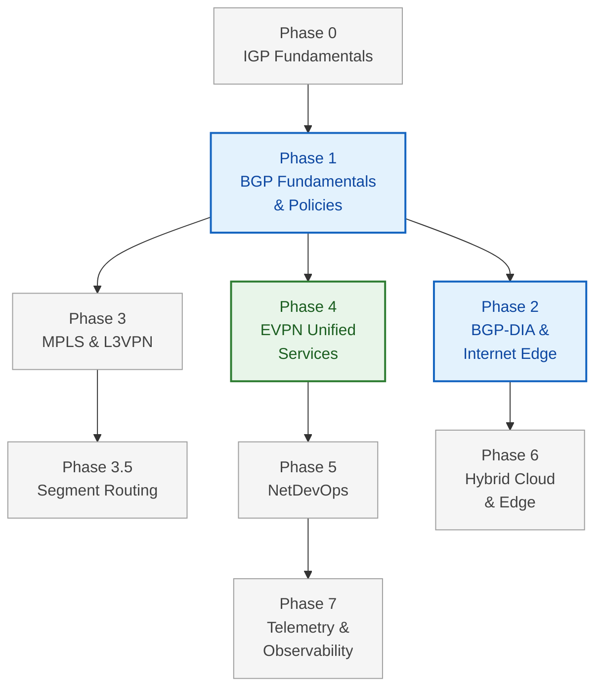

# Curriculum Roadmap

NetForge is built in **phases**, from the routing foundations up to operating a
network in production. Each phase is a standalone course with its own sessions and
labs — but they're ordered so each one builds on the last.

Everything runs in **containers on your own laptop**. No cloud bill, no hardware.

---

## The path

---

## Phases

| Phase | Course | Focus | Status |
|---|---|---|---|
| **0** | IGP Fundamentals | OSPFv2/v3, IS-IS (dual-stack IPv4/IPv6) | 📋 Planned |
| **1** | BGP Fundamentals & Policies | eBGP, iBGP, route reflectors, advanced path selection | 📋 Planned |
| **2** | BGP-DIA & Internet Edge | Multi-homing, RPKI, peering, NAT / CGNAT | 📋 Planned |
| **3** | MPLS & L3VPN | LDP, RSVP-TE, L3VPN (Options A, B, C) | 🔬 Platform probe done |
| **3.5** | Segment Routing | SR-MPLS, SR-PCE, Ti-LFA, SRv6 basics | 🔬 Platform probe done |
| **4** | EVPN Unified Services | EVPN-VPWS, EVPN-ELAN, VXLAN-EVPN DCI | 🟢 **Partly live** |
| **5** | Network Automation & NetDevOps | NetBox, Ansible, Python, gNMI, CI/CD | 📋 Planned |
| **6** | Hybrid Cloud & Edge | AWS TGW, BGP over DirectConnect, IPSec / SD-WAN | 📋 Planned |
| **7** | Telemetry & Observability | Prometheus, Grafana, OpenConfig, TRex | 📋 Planned |

**Available now:** [VXLAN-EVPN on Arista cEOS](ceos/vxlan-evpn.md) — the validated
core of Phase 4 — plus [VXLAN-EVPN on Juniper](sessions/index.md) as a written
reference course.

---

## Where to start

- **New to routing?** Phase 0 → 1 → 2. That's the enterprise path.
- **Data-centre focus?** Phase 1, then jump to
  [Phase 4 (VXLAN-EVPN)](ceos/vxlan-evpn.md) — it's live today.
- **Service-provider focus?** Phase 1 → 3 → 3.5.
- **Already know the protocols?** Phase 5 and 7 are where the job actually is.

Phase 0 is deliberately light. OSPF and IS-IS are well covered everywhere; we cover
what you need for the labs and move on to the parts that are harder to find.

---

## Platform

Everything is built on **Arista cEOS** — a container, so a full fabric boots on a
laptop in minutes. Start with the [macOS lab setup](ceos/00-mac-setup.md).

We verify what the platform can actually do *before* writing a course. Current
findings for the MPLS and Segment Routing phases:

| Capability | cEOS 4.32.0F |
|---|---|
| MPLS + LDP | ✅ supported |
| BGP VPNv4 / VPNv6, VRF with RD/RT | ✅ supported |
| IS-IS / OSPF Segment Routing (SR-MPLS) | ✅ supported |
| EVPN-VPWS | ✅ supported |
| SRv6 | ❌ not available — will use a second NOS |

!!! note "What this table does and doesn't say"
    It confirms the **control plane** exists — the CLI accepts the configuration and
    builds the state. It does **not** yet prove labelled packets forward end to end.
    That test comes before any Phase 3 content is written, and this page will be
    updated with the result either way.

---

## How courses are built

Every course follows the same rhythm, so once you've done one you know how to read
them all:

**Mental model → why → mechanism → build → verify → break it → interview.**

Labs are gated: each step has a verification command and a **✅ DONE when…**
condition, so you never build on top of something that silently didn't work.

!!! warning "Draft vs validated"
    A lab is marked **⚠️ DRAFT** until its configuration has been run end to end on a
    live fabric, and **✅ Validated** only after. Every `show` output you see in a
    validated course was captured from a real run — not written from memory.
