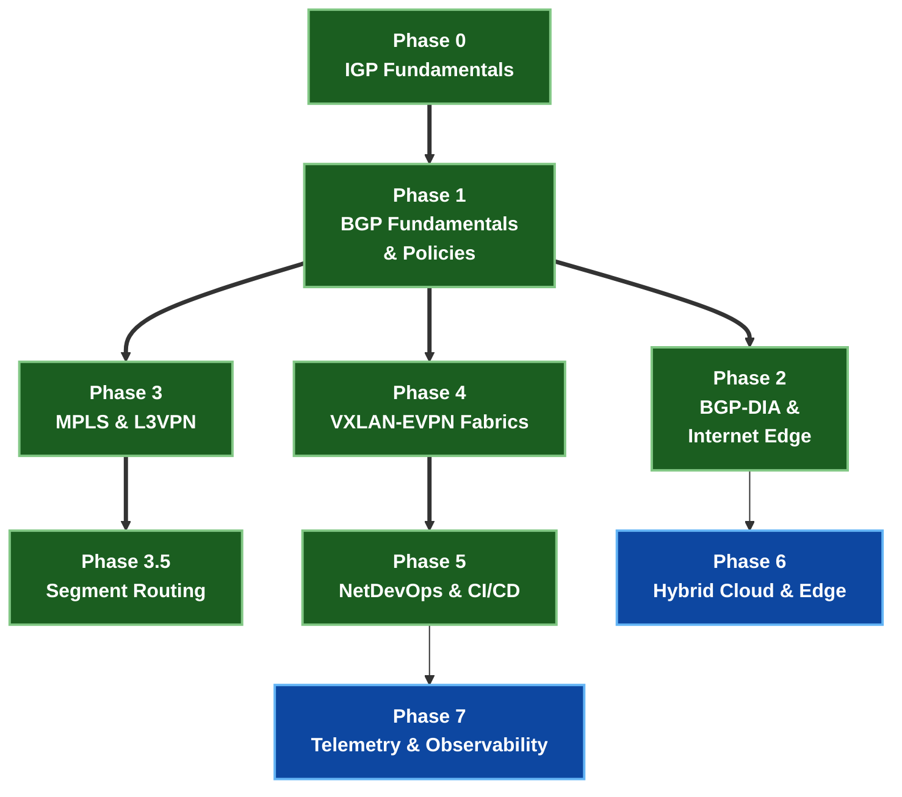

# Curriculum Roadmap

NetForge Labs is built in **phases**, from routing underlay foundations up to operating high-scale service provider and data center fabrics in production. Each phase is a standalone course with executable containerlab topologies, single-source step configs, and automated verifiers.

Everything runs in **containers on your own laptop**. No cloud bills, no hardware.

---

## 🏛️ Curriculum Path & Phase Dependencies

---

## 📋 Course Status & Lab Matrix

| Phase | Course | Focus & Core Architecture | Status |
|---|---|---|---|
| **–** | [Foundations · Linux & Networking](courses/linux-foundations/index.md) | Shell, text processing, SSH, systemd/logs, git, kernel networking | 🟢 **Available** — prerequisite |
| **0** | [IGP Fundamentals](courses/00-igp-fundamentals/index.md) | OSPFv2/v3, IS-IS Wide Metrics (RFC 5305) | 🟢 **Available** — reading track |
| **1** | [BGP Fundamentals & Policies](courses/01-bgp/index.md) | eBGP, iBGP, Route Reflectors, 10-Step Path Selection | 🟢 **4 labs live** |
| **2** | [BGP-DIA & Internet Edge](courses/02-bgp-dia/index.md) | Multi-homing, BGP Communities, RPKI, IXP Peering, BFD, CGNAT | 🟢 **4 labs live** |
| **3** | [MPLS & L3VPN](courses/03-mpls-l3vpn/index.md) | LDP, PHP (Label 3), L3VPN Options A/B/C, MPLS L2VPN VPWS/VPLS | 🟢 **5 labs live** |
| **3.5** | [Segment Routing](courses/035-segment-routing/index.md) | SR-MPLS, SRGB (16000–23999), Node SIDs, Ti-LFA Sub-50ms FRR, SR-PCE | 🟢 **3 labs live** |
| **4** | [VXLAN-EVPN Datacenter Fabrics](courses/04-evpn/index.md) | Pure L2VNI, Symmetric IRB, ESI All-Active, EVPN-VPWS/ELAN, DCI | 🟢 **5 labs live** |
| **5** | [Network Automation & CI/CD](courses/05-netdevops/index.md) | Jinja2/YAML, PyATS, Batfish Static Analysis, gNMI, GitHub Actions CI/CD | 🟢 **5 labs live** |
| **6** | Hybrid Cloud & Edge | AWS DirectConnect Gateway, GCP Cloud Router, BGP IPsec Tunnels | 📋 Planned |
| **7** | Telemetry & Observability | Streaming Telemetry: OpenConfig YANG, gNMI, Prometheus, Grafana | 📋 Planned |

---

## 🧭 Learning Paths

- **Enterprise & Data Center Focus**: Phase 0 $\rightarrow$ Phase 1 $\rightarrow$ **[Phase 4 (VXLAN-EVPN)](courses/04-evpn/index.md)** $\rightarrow$ **[Phase 5 (NetDevOps)](courses/05-netdevops/index.md)**.
- **Service Provider & WAN Focus**: Phase 1 $\rightarrow$ **[Phase 3 (MPLS)](courses/03-mpls-l3vpn/index.md)** $\rightarrow$ **[Phase 3.5 (Segment Routing)](courses/035-segment-routing/index.md)**.
- **Network Automation & NetDevOps**: Jump straight into **[Phase 5 · Network Automation & CI/CD Pipelines](courses/05-netdevops/index.md)**.

---

## ⚡ Validated NOS Platform

All labs are validated on **Arista cEOS 4.32.0F** running in **OrbStack** containers:

| Capability | Arista cEOS 4.32.0F |
|---|---|
| **OSPFv2 / OSPFv3 & IS-IS Wide Metrics** | ✅ Supported |
| **BGP EVPN (AFI 25 / SAFI 70) & Route Types 1–5** | ✅ Supported |
| **MPLS + LDP Forwarding & PHP (Label 3)** | ✅ Supported |
| **BGP VPNv4 / VPNv6 & VRF RD/RT Isolation** | ✅ Supported |
| **IS-IS Segment Routing (SR-MPLS) & Ti-LFA FRR** | ✅ Supported |
| **EVPN-VPWS & EVPN-ELAN Services** | ✅ Supported |
| **gNMI Streaming Telemetry & OpenConfig YANG** | ✅ Supported |
