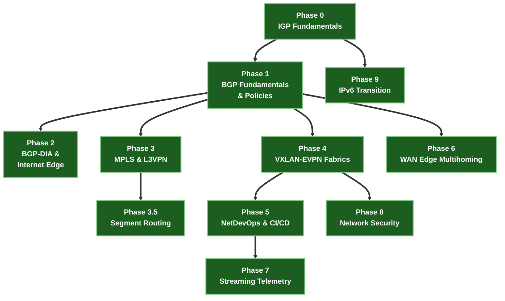

# သင်ရိုးညွှန်းတမ်း လမ်းပြမြေပုံ (Curriculum Roadmap)

NetForge Labs ကို အခြေခံ routing underlay အဆင့်မှသည် လုပ်ငန်းခွင်သုံး high-scale service provider၊ data center နှင့် enterprise WAN fabrics များကို မောင်းနှင်လည်ပတ်နိုင်သည့် အဆင့်အထိ **အဆင့်ဆင့် (Phases)** တည်ဆောက်ထားပါသည်။ Phase တစ်ခုချင်းစီသည် သီးခြားလေ့လာနိုင်သော course တစ်ခုဖြစ်ပြီး တိုက်ရိုက် run နိုင်သော containerlab topologies၊ single-source အဆင့်ဆင့် configurations များနှင့် automated verifiers များ ပါဝင်ပါသည်။

အရာအားလုံးသည် **မိမိ laptop ပေါ်ရှိ containers များတွင်သာ** တိုက်ရိုက် လည်ပတ်ပါသည်။ Cloud ကုန်ကျစရိတ် မရှိပါ၊ hardware ဝယ်ယူရန် မလိုပါ၊ စက်ကို အပိုဝန်ပိစေခြင်း (idle load) လုံးဝ မရှိပါ။

---

## 🏛️ သင်ရိုးညွှန်းတမ်း လမ်းကြောင်းနှင့် အဆင့်ဆင့် အမှီသဟဲပြုပုံ (Phase Dependencies)

---

## 📋 သင်တန်းအခြေအနေနှင့် လက်တွေ့ Lab ဇယား (Course Status & Lab Matrix)

| Phase | သင်တန်းအမည် | အဓိက အလေးပေးမှုနှင့် ဗိသုကာ | လက်ရှိ အခြေအနေ |
|---|---|---|---|
| **–** | [Foundations · Linux & Networking](courses/linux-foundations/index.md) | Shell၊ text processing၊ SSH၊ systemd/logs၊ git၊ kernel networking | 🟢 **Available** — မဖြစ်မနေ လိုအပ်ချက် |
| **0** | [IGP Fundamentals](courses/00-igp-fundamentals/index.md) | OSPFv2/v3၊ IS-IS Wide Metrics (RFC 5305) | 🟢 **Available** — သဘောတရားဖတ်ရှုရန် |
| **1** | [BGP Fundamentals & Policies](courses/01-bgp/index.md) | eBGP၊ iBGP၊ Route Reflectors၊ 10-Step Path Selection | 🟢 **Labs ၄ ခု ပါဝင်သည်** |
| **2** | [BGP-DIA & Internet Edge](courses/02-bgp-dia/index.md) | Multi-homing၊ BGP Communities၊ RPKI၊ IXP Peering၊ BFD၊ CGNAT | 🟢 **Labs ၄ ခု ပါဝင်သည်** |
| **3** | [MPLS & L3VPN](courses/03-mpls-l3vpn/index.md) | LDP၊ PHP (Label 3)၊ L3VPN Options A/B/C၊ MPLS L2VPN VPWS/VPLS | 🟢 **Labs ၅ ခု ပါဝင်သည်** |
| **3.5** | [Segment Routing](courses/035-segment-routing/index.md) | SR-MPLS၊ SRGB (16000–23999)၊ Node SIDs၊ Ti-LFA Sub-50ms FRR၊ SR-PCE | 🟢 **Labs ၃ ခု ပါဝင်သည်** |
| **4** | [VXLAN-EVPN Datacenter Fabrics](courses/04-evpn/index.md) | Pure L2VNI၊ Symmetric IRB၊ ESI All-Active၊ EVPN-VPWS/ELAN၊ DCI | 🟢 **Labs ၅ ခု ပါဝင်သည်** |
| **5** | [Network Automation & CI/CD](courses/05-netdevops/index.md) | Jinja2/YAML၊ PyATS၊ Batfish Static Analysis၊ gNMI၊ GitHub Actions CI/CD | 🟢 **Labs ၅ ခု ပါဝင်သည်** |
| **6** | [Enterprise WAN Edge](courses/06-hybrid-cloud/index.md) | Dual-ISP eBGP Multihoming၊ AS-PATH Prepending၊ BFD၊ RPKI ROV | 🟢 **Labs ၄ ခု ပါဝင်သည်** |
| **7** | [Streaming Telemetry](courses/07-telemetry/index.md) | gNMI gRPC Streams၊ OpenConfig YANG၊ Prometheus၊ Grafana | 🟢 **Labs ၅ ခု ပါဝင်သည်** |
| **8** | [Network Security](courses/08-security/index.md) | Control Plane Policing (CoPP)၊ VRF Microsegmentation၊ iACLs၊ MACsec | 🟢 **Labs ၄ ခု ပါဝင်သည်** |
| **9** | [IPv6 Transition](courses/09-ipv6/index.md) | IPv6 ND/SLAAC၊ BGP Unnumbered RFC 5549၊ 6PE/6VPE over MPLS၊ NAT64 | 🟢 **Labs ၄ ခု ပါဝင်သည်** |

---

## 🎯 Hyperscale System Design နှင့် အင်တာဗျူး ပြင်ဆင်မှု

- **[Google & Hyperscale System Design Drills](interview-prep/google-system-design.md)**: 5-Stage Clos topologies၊ eBGP နှင့် iBGP trade-offs၊ Ti-LFA micro-loop ကာကွယ်မှု၊ EVPN ESI failure modes နှင့် gNMI telemetry vs. SNMP ဆိုင်ရာ scenario အခြေပြု အင်တာဗျူးလေ့ကျင့်ခန်းများ။
