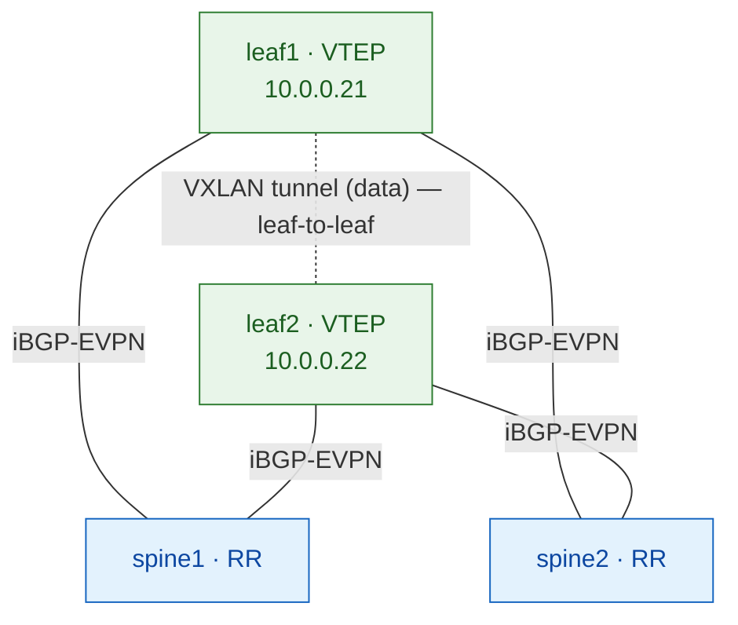

# Session 2 — The Overlay (iBGP-EVPN + Route Reflectors)

> **Goal:** give the fabric a *brain*. In Session 1 the underlay learned to move
> packets between loopbacks. Now the leaves learn to **tell each other where every
> host lives** — using BGP with the EVPN address family — and we do it the way real
> fabrics do it: with the spines as **route reflectors**. By the end you'll know
> why full-mesh doesn't scale, what a route reflector actually does, and why the
> spine never touches a data packet.

---

## 1. Mental model

The underlay was the **road network**. The overlay is the **postal directory
service** running on top of it.

Every leaf is a post office that knows the local residents (the hosts plugged into
it). For mail to reach a resident on *another* leaf, the post offices must share
their directories: *"MAC aa:bb:cc, IP 10.100.10.11 — that resident lives behind
me."* BGP-EVPN is how they share those directory entries.

The **route reflectors** (the spines) are the **central sorting office**. Instead
of every post office phoning every other (chaos at scale), each one reports to the
central office, which redistributes the directory to everyone. Crucially, the
sorting office only handles the *directory* — the actual mail (data packets) still
travels post-office-to-post-office directly on the roads.

---

## 2. Why before how

**Why a control plane at all?**
Plain VXLAN, with no control plane, falls back to Layer-2 **flood-and-learn**: to
find an unknown MAC, flood the frame everywhere and learn from who replies. That
wastes bandwidth and doesn't scale. A control plane lets VTEPs **advertise** what
they know instead of discovering it by flooding.

**Why BGP?**
BGP already distributes reachability at internet scale, with mature policy, and it
carries *families* of routes. EVPN is simply a new address family bolted onto the
BGP you already know. Reusing BGP means one protocol, one mental model, proven
scaling.

**Why iBGP here (not eBGP)?**
All our switches are in **one autonomous system (AS 65000)**, so the overlay is
*internal* BGP (iBGP). It's the simplest starting point. (An eBGP overlay — each
leaf its own AS — is a later session with different trade-offs.)

**Why route reflectors instead of a full mesh?** *(the heart of this session)*
iBGP has a hard rule (next section) that forces **every iBGP speaker to peer with
every other** — a full mesh. That's **N×(N-1)/2** sessions:

| Leaves | Full-mesh sessions |
|--------|--------------------|
| 2 | 1 |
| 4 | 6 |
| 16 | 120 |
| 48 | 1,128 |

Unmanageable past a handful, and adding one leaf means reconfiguring *every*
existing leaf. **Route reflectors collapse this to 2 sessions per leaf, forever.**
That's why every production fabric uses them.

---

## 3. The mechanism (technical depth)

### EVPN is an address family in MP-BGP
Multiprotocol BGP can carry many kinds of reachability, identified by
**AFI/SAFI**. EVPN is **AFI 25 (L2VPN) / SAFI 70 (EVPN)**. In Junos you enable it
with `family evpn signaling` on the BGP group. The leaves negotiate this family
and can then exchange **EVPN routes** (the Type-2/3/5 routes of Session 3+).

### The iBGP split-horizon rule — *why full mesh exists*
To prevent routing loops, iBGP enforces: **a route learned from one iBGP peer is
NOT re-advertised to another iBGP peer.** (eBGP doesn't need this because the
AS-path prevents loops; iBGP has no AS-path change between internal peers, so it
uses this rule instead.)

Consequence: if leaf1 tells spine1 about a host, spine1 — a normal iBGP peer —
**may not pass it on to leaf2**. The only way leaf2 hears it is if leaf1 tells
leaf2 *directly*. Hence: everyone must peer with everyone. Full mesh.

### Route reflection — the exception that saves us
A **route reflector (RR)** is explicitly *allowed* to break the split-horizon rule
and **reflect** routes between its clients. Configure a spine with a **cluster
id** and it becomes an RR; the leaves peering with it become its **clients**. Now:

- leaf1 → spine1 (RR): "here's my host"
- spine1 reflects it → leaf2

leaf2 hears about leaf1's host *via the reflector* — without a direct leaf1↔leaf2
session. Each leaf needs only its two sessions to the two spines.

**Loop prevention for RRs** uses two attributes the RR adds: **Originator-ID**
(who first advertised it — don't send it back to them) and **Cluster-list** (the
list of clusters it passed through — drop if it sees its own). This is why the two
spines get **different** cluster ids.

### ⭐ Next-hop is preserved — the spine is NOT a VTEP
This is the subtle, essential point. When the RR reflects an EVPN route, it **does
not change the BGP next-hop** — the next-hop stays the *originating leaf's*
loopback. So when leaf2 installs leaf1's host route, it points at **leaf1's VTEP**,
and the VXLAN tunnel is built **leaf1 ↔ leaf2 directly**. The spine relays the
*directory entry* but never sits in the *data path* — it has no `switch-options`,
no VNIs, and never encapsulates a packet.

> A spine-as-RR scales the **control plane** without pulling the spine into the
> **data plane**. That decoupling is the whole elegance of the design — and a
> favourite interview question.

### Redundancy
Both spines are RRs (different cluster ids), and every leaf peers with both. Lose
one spine and the other still reflects the full directory — you'll prove this in
Break & observe.

---

## 4. Build it

This session builds the overlay of **[Lab 02 — route reflectors](../labs/lab-02-rr.md)**.



```bash
./scripts/deploy.sh 02-ospf-ibgp-rr
./scripts/apply.sh  02-ospf-ibgp-rr 01   # fabric (Session 1)
./scripts/apply.sh  02-ospf-ibgp-rr 02   # underlay OSPF (Session 1)
./scripts/apply.sh  02-ospf-ibgp-rr 03   # overlay — this session
```

**Config, explained — spine1 (a route reflector):**
```
set routing-options autonomous-system 65000
set protocols bgp group overlay type internal          # iBGP
set protocols bgp group overlay local-address 10.0.0.11 # source from loopback
set protocols bgp group overlay family evpn signaling   # the EVPN address family
set protocols bgp group overlay cluster 10.0.0.11       # ← makes this an RR
set protocols bgp group overlay neighbor 10.0.0.21      # leaf1 (client)
set protocols bgp group overlay neighbor 10.0.0.22      # leaf2 (client)
```
spine2 is identical with `local-address`/`cluster` = `10.0.0.12` (different cluster id).

**leaf1 (an RR client)** — just peers with the two spines, no cluster:
```
set routing-options autonomous-system 65000
set protocols bgp group overlay type internal
set protocols bgp group overlay local-address 10.0.0.21
set protocols bgp group overlay family evpn signaling
set protocols bgp group overlay neighbor 10.0.0.11      # spine1 (RR)
set protocols bgp group overlay neighbor 10.0.0.12      # spine2 (RR)
```
leaf2 mirrors with `local-address 10.0.0.22`. The one line that turns a spine into
a reflector is `cluster` — everything else is ordinary iBGP.

---

## 5. Verify — and how to read it

### Leaves peer with *both* spines
```
leaf1> show bgp summary
Peer          AS      State|#Active/Received/Accepted
10.0.0.11     65000   Establ    ← spine1
10.0.0.12     65000   Establ    ← spine2
```
Two sessions, both `Establ`, and no leaf1↔leaf2 session. That's the whole scaling
win visible in one command: **2 sessions per leaf, not N-1.**

### The spine is now in the control plane
```
spine1> show bgp summary
Peer          AS      State
10.0.0.21     65000   Establ    ← leaf1 (client)
10.0.0.22     65000   Establ    ← leaf2 (client)
```
Unlike Session 1 (where a spine ran only OSPF and `show bgp summary` said *"BGP is
not running"*), the spine now speaks BGP-EVPN — as a reflector.

### ⭐ The RR holds and reflects routes
```
spine1> show route table bgp.evpn.0
```
Once a VNI has hosts (Session 3), this table on the **spine** holds the EVPN routes
it's reflecting between leaves. Seeing routes here proves reflection is happening.

### ⭐ The data plane bypasses the spine
```
leaf1> show route table bgp.evpn.0 extensive | match "Protocol next hop"
   Protocol next hop: 10.0.0.22        ← leaf2, NOT a spine
```
Even though a spine *reflected* the route, its next-hop is the far **leaf**. Proof
the VXLAN tunnel is leaf-to-leaf and the spine is control-plane only.

*(At this stage, with no VNIs yet, `bgp.evpn.0` is legitimately empty — sessions are
up with nothing to advertise. Routes arrive in Session 3.)*

---

## 6. Break & observe

**Kill a route reflector:**
```
spine1# deactivate protocols bgp   ; commit
```
- **Predict:** does the overlay survive? Do hosts still reach each other?
- **Observe:** on leaf1, `show bgp summary` — the `10.0.0.11` session drops, but
  `10.0.0.12` stays `Establ`. Everything keeps working, because the *other* RR
  still reflects the full directory. **This is exactly why you run two RRs.**
- **Reverse:** `activate protocols bgp ; commit`.

**Remove the `cluster` from a spine** (turn the RR back into a plain iBGP peer):
```
spine1# delete protocols bgp group overlay cluster 10.0.0.11   ; commit
```
- **Predict:** does spine1 still pass leaf1's routes to leaf2?
- **Observe:** without `cluster`, the split-horizon rule reapplies — spine1 accepts
  leaf1's routes but **won't reflect** them to leaf2. If it were the only RR, leaf2
  would lose reachability. **This is the cleanest demonstration of *why* route
  reflection exists.**
- **Reverse:** re-add the `cluster`.

---

## 7. Lessons & interview

**Design note:**
- Spine-as-RR scales the control plane to any fabric size (2 sessions/leaf) while
  keeping spines out of the data plane. It's the default for real deployments.

**Open validation item (Junos):**
- A route reflector that isn't a VTEP has no routing-instance to import routes
  into. On Junos the EVPN routes should still sit in `bgp.evpn.0` and be reflected
  — but some platforms (e.g. Cisco) need a *"retain route-target all"* knob.
  Confirm on the live fabric that the spine's `bgp.evpn.0` holds routes; if it's
  empty, that knob is the fix.

**Interview questions:**
1. Why does iBGP require a full mesh, and what rule causes it?
2. What single piece of config turns a router into a route reflector, and what do
   Originator-ID and Cluster-list prevent?
3. ⭐ When a spine reflects an EVPN route, what happens to the next-hop — and why
   does that keep the spine out of the data plane?
4. You have 30 leaves. How many overlay sessions per leaf with full mesh vs with
   two route reflectors?
5. Why do the two spines need different cluster ids?

---

**Next:** Session 3 — **L2VNI: stretching a VLAN across the fabric** — where we
finally put hosts on the wire and watch Type-2/Type-3 routes bring the overlay to
life.
