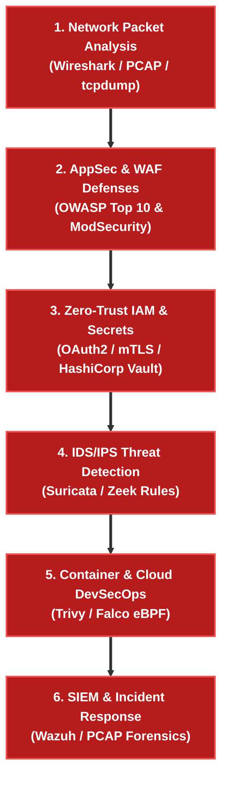

# 🔒 Cybersecurity & DevSecOps Engineer Track

> 🚀 **Real Cybersecurity Engineering**: From Web Application Firewalls (WAF) and Identity & Access Management (IAM) to Cloud/Container Security (Trivy/Falco), Suricata IDS/IPS, SIEM Log Analysis, and Incident Response Playbooks.

---

## 🎯 Target Roles & Industry Demand
- **Roles**: Cybersecurity Engineer, DevSecOps Engineer, Security Operations (SecOps) Lead, Cloud Security Architect, Incident Responder.
- **Target Employers**: Hyperscalers, Financial Tech (FinTech), Healthcare, Defense Contractors, and Security Operations Centers (SOC).

---

## 🧠 Core Cybersecurity Domains & Real Engineering Tools

| Security Domain | Real Engineering Tool | Key Technical Mechanics |
|---|---|---|
| **AppSec & WAF** | **OWASP Top 10 / WAF (ModSecurity)** | Preventing SQLi, XSS, CSRF, and API rate-limiting |
| **IAM & Zero-Trust Auth** | **OAuth2 / OIDC / mTLS / HashiCorp Vault** | Secret management, mTLS client certs, JWT validation |
| **Cloud & Container Sec** | **Trivy / Falco / K8s RBAC** | Container vulnerability scanning, eBPF runtime threat detection |
| **IDS / IPS & Detection** | **Suricata / Snort / Zeek** | Deep packet inspection, signature matching, YARA rules |
| **SIEM & SecOps** | **Elastic SIEM / Wazuh / Splunk** | Log aggregation, PCAP forensic analysis, automated IR playbooks |

---

## 🧪 Real Cybersecurity Lab Roadmap

---

## 🎯 Cybersecurity Engineer Technical Interview Drills

### ❓ Question 1: How does eBPF runtime detection (Falco) catch container breakouts without adding latency?
**Answer:**
Traditional security agents run in user space and poll process tables, adding CPU overhead. **Falco uses eBPF (Extended Berkeley Packet Filter)** programs loaded directly inside the Linux kernel to intercept system calls (`execve`, `clone`, `openat`) in real-time. If a container executes a shell (`/bin/sh`) or modifies sensitive host paths (`/etc/shadow`), Falco triggers an instant high-priority alert with zero user-space context switching overhead.

### ❓ Question 2: Explain the difference between OAuth2, OIDC, and mTLS in a Zero-Trust architecture.
**Answer:**
- **OAuth2**: An **authorization framework** providing scoped access tokens (`Bearer JWT`) to third-party applications.
- **OIDC (OpenID Connect)**: An **identity layer on top of OAuth2** (`id_token`) providing user authentication details.
- **mTLS (Mutual TLS)**: A **transport-layer security mechanism** where both client and server present X.509 cryptographic certificates to mutually authenticate before exchanging application payload bytes.
