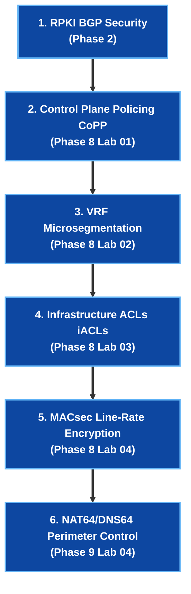

# 🔒 Network Security Architect Track

> 🚀 **Future-Proof Career Track**: Master Control Plane Protection (CoPP), Zero-Trust VRF Microsegmentation, Infrastructure ACLs (iACLs), IEEE 802.1AE MACsec Line-Rate Encryption, and RPKI Route Origin Validation.

---

## 🎯 Target Roles & Industry Demand
- **Roles**: Network Security Architect, Principal SecOps Engineer, Datacenter Security Lead, Infrastructure Security Architect.
- **Target Companies**: Financial Institutions (JPMorgan, Goldman Sachs), Defense & Government Contractors, Hyperscalers (Google, Meta, AWS), and Global Enterprises.

---

## 🧠 Core Production Security Requirements

| Security Domain | Production Risk / Attack Vector | Engineering Solution & Protocol |
|---|---|---|
| **Control Plane Protection** | SYN Floods & DDoS targeting switch CPU | **Control Plane Policing (CoPP)** rate-limiting at switch ASIC level |
| **Datacenter Segmentation** | East-West Lateral Threat Movement | **Zero-Trust VRF Microsegmentation** + Inter-VRF Route Leaking ACLs |
| **Core Router Protection** | External IP Scanning & Transit Spoofing | **Infrastructure Access Control Lists (iACLs)** protecting loopbacks |
| **Physical Link Security** | Man-in-the-Middle (MitM) Fiber Tapping | **IEEE 802.1AE MACsec (AES-256-GCM)** line-rate hardware encryption |
| **BGP Edge Security** | BGP Route Hijacking & Prefix Leaks | **RPKI Route Origin Validation (ROV)** & ROA Validator daemons |

---

## 🧪 Sequential Hands-On Lab Roadmap



---

## 📁 Executable Lab Environment

All security mechanisms are 100% containerized and executable locally:

```bash
# Clone repository & enter security lab
git clone https://github.com/etherhtun/netforge-labs.git
cd netforge-labs/labs/security-lab

# Run all security gate checks live on OrbStack cEOS nodes
./run.sh --all
```

---

## 🎯 Network Security Architect Interview Drills

### ❓ Question 1: How does CoPP protect the switch CPU during a 10Mpps SYN flood?
**Answer:**
CoPP applies `class-map` classifiers and `policy-map` hardware rate-limiters at the switch ASIC ingress pipeline **before** packets are punted to the CPU. Unspecified or high-rate traffic exceeding the committed rate (`police pps 1000`) is dropped in hardware, allowing critical BGP and OSPF keepalives to reach the routing daemon without CPU starvation.

### ❓ Question 2: Why is MACsec preferred over IPsec for interconnecting data center switches?
**Answer:**
IPsec operates at Layer 3 and requires software fragmentation/reassembly overhead, adding microsecond latency and reducing throughput. **MACsec (IEEE 802.1AE)** operates at Layer 2 directly on the Ethernet physical layer, encrypting the entire payload (including VLAN tags) at 100G/400G line rate inside switch ASICs with zero packet latency penalty.
