# 🔒 Cybersecurity & DevSecOps Learning Path

> 🚀 **Real Cybersecurity & Infrastructure Defense**: From Control Plane Policing (CoPP) and VRF microsegmentation to Web Application Firewalls (WAF), Zero-Trust Identity (IAM/mTLS), Container Security (Falco eBPF), and SIEM Incident Response.

---

## 📊 Learning Path Overview

| Metric | Target Specification |
|---|---|
| **Estimated Completion Time** | **30 – 35 Hours** (Hands-on labs & scenario-driven drills) |
| **Milestone Stages** | **6 Progressive Stages** (Packet Analysis $\rightarrow$ AppSec/WAF $\rightarrow$ Zero-Trust $\rightarrow$ Network & CoPP Defense $\rightarrow$ Container Security $\rightarrow$ SIEM & IR) |
| **Lab Framework** | **Containerlab + Arista cEOS + Linux Security Tools** (Runs 100% locally on macOS OrbStack or Linux Docker) |
| **Target Roles** | Cybersecurity Engineer, DevSecOps Engineer, Security Operations (SecOps) Lead, Cloud Security Architect |
| **Target Employers** | Hyperscalers, Financial Tech (FinTech), Healthcare, Defense Contractors, and Security Operations Centers (SOC) |

---

## 🧠 Core Cybersecurity Domains & Real Engineering Tools

| Security Domain | Real Engineering Tool | Key Technical Mechanics |
|---|---|---|
| **Network & Switch Defense** | **Arista cEOS / CoPP / iACLs** | CPU control plane rate-limiting, BGP TTL security, and VRF microsegmentation |
| **AppSec & WAF** | **OWASP Top 10 / ModSecurity** | Preventing SQLi, XSS, CSRF, and enforcing API rate-limiting rules |
| **IAM & Zero-Trust Auth** | **OAuth2 / OIDC / mTLS / Vault** | Secret lifecycle management, mTLS client certificates, and scoped JWT validation |
| **Cloud & Container Sec** | **Trivy / Falco / K8s RBAC** | Static image vulnerability scanning and eBPF runtime kernel call interception |
| **IDS / IPS & Detection** | **Suricata / Snort / Zeek** | Deep packet inspection, signature matching, and automated threat blocking |
| **SIEM & SecOps** | **Wazuh / Elastic SIEM / PCAP** | Centralized security log ingestion, forensic analysis, and automated triage playbooks |

---

## 🗺️ 6-Stage Progressive Milestone Roadmap

```mermaid
graph TD
    S1["<b>Stage 1: Packet Forensics & Traffic Inspection</b><br/>Wireshark, tcpdump & Flow Analysis<br/><i>Dissect protocol handshakes and malformed headers</i>"]
    S2["<b>Stage 2: Application Security & Edge WAF</b><br/>OWASP Top 10 Defenses & ModSecurity Rules<br/><i>Filter malicious payloads before reaching application backends</i>"]
    S3["<b>Stage 3: Zero-Trust Identity & Secrets Management</b><br/>OAuth2, OIDC, mTLS & HashiCorp Vault<br/><i>Cryptographic identity and short-lived credential rotation</i>"]
    S4["<b>Stage 4: Network Fabric Hardening & CoPP Defense</b><br/>Control Plane Policing, iACLs & VRF Segmentation<br/><i>Shield switch CPUs from distributed denial of service</i>"]
    S5["<b>Stage 5: Container & Cloud DevSecOps</b><br/>Trivy Scanning & Falco eBPF Kernel Threat Detection<br/><i>Detect container breakouts and privilege escalation in real time</i>"]
    S6["<b>Stage 6: SIEM Ingestion & Incident Response Playbooks</b><br/>Wazuh, Log Analysis & Forensic Containment<br/><i>Investigate breaches and automate threat isolation</i>"]

    S1 ==> S2 ==> S3 ==> S4 ==> S5 ==> S6

    click S1 href "#stage-1-packet-forensics-traffic-inspection" "Jump to Stage 1"
    click S2 href "#stage-2-application-security-edge-waf" "Jump to Stage 2"
    click S3 href "#stage-3-zero-trust-identity-secrets-management" "Jump to Stage 3"
    click S4 href "#stage-4-network-fabric-hardening-copp-defense" "Jump to Stage 4"
    click S5 href "#stage-5-container-cloud-devsecops" "Jump to Stage 5"
    click S6 href "#stage-6-siem-ingestion-incident-response-playbooks" "Jump to Stage 6"

    classDef sec fill:#b71c1c,stroke:#ef5350,color:#ffffff,stroke-width:2px,font-weight:bold;
    class S1,S2,S3,S4,S5,S6 sec;
```



---

## 🚀 Interactive Lesson Directory (Click Any Lesson to Start)

| Milestone Stage | Security Domain | Clickable Lessons & Hands-on Labs | Runnable Lab | Action |
|---|---|---|---|---|
| **Stage 1**<br/>`Packet Forensics` | Wireshark Dissection, TCP Handshake Anomalies, tcpdump PCAPs | • [Linux Networking & Packet Diagnostics](../courses/linux-foundations/06-kernel-networking.md) | Local Terminal | [Start Stage 1 →](../courses/linux-foundations/06-kernel-networking.md) |
| **Stage 2**<br/>`AppSec & WAF` | OWASP Top 10 Defenses, ModSecurity Rules, Rate-Limiting | • [Application Security & Reverse Proxy Architecture](../courses/02-bgp-dia/lab-04-cgnat-services.md) | Local Container | [Start Stage 2 →](../courses/02-bgp-dia/lab-04-cgnat-services.md) |
| **Stage 3**<br/>`Zero-Trust Auth` | OAuth2 Scopes, OIDC Claims, mTLS Client Certs, HashiCorp Vault | • [Zero-Trust Architecture & Interview Drills](#question-2-explain-the-difference-between-oauth2-oidc-and-mtls-in-a-zero-trust-architecture) | Local Terminal | [Review Questions →](#question-2-explain-the-difference-between-oauth2-oidc-and-mtls-in-a-zero-trust-architecture) |
| **Stage 4**<br/>`Network Defense` | Control Plane Policing (CoPP), Infrastructure ACLs, VRF Isolation, MACsec | • [Phase 8 · Lab 01: CoPP CPU Protection](../courses/08-security/lab-01-copp-cpu-protection.md)<br/>• [Phase 8 · Lab 02: VRF Microsegmentation](../courses/08-security/lab-02-vrf-route-leaking-acls.md)<br/>• [Phase 8 · Lab 03: Infrastructure ACLs (iACL)](../courses/08-security/lab-03-infrastructure-acls.md)<br/>• [Phase 8 · Lab 04: MACsec Line-Rate Security](../courses/08-security/lab-04-macsec-line-rate-security.md) | `labs/security-lab` | [Start Stage 4 →](../courses/08-security/lab-01-copp-cpu-protection.md) |
| **Stage 5**<br/>`Container Security` | Trivy Image Scanning, Linux Namespaces, Falco eBPF System Call Filters | • [Container Security & eBPF Drills](#question-1-how-does-ebpf-runtime-detection-falco-catch-container-breakouts-without-adding-latency) | Local Docker | [Review Drills →](#question-1-how-does-ebpf-runtime-detection-falco-catch-container-breakouts-without-adding-latency) |
| **Stage 6**<br/>`SIEM & IR Playbooks` | Wazuh SIEM Ingestion, Alert Correlation, Incident Containment | • [Telemetry Alerting & Anomaly Detection](../courses/07-telemetry/lab-05-telemetry-alerting.md) | `labs/telemetry-lab` | [Start Stage 6 →](../courses/07-telemetry/lab-05-telemetry-alerting.md) |

---

## 🧪 Detailed Milestone Curricula

### 📍 Stage 1: Packet Forensics & Traffic Inspection
- **Core Focus**: Mastering raw packet capture analysis and protocol behavior at Layer 2 through Layer 7.
- **Key Concepts**: TCP 3-way handshake anomalies, TCP window exhaustion, ARP poisoning detection, and ICMP tunneling.

### 📍 Stage 2: Application Security & Edge WAF
- **Core Focus**: Defending web APIs and microservices against the OWASP Top 10 web application vulnerabilities.
- **Key Concepts**: SQL injection patterns, cross-site scripting (XSS), request rate-limiting, and CRS rule tuning in ModSecurity.

### 📍 Stage 3: Zero-Trust Identity & Secrets Management
- **Core Focus**: Cryptographic mutual authentication and dynamic secret issuance.
- **Key Concepts**: Public Key Infrastructure (PKI), TLS 1.3 handshakes, mutual TLS (mTLS) with client certs, OAuth2 scopes, and HashiCorp Vault transit secrets.

### 📍 Stage 4: Network Fabric Hardening & CoPP Defense
- **Core Focus**: Hardening network switches and routers against control-plane exhaustion and unauthorized lateral movement.
- **Key Concepts**: Modular QoS CLI (MQC) Control Plane Policing (CoPP), Infrastructure ACLs (iACLs) dropping spoofed traffic, BGP Generalized TTL Security Mechanism (GTSM RFC 5082), and VRF microsegmentation.
- **Interactive Labs**:
    - [Phase 8: Network Security & Microsegmentation](../courses/08-security/index.md)
    - [Lab 01: Control Plane Policing (CoPP)](../courses/08-security/lab-01-copp-cpu-protection.md)
    - [Lab 02: VRF Microsegmentation](../courses/08-security/lab-02-vrf-route-leaking-acls.md)
    - [Lab 03: Infrastructure ACLs (iACL)](../courses/08-security/lab-03-infrastructure-acls.md)
    - [Lab 04: MACsec Line-Rate Encryption](../courses/08-security/lab-04-macsec-line-rate-security.md)
- **Local Runner**:
    ```bash
    cd labs/security-lab
    ./run.sh --guided
    ```

### 📍 Stage 5: Container & Cloud DevSecOps
- **Core Focus**: Securing cloud-native containers across CI/CD build time and cluster runtime.
- **Key Concepts**: Static vulnerability scanners (Trivy), Linux kernel capabilities, and eBPF system call tracing with Falco.

### 📍 Stage 6: SIEM Ingestion & Incident Response Playbooks
- **Core Focus**: Detecting, triaging, and responding to security incidents with verifiable audit trails.
- **Key Concepts**: Syslog/gNMI telemetry ingestion, correlation rules, PCAP deep dives, and automated quarantine scripts.

---

## 🛠️ Executable Local Lab Environment

Test your network security policies on live Arista cEOS containers:

```bash
# 1. Navigate to the Security & Microsegmentation lab
cd labs/security-lab

# 2. Launch the guided interactive runner
./run.sh --guided

# Or deploy the complete verified topology in one command
./run.sh --all
```

---

## 🎯 Cybersecurity Engineer Technical Interview Drills

### ❓ Question 1: How does eBPF runtime detection (Falco) catch container breakouts without adding latency?
**Answer:**
Traditional security agents run in user space and poll process tables, adding substantial CPU overhead. **Falco uses eBPF (Extended Berkeley Packet Filter)** programs loaded directly inside the Linux kernel to intercept system calls (`execve`, `clone`, `openat`) in real-time. If a container executes an unauthorized shell (`/bin/sh`) or modifies sensitive host paths (`/etc/shadow`), Falco triggers an instant alert with zero user-space context switching overhead.

### ❓ Question 2: Explain the difference between OAuth2, OIDC, and mTLS in a Zero-Trust architecture.
**Answer:**
- **OAuth2**: An **authorization framework** providing scoped access tokens (`Bearer JWT`) to third-party applications.
- **OIDC (OpenID Connect)**: An **identity layer on top of OAuth2** (`id_token`) providing cryptographically signed user authentication claims.
- **mTLS (Mutual TLS)**: A **transport-layer security mechanism** where both client and server present X.509 cryptographic certificates to mutually authenticate before exchanging application payload bytes.

### ❓ Question 3: Why is Control Plane Policing (CoPP) mandatory on high-throughput datacenter switches?
**Answer:**
Switch ASICs forward data plane packets at terabit speeds using dedicated TCAM. However, packets destined for the switch CPU (BGP keepalives, OSPF hellos, ARP, ICMP, SSH) travel across an internal low-bandwidth PCIe bus. Without **CoPP rate-limiters**, a simple ping flood or SYN flood can overwhelm the Supervisor CPU, causing BGP sessions to time out and bringing down the entire datacenter fabric.
