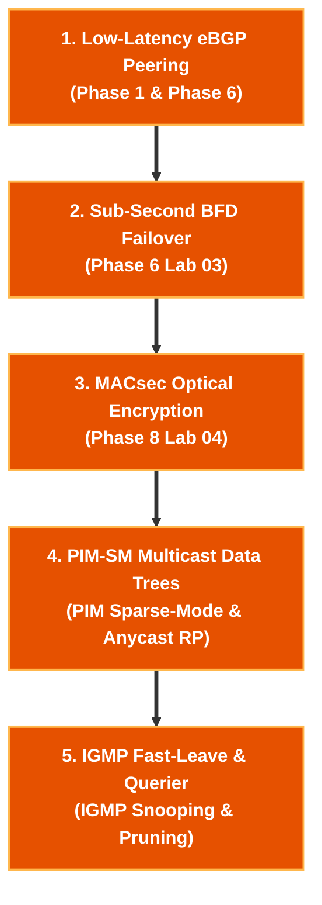

# ⚡ Low-Latency Financial Network Engineer Track

> 🚀 **High-Frequency Trading (HFT) & Low-Latency Infrastructure**: Master PIM-SM multicast market data distribution trees, IGMP fast-leave, BFD sub-second link detection, MACsec line-rate encryption, and kernel-bypass network architectures.

---

## 🎯 Target Roles & Target Companies
- **Target Roles**: High-Frequency Trading (HFT) Network Engineer, Quantitative Infrastructure Engineer, Low-Latency Network Architect, Exchange Co-location Lead.
- **Target Employers**: Citadel, Jane Street, Jump Trading, Two Sigma, Optiver, DRW, NYSE, NASDAQ, and CME Group.

---

## 🧠 Core Low-Latency Engineering Pillars

| Engineering Pillar | Key Low-Latency Technologies | Technical Function |
|---|---|---|
| **Multicast Market Feeds** | **PIM-SM / Anycast RP / IGMPv2/v3** | One-to-many market data tick feed distribution |
| **Sub-Second Failover** | **BFD (Microsecond Timers)** | Instant detection of co-location fiber link drops |
| **Line-Rate Encryption** | **IEEE 802.1AE MACsec (AES-256-GCM)** | Low-latency physical optical link encryption |
| **Kernel Bypass** | **Solarflare / OpenOnload / DPDK** | Bypassing OS kernel stack for sub-microsecond latency |

---

## 🧪 Sequential Lab Roadmap



---

## 📁 Executable Local Lab Environment

```bash
# Clone repository & enter WAN Edge lab
git clone https://github.com/etherhtun/netforge-labs.git
cd netforge-labs/labs/wan-edge-lab

# Deploy BFD sub-second failover and eBGP peering
./run.sh --all
```
