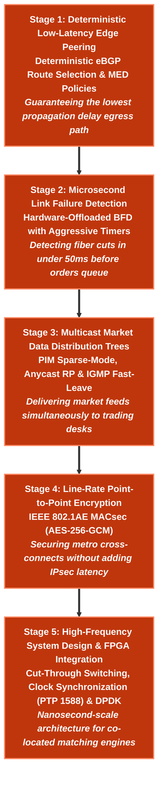

# ⚡ Low-Latency Financial Network Engineer Learning Path

> 🚀 **High-Frequency Trading (HFT) & Low-Latency Infrastructure**: Master PIM-SM multicast market data distribution trees, IGMP fast-leave, BFD sub-second link detection, MACsec line-rate encryption, cut-through switching, and kernel-bypass network architectures.

---

## 📊 Learning Path Overview

| Metric | Target Specification |
|---|---|
| **Estimated Completion Time** | **25 – 30 Hours** (Self-paced, hands-on lab driven) |
| **Milestone Stages** | **5 Progressive Stages** (Low-Latency Peering $\rightarrow$ Microsecond Failover $\rightarrow$ Multicast Market Feeds $\rightarrow$ Line-Rate Encryption $\rightarrow$ Hardware Acceleration) |
| **Lab Framework** | **Containerlab + Arista cEOS** (Runs 100% locally on macOS OrbStack or Linux Docker) |
| **Target Roles** | High-Frequency Trading (HFT) Network Engineer, Quantitative Infrastructure Engineer, Low-Latency Systems Architect, Exchange Co-location Lead |
| **Target Employers** | Citadel, Jane Street, Jump Trading, Two Sigma, Optiver, DRW, Hudson River Trading, NYSE, NASDAQ, and CME Group |

---

## 🧠 Core Low-Latency Engineering Pillars

| Engineering Pillar | Key Low-Latency Technologies | Technical Function |
|---|---|---|
| **Multicast Market Feeds** | **PIM-SM / Anycast RP / IGMPv2/v3** | One-to-many market data tick feed distribution with zero serialization delay |
| **Sub-Second Failover** | **BFD (Microsecond Timers)** | Instant detection of co-location fiber link drops without route oscillation |
| **Line-Rate Encryption** | **IEEE 802.1AE MACsec (AES-256-GCM)** | Point-to-point Layer-2 optical link encryption with sub-microsecond hardware latency |
| **Cut-Through Switching** | **ASIC Cut-Through Forwarding** | Forwarding Ethernet frames after reading only the first 64 bytes (DA/SA/Ethertype) |
| **Kernel Bypass** | **Solarflare OpenOnload / DPDK** | Bypassing the Linux OS network stack directly into user-space memory buffers |

---

## 🗺️ 5-Stage Progressive Milestone Roadmap



---

## 🚀 Interactive Lesson Directory (Click Any Lesson to Start)

| Milestone Stage | Engineering Pillar | Clickable Lessons & Hands-on Labs | Runnable Lab | Action |
|---|---|---|---|---|
| **Stage 1**<br/>`Low-Latency Peering` | Deterministic eBGP Local-Pref, Communities, Inbound/Outbound TE | • [Phase 1 · Lab 01: eBGP Peering & Policy](../courses/01-bgp/lab-01-ebgp-ibgp.md)<br/>• [Phase 2 · Lab 01: Multi-Provider Transit](../courses/02-bgp-dia/lab-01-dia-multihoming.md) | `labs/bgp-dia-lab` | [Start Stage 1 →](../courses/02-bgp-dia/lab-01-dia-multihoming.md) |
| **Stage 2**<br/>`Sub-50ms Failover` | Microsecond BFD Hardware Offload, Async Mode, Link Cutover | • [Phase 2 · Lab 03: Sub-Second BFD Peering](../courses/02-bgp-dia/lab-03-ixp-peering.md)<br/>• [Phase 6 · Lab 03: WAN Edge BFD Failover](../courses/06-hybrid-cloud/lab-03-bfd-subsecond-failover.md) | `labs/wan-edge-lab` | [Start Stage 2 →](../courses/06-hybrid-cloud/lab-03-bfd-subsecond-failover.md) |
| **Stage 3**<br/>`Multicast Market Feeds` | PIM Sparse-Mode, Anycast RP Trees, IGMPv3 SSM, IGMP Fast-Leave | • [Multicast Distribution Architecture & Verification Drills](../courses/04-evpn/lab-01-pure-l2vni.md) | `labs/evpn-datacenter-lab` | [Start Stage 3 →](../courses/04-evpn/lab-01-pure-l2vni.md) |
| **Stage 4**<br/>`Line-Rate Security` | IEEE 802.1AE MACsec AES-256-GCM Hardware Wire Encryption | • [Phase 8 · Lab 04: MACsec Line-Rate Security](../courses/08-security/lab-04-macsec-line-rate-security.md) | `labs/security-lab` | [Start Stage 4 →](../courses/08-security/lab-04-macsec-line-rate-security.md) |
| **Stage 5**<br/>`Nanosecond Hardware` | Cut-Through Forwarding, IEEE 1588 PTP Clocks, Solarflare OpenOnload | • [System Design Trade-off Drills](../interview-prep/google-system-design.md) | N/A | [Start Stage 5 →](../interview-prep/google-system-design.md) |

---

## 🧪 Detailed Milestone Curricula

### 📍 Stage 1: Deterministic Low-Latency Edge Peering
- **Core Focus**: Designing BGP peering architectures where traffic paths are strictly deterministic, eliminating route oscillation and jitter.
- **Key Concepts**: Explicit BGP Local Preference, strict AS-PATH prepending rules, and community-driven route propagation.
- **Interactive Labs**:
    - [Phase 1: BGP Fundamentals & Policy Routing](../courses/01-bgp/index.md)
    - [Phase 2: BGP Dual-Homed Internet Access (DIA)](../courses/02-bgp-dia/index.md)
- **Local Runner**:
    ```bash
    cd labs/bgp-dia-lab
    ./run.sh --guided
    ```

### 📍 Stage 2: Microsecond Link Failure Detection
- **Core Focus**: Minimizing packet loss when dark fiber or optical transceivers fail between exchanges.
- **Key Concepts**: BFD asynchronous mode, hardware ASIC offloading, 50ms/100ms multiplier thresholds, and integration with BGP/OSPF.
- **Interactive Labs**:
    - [Phase 6: Enterprise WAN Edge & BFD](../courses/06-hybrid-cloud/index.md)
- **Local Runner**:
    ```bash
    cd labs/wan-edge-lab
    ./run.sh --guided
    ```

### 📍 Stage 3: Multicast Market Data Distribution Trees
- **Core Focus**: Delivering exchange market data (e.g. ITCH/OUCH feeds) to hundreds of trading servers simultaneously.
- **Key Concepts**: PIM-SM Rendezvous Point (RP) trees, Shortest Path Trees (SPT switchover), IGMPv3 Source-Specific Multicast (SSM), and IGMP fast-leave to release switch egress buffers.
- **Interactive Labs**:
    - Multicast Distribution Architecture & Verification Drills
- **Milestone Gate**: Multicast stream delivers continuous packets to subscriber interfaces with instant pruning upon leave messages.

### 📍 Stage 4: Line-Rate Point-to-Point Encryption
- **Core Focus**: Providing cryptographic wire security between data centers without the latency penalty of IPSec tunnels.
- **Key Concepts**: IEEE 802.1AE MACsec, AES-256-GCM encryption, Key Agreement (MKA), pre-shared keys, and hardware crypto engines.
- **Interactive Labs**:
    - [Phase 8: Network Security & Microsegmentation](../courses/08-security/index.md)
    - [Security Lab 04: MACsec Line-Rate Encryption](../courses/08-security/lab-04-macsec-line-rate-security.md)
- **Local Runner**:
    ```bash
    cd labs/security-lab
    ./run.sh --guided
    ```

### 📍 Stage 5: High-Frequency System Design & Precision Timing
- **Core Focus**: End-to-end hardware architecture from exchange matching engine to server NIC.
- **Topics**: IEEE 1588 Precision Time Protocol (PTP) for nanosecond timestamping, Cut-Through vs. Store-and-Forward switching latency math, and Kernel-bypass sockets (Solarflare EF_VI / DPDK).

---

## 🛠️ Executable Local Lab Environment

Test your low-latency configs on real Arista cEOS switches using guided runners:

```bash
# 1. Navigate to the WAN Edge / BFD lab
cd labs/wan-edge-lab

# 2. Launch the guided interactive runner
./run.sh --guided

# Or deploy the complete verified topology in one command
./run.sh --all
```

---

## 🎓 Career Defense: Portfolio Projects

1. **Sub-50ms Co-Location Transit Failover**:
   - Demonstrate how BFD integrated with BGP shifts outbound order routing within 2 missed packets during an optical drop.
2. **Deterministic Multicast Tree with Fast-Leave**:
   - Showcase a multicast distribution architecture where dropped consumer sockets instantly release switch port buffers.
3. **Zero-Overhead Wire-Speed MACsec Deployment**:
   - Explain how 802.1AE encrypts inter-datacenter links at 100Gbps line rate with under 100 nanoseconds added latency.
