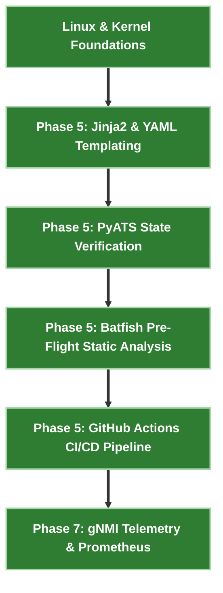

# 🤖 NetDevOps & Infrastructure Automation Engineer Track

> 🚀 **Infrastructure as Code (IaC)**: Treat network infrastructure as code using Jinja2/YAML data modeling, PyATS operational assertions, Batfish AST static pre-flight analysis, gNMI OpenConfig telemetry, and GitHub Actions CI/CD.

---

## 🎯 Target Roles & Target Companies
- **Target Roles**: NetDevOps Engineer, Network Automation Developer, Cloud Network Engineer, Infrastructure Automation Architect.
- **Target Employers**: Tech Enterprise Companies, Hyperscalers, Telecom Operators, and Automation Consultancies.

---

## 🧠 Core NetDevOps Toolchain & Technologies

| Automation Layer | Production Tool & Protocol | Engineering Function |
|---|---|---|
| **Data Modeling & Rendering** | **YAML / Jinja2 / Python** | Single-source-of-truth configuration templating |
| **CLI State Parsing** | **PyATS / Genie** | Automated operational state assertions post-change |
| **Pre-Flight Static Analysis** | **Batfish AST** | Simulating reachability & ACL policies offline |
| **Streaming Telemetry** | **gNMI / OpenConfig YANG / pygnmi** | Sub-second gRPC real-time metric collection |
| **CI/CD Pipelines** | **GitHub Actions / containerlab** | Automated gate checks on every `git push` |

---

## 🧪 Sequential Lab Roadmap



---

## 📁 Executable Local Lab Environment

```bash
# Clone repository & enter NetDevOps lab
git clone https://github.com/etherhtun/netforge-labs.git
cd netforge-labs/labs/netdevops-lab

# Run automated config generation and PyATS gate checks
./run.sh --all
```
