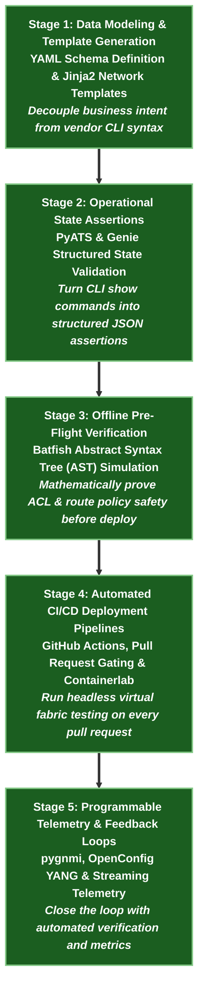

# 🤖 NetDevOps & Infrastructure Automation Learning Path

> 🚀 **Infrastructure as Code (IaC) Masterclass**: Treat network infrastructure as code using Jinja2/YAML data modeling, PyATS operational assertions, Batfish AST static pre-flight analysis, gNMI OpenConfig telemetry, and GitHub Actions CI/CD pipelines.

---

## 📊 Learning Path Overview

| Metric | Target Specification |
|---|---|
| **Estimated Completion Time** | **35 – 40 Hours** (Self-paced, hands-on lab driven) |
| **Milestone Stages** | **5 Progressive Stages** (Data Modeling $\rightarrow$ Automated Assertions $\rightarrow$ Offline Pre-Flight $\rightarrow$ CI/CD Automation $\rightarrow$ Telemetry) |
| **Lab Framework** | **Containerlab + Arista cEOS + Python 3** (Runs 100% locally on macOS OrbStack or Linux Docker) |
| **Target Roles** | NetDevOps Engineer, Network Automation Developer, Cloud Network Automation Architect, Site Reliability Engineer |
| **Target Employers** | Tech Enterprise Companies, Hyperscalers, Financial Tech (FinTech), Telecom Operators, and Automation Consultancies |

---

## 🧠 Core NetDevOps Toolchain & Technologies

| Automation Layer | Production Tool & Protocol | Engineering Function |
|---|---|---|
| **Data Modeling & Rendering** | **YAML / Jinja2 / Python** | Single-source-of-truth configuration templating decoupled from device syntax |
| **CLI State Parsing** | **Cisco PyATS / Genie** | Automated operational state assertions and differential snapshots post-change |
| **Pre-Flight Static Analysis** | **Batfish AST** | Simulating end-to-end reachability, ACL policies, and BGP convergence offline before hitting hardware |
| **Streaming Telemetry** | **gNMI / OpenConfig YANG / pygnmi** | Sub-second gRPC real-time programmatic metric streaming and push configuration |
| **CI/CD Pipelines** | **GitHub Actions / Containerlab** | Automated gate checks on every `git push` preventing syntax and routing regressions |

---

## 🗺️ 5-Stage Progressive Milestone Roadmap



---

## 🚀 Interactive Lesson Directory (Click Any Lesson to Start)

| Milestone Stage | Automation Layer | Clickable Lessons & Hands-on Labs | Runnable Lab | Action |
|---|---|---|---|---|
| **Stage 1**<br/>`Data Modeling` | YAML Single Source of Truth & Jinja2 Network Templates | • [Phase 5 · Lab 01: Jinja2 & YAML Data Modeling](../courses/05-netdevops/lab-01-jinja2-yaml.md) | `labs/netdevops-lab` | [Start Stage 1 →](../courses/05-netdevops/lab-01-jinja2-yaml.md) |
| **Stage 2**<br/>`State Assertions` | Cisco PyATS & Genie Structured Testbed Validation | • [Phase 5 · Lab 02: PyATS State Verification](../courses/05-netdevops/lab-02-pyats-verification.md) | `labs/netdevops-lab` | [Start Stage 2 →](../courses/05-netdevops/lab-02-pyats-verification.md) |
| **Stage 3**<br/>`Pre-Flight Verification` | Batfish Abstract Syntax Tree Reachability & ACL Simulation | • [Phase 5 · Lab 03: Batfish Simulation](../courses/05-netdevops/lab-03-batfish-simulation.md) | `labs/netdevops-lab` | [Start Stage 3 →](../courses/05-netdevops/lab-03-batfish-simulation.md) |
| **Stage 4**<br/>`CI/CD Pipelines` | GitHub Actions Workflows & Ephemeral Containerlab Testbeds | • [Phase 5 · Lab 05: GitHub Actions CI/CD](../courses/05-netdevops/lab-05-github-actions-cicd.md) | `labs/netdevops-lab` | [Start Stage 4 →](../courses/05-netdevops/lab-05-github-actions-cicd.md) |
| **Stage 5**<br/>`Programmable Telemetry` | pygnmi Python Library, OpenConfig YANG Schemas, gRPC | • [Phase 7 · Lab 01: gNMI Basics & OpenConfig](../courses/07-telemetry/lab-01-gnmi-openconfig.md)<br/>• [Phase 7 · Lab 02: pygnmi Python Client Integration](../courses/07-telemetry/lab-02-pygnmi-python.md) | `labs/telemetry-lab` | [Start Stage 5 →](../courses/07-telemetry/lab-01-gnmi-openconfig.md) |

---

## 🧪 Detailed Milestone Curricula

### 📍 Stage 1: Data Modeling & Template Generation
- **Core Focus**: Establishing a single source of truth (SSOT) using structured YAML files and rendering configuration using Jinja2 templates.
- **Key Concepts**: Variable scoping, loop constructs, conditional blocks, YAML validation schemas, and preventing syntax errors.
- **Interactive Labs**:
    - [Phase 5: Network Automation Overview](../courses/05-netdevops/index.md)
    - [Lab 01: Jinja2 & YAML Data Modeling](../courses/05-netdevops/lab-01-jinja2-yaml.md)
- **Local Runner**:
    ```bash
    cd labs/netdevops-lab
    ./run.sh --guided
    ```

### 📍 Stage 2: Operational State Assertions
- **Core Focus**: Transitioning from human eye inspection to machine-parsable state verification.
- **Key Concepts**: Cisco Genie CLI parsers, PyATS testbeds, structured JSON output extraction, routing table convergence validation, and BGP peer state checks.
- **Interactive Labs**:
    - [Phase 5: Lab 02 - PyATS State Verification](../courses/05-netdevops/lab-02-pyats-verification.md)
- **Local Runner**:
    ```bash
    cd labs/netdevops-lab
    ./run.sh --guided
    ```

### 📍 Stage 3: Offline Pre-Flight Verification with Batfish
- **Core Focus**: Verifying network changes *before* pushing them to production devices using symbolic execution and AST analysis.
- **Key Concepts**: Batfish snapshot ingestion, routing table simulation, ACL reachability testing, and detecting unintended blackholes offline.
- **Interactive Labs**:
    - [Phase 5: Lab 03 - Batfish Simulation](../courses/05-netdevops/lab-03-batfish-simulation.md)
- **Local Runner**:
    ```bash
    cd labs/netdevops-lab
    ./run.sh --guided
    ```

### 📍 Stage 4: Automated CI/CD Deployment Pipelines
- **Core Focus**: Integrating Containerlab and network testing into GitHub Actions CI/CD workflows.
- **Key Concepts**: Ephemeral containerized testbeds, automated linting, pre-merge gate checks, and automated rollback triggers.
- **Interactive Labs**:
    - [Phase 5: Lab 05 - GitHub Actions CI/CD](../courses/05-netdevops/lab-05-github-actions-cicd.md)
- **Local Runner**:
    ```bash
    cd labs/netdevops-lab
    ./run.sh --guided
    ```

### 📍 Stage 5: Programmable Telemetry & Feedback Loops
- **Core Focus**: Using Python client libraries (`pygnmi`) to interact with gRPC endpoints, subscribe to OpenConfig paths, and trigger automated remediations.
- **Key Concepts**: gNMI Get/Set/Subscribe RPCs, ProtoBuf encoding, OpenConfig interface models, and event-driven automation.
- **Interactive Labs**:
    - [Phase 7: Streaming Telemetry Overview](../courses/07-telemetry/index.md)
    - [Lab 01: gNMI Subscriptions & OpenConfig](../courses/07-telemetry/lab-01-gnmi-openconfig.md)
    - [Lab 02: pygnmi Python Client Integration](../courses/07-telemetry/lab-02-pygnmi-python.md)
- **Local Runner**:
    ```bash
    cd labs/telemetry-lab
    ./run.sh --guided
    ```

---

## 🛠️ Executable Local Lab Environment

NetForge Labs provides automated guided runners so you can practice NetDevOps pipelines locally without managing complex virtual machines.

```bash
# 1. Navigate to the NetDevOps lab
cd labs/netdevops-lab

# 2. Launch the guided interactive runner
./run.sh --guided

# Or test all pipeline stages end-to-end
./run.sh --all
```

---

## 🎓 Career Defense: Portfolio Projects

1. **Multi-Vendor Network Template Engine**:
   - Showcase a Jinja2/YAML engine that accepts high-level data models and renders validated Arista and Cisco configurations.
2. **Offline Pre-Flight Change Gating (Batfish)**:
   - Demonstrate a pipeline where proposed BGP route-map changes are simulated with Batfish, catching an intentional routing loop before it ever hits a device.
3. **Automated Ephemeral CI/CD Test Matrix**:
   - Present a GitHub Actions workflow that boots a 4-node Arista cEOS topology inside containerlab, executes PyATS test suites, and tears down the lab in under 90 seconds.
