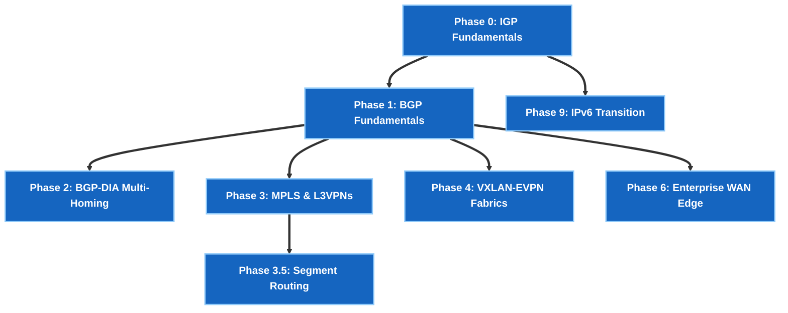

# 🌐 Network Infrastructure & Hyperscale Architect Track

> 🚀 **Core Networking Masterclass**: Master 5-Stage Clos Datacenter Fabrics, BGP 10-Step Path Selection, MPLS L3VPNs, Segment Routing Ti-LFA, VXLAN-EVPN ESI Multihoming, and IPv6 BGP Unnumbered.

---

## 🎯 Target Roles & Target Companies
- **Target Roles**: Network Engineer, Senior/Staff Network Infrastructure Engineer, Datacenter Architect, Core Backbone Engineer.
- **Target Employers**: Google, Meta, Apple, AWS, Microsoft, Service Providers, and Global Enterprises.

---

## 🧠 Core Engineering Domains & Protocols

| Domain | Key Technologies & RFC Protocols |
|---|---|
| **Underlay Routing** | OSPFv2/v3 Area 0 & IS-IS Wide Metrics (RFC 5305) |
| **BGP Control Plane** | eBGP (RFC 7938), iBGP Route Reflectors, 10-Step Path Selection |
| **Service Provider Backbones** | MPLS LDP, PHP (Label 3), MP-BGP VPNv4, Inter-AS Options A/B/C |
| **Segment Routing** | SR-MPLS, SRGB (`16000–23999`), Node SIDs, Sub-50ms Ti-LFA FRR |
| **Datacenter EVPN Fabrics** | VXLAN-EVPN, Symmetric IRB, ESI All-Active Multihoming, DCI |
| **IPv6 Transition** | IPv6 ND/SLAAC, BGP Unnumbered over IPv6 Link-Local (RFC 5549) |

---

## 🧪 Sequential Lab Roadmap



---

## 📁 Executable Local Lab Environment

```bash
# Clone repository & navigate to EVPN datacenter lab
git clone https://github.com/etherhtun/netforge-labs.git
cd netforge-labs/labs/evpn-lab

# Deploy & run all EVPN gate checks live on OrbStack cEOS nodes
./run.sh --all
```
