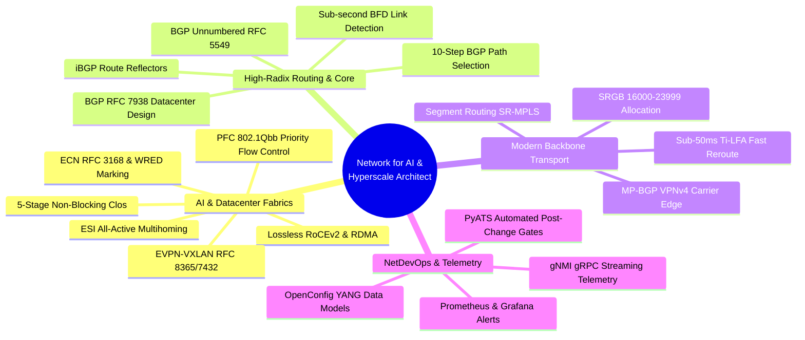

# 🌐 Network for AI & Hyperscale Infrastructure Architect Learning Path

> 🚀 **Elite Infrastructure Masterclass**: Design, build, and operate non-blocking AI training fabrics (RoCEv2, PFC, ECN), 5-stage BGP Clos fabrics (RFC 7938), Segment Routing Ti-LFA backbones, and EVPN-VXLAN ESI multihomed clusters on real Arista cEOS containers.

---

## 📊 Learning Path Overview

| Metric | Target Specification |
|---|---|
| **Estimated Completion Time** | **40 – 50 Hours** (Self-paced, hands-on lab driven) |
| **Milestone Stages** | **6 Progressive Stages** (Underlay $\rightarrow$ BGP Core $\rightarrow$ SR-MPLS $\rightarrow$ AI/EVPN Fabrics $\rightarrow$ Telemetry $\rightarrow$ Capstone) |
| **Lab Framework** | **Containerlab + Arista cEOS** (Runs 100% locally on macOS OrbStack or Linux Docker) |
| **Target Roles** | Architect - Network for AI, Hyperscale Infrastructure Architect, Principal Network Engineer, Core Backbone Architect |
| **Target Employers** | Hyperscalers (Google, Meta, AWS, Microsoft), AI Supercomputing Labs (NVIDIA, OpenAI, Anthropic), OEM Titans (HPE/Aruba, Arista, Cisco), and Tier-1 Service Providers |

---

## 🎯 Industry Alignment: The AI & Hyperscale Revolution

Modern AI training clusters (LLM pre-training, mixture-of-experts, distributed GPU compute) have fundamentally shifted networking requirements from traditional enterprise designs to **lossless, high-radix, ultra-low-latency fabrics**. 

This learning path directly mirrors the production competencies required by leading architecture positions (such as the *HPE Architect - Network for AI, Routing and Automation* and *Meta Production Network Architect* roles):



---

## 🗺️ 6-Stage Progressive Milestone Roadmap

```mermaid
graph TD
    S1["<b>Stage 1: Underlay Routing & High-Performance Fabrics</b><br/>OSPFv2/v3 Area 0 & IS-IS Wide Metrics (RFC 5305)<br/><i>Foundation for predictable latency & ECMP</i>"]
    S2["<b>Stage 2: Enterprise Edge & Hyperscale BGP-4 Core</b><br/>RFC 7938 eBGP Clos, Route Reflectors & 10-Step Path Selection<br/><i>Blast-radius containment across massive scale</i>"]
    S3["<b>Stage 3: Backbone Transport & Segment Routing</b><br/>MP-BGP VPNv4 & SR-MPLS Ti-LFA Sub-50ms Fast Reroute<br/><i>Next-gen traffic steering without LDP/RSVP-TE bloat</i>"]
    S4["<b>Stage 4: AI & Datacenter Fabrics (EVPN-VXLAN + Lossless)</b><br/>Symmetric IRB, ESI Multihoming, RoCEv2, PFC & ECN<br/><i>Ultra-Ethernet architectures for GPU-to-GPU clusters</i>"]
    S5["<b>Stage 5: NetDevOps & Real-Time Streaming Telemetry</b><br/>gNMI OpenConfig, Prometheus, Grafana & PyATS Validations<br/><i>Sub-second telemetry replacing legacy SNMP polling</i>"]
    S6["<b>Stage 6: Capstone System Design & Failure Triage</b><br/>5-Stage Clos Scaling Math, Buffer Overflows & Link Drop Drills<br/><i>Staff-level architecture defense & live troubleshooting</i>"]

    S1 ==> S2 ==> S3 ==> S4 ==> S5 ==> S6

    click S1 href "#stage-1-underlay-routing-high-performance-fabrics" "Jump to Stage 1 Lessons"
    click S2 href "#stage-2-enterprise-edge-hyperscale-bgp-4-core" "Jump to Stage 2 Lessons"
    click S3 href "#stage-3-backbone-transport-segment-routing-sr-mpls" "Jump to Stage 3 Lessons"
    click S4 href "#stage-4-ai-datacenter-fabrics-evpn-vxlan-lossless-ethernet" "Jump to Stage 4 Lessons"
    click S5 href "#stage-5-netdevops-real-time-streaming-telemetry" "Jump to Stage 5 Lessons"
    click S6 href "#stage-6-capstone-system-design-failure-triage-drills" "Jump to Stage 6 Lessons"

    classDef stage fill:#0d47a1,stroke:#64b5f6,color:#ffffff,stroke-width:2px,font-weight:bold;
    class S1,S2,S3,S4,S5,S6 stage;
```



---

## 🚀 Interactive Lesson Directory (Click Any Lesson to Start)

| Milestone Stage | Key Protocol Focus | Clickable Lessons & Hands-on Labs | Runnable Lab | Action |
|---|---|---|---|---|
| **Stage 1**<br/>`Underlay Routing` | OSPFv2/v3, IS-IS Wide Metrics, Point-to-Point Adjacencies, ECMP | • [01 · Link-State Routing Foundations](../courses/00-igp-fundamentals/01-link-state.md)<br/>• [02 · OSPF Multi-Area Core Architecture](../courses/00-igp-fundamentals/02-ospf.md)<br/>• [03 · IS-IS Backbone Engineering](../courses/00-igp-fundamentals/03-isis.md)<br/>• [05 · IGPs at Hyper-Scale](../courses/00-igp-fundamentals/05-at-scale.md) | `labs/igp-lab` | [Start Stage 1 →](../courses/00-igp-fundamentals/02-ospf.md) |
| **Stage 2**<br/>`BGP-4 Core & Edge` | RFC 7938 BGP Clos, 10-Step Decision, Route Reflectors, Multi-Homing | • [Lab 01 · eBGP, iBGP & next-hop-self](../courses/01-bgp/lab-01-ebgp-ibgp.md)<br/>• [Lab 02 · iBGP over IS-IS Underlay](../courses/01-bgp/lab-02-isis-underlay.md)<br/>• [Lab 03 · Scalable Route Reflectors](../courses/01-bgp/lab-03-route-reflectors.md)<br/>• [Lab 04 · Multihomed BGP Edge](../courses/01-bgp/lab-04-dual-homed-edge.md)<br/>• [DIA Lab 01 · Multi-Provider Transit](../courses/02-bgp-dia/lab-01-dia-multihoming.md) | `labs/bgp-lab` | [Start Stage 2 →](../courses/01-bgp/lab-01-ebgp-ibgp.md) |
| **Stage 3**<br/>`Backbone & SR-MPLS` | MP-BGP VPNv4, SRGB 16000–23999, Prefix SIDs, Sub-50ms Ti-LFA | • [MPLS Lab 01 · MPLS + LDP Underlay](../courses/03-mpls-l3vpn/lab-01-mpls-ldp.md)<br/>• [MPLS Lab 02 · Single-AS L3VPN & VRF](../courses/03-mpls-l3vpn/lab-02-l3vpn-option-a.md)<br/>• [SR Lab 01 · SR-MPLS Node & Prefix SIDs](../courses/035-segment-routing/lab-01-sr-mpls-sids.md)<br/>• [SR Lab 02 · Ti-LFA Sub-50ms FRR](../courses/035-segment-routing/lab-02-ti-lfa-frr.md)<br/>• [SR Lab 03 · BGP Color Traffic Steering](../courses/035-segment-routing/lab-03-sr-pce-te.md) | `labs/segment-routing-lab` | [Start Stage 3 →](../courses/035-segment-routing/lab-01-sr-mpls-sids.md) |
| **Stage 4**<br/>`AI & EVPN Fabrics` | Lossless RoCEv2, PFC 802.1Qbb, ECN, Symmetric IRB, ESI Multihoming | • [EVPN Lab 01 · Pure Layer-2 VNI](../courses/04-evpn/lab-01-pure-l2vni.md)<br/>• [EVPN Lab 02 · Symmetric IRB Routing](../courses/04-evpn/lab-02-symmetric-irb.md)<br/>• [EVPN Lab 03 · ESI All-Active Multihoming](../courses/04-evpn/lab-03-esi-multihoming.md)<br/>• [EVPN Lab 04 · EVPN-VPWS & E-LAN](../courses/04-evpn/lab-04-evpn-vpws-elan.md)<br/>• [EVPN Lab 05 · EVPN DCI Multi-Site](../courses/04-evpn/lab-05-evpn-dci-multisite.md) | `labs/evpn-datacenter-lab` | [Start Stage 4 →](../courses/04-evpn/lab-01-pure-l2vni.md) |
| **Stage 5**<br/>`NetDevOps & Telemetry` | gNMI Streaming Protobuf, OpenConfig YANG, Prometheus, PyATS Assertions | • [NetDevOps Lab 01 · Jinja2/YAML Modeling](../courses/05-netdevops/lab-01-jinja2-yaml.md)<br/>• [NetDevOps Lab 02 · PyATS Assertions](../courses/05-netdevops/lab-02-pyats-verification.md)<br/>• [Telemetry Lab 01 · gNMI & OpenConfig](../courses/07-telemetry/lab-01-gnmi-openconfig.md)<br/>• [Telemetry Lab 02 · pygnmi Python Streams](../courses/07-telemetry/lab-02-pygnmi-python.md)<br/>• [Telemetry Lab 04 · Real-Time Grafana](../courses/07-telemetry/lab-04-grafana-observability.md) | `labs/telemetry-lab` | [Start Stage 5 →](../courses/07-telemetry/lab-01-gnmi-openconfig.md) |
| **Stage 6**<br/>`Capstone System Design` | 5-Stage Clos Sizing, Buffer Exhaustion, CoPP Defense, BGP Unnumbered | • [System Design Masterclass & Scenario Drills](../interview-prep/google-system-design.md)<br/>• [Security Lab 01 · CoPP CPU Protection](../courses/08-security/lab-01-copp-cpu-protection.md)<br/>• [IPv6 Lab 02 · BGP Unnumbered (RFC 5549)](../courses/09-ipv6/lab-02-bgp-unnumbered-rfc5549.md) | `labs/security-lab` | [Start Stage 6 →](../interview-prep/google-system-design.md) |

---

## 🧪 Detailed Milestone Curricula & Verification Gates

### 📍 Stage 1: Underlay Routing & High-Performance Fabrics
- **Core Focus**: Deterministic equal-cost multi-pathing (ECMP), sub-second convergence, and carrier-grade link-state protocols.
- **Protocol Mechanics**: OSPFv2 LSA types 1/2/3/5, Point-to-Point network types (bypassing DR/BDR election latency), IS-IS Level-1/Level-2 hierarchy, and TLV-based wide metric extensions (RFC 5305).
- **Interactive Labs**:
    - [Phase 0: IGP Fundamentals Overview](../courses/00-igp-fundamentals/index.md)
    - [OSPFv2 Multi-Area Core](../courses/00-igp-fundamentals/02-ospf.md)
    - [IS-IS Backbone Engineering](../courses/00-igp-fundamentals/03-isis.md)
- **Local Runner**:
    ```bash
    cd labs/igp-lab
    ./run.sh --guided
    ```
- **Milestone Gate**: Full bidirectional reachability across all loopbacks with ECMP load balancing verified by automated tests.

---

### 📍 Stage 2: Enterprise Edge & Hyperscale BGP-4 Core
- **Core Focus**: Autonomous System boundaries, multi-homed transit edge, and massive-scale datacenter routing based on RFC 7938.
- **Protocol Mechanics**: 10-step BGP decision algorithm (Weight $\rightarrow$ Local Pref $\rightarrow$ AS-PATH $\rightarrow$ Origin $\rightarrow$ MED $\rightarrow$ eBGP over iBGP), iBGP full-mesh avoidance via Route Reflectors (`cluster-id`, `originator-id`), BGP communities for traffic engineering, and BGP Unnumbered over IPv6 Link-Local (RFC 5549).
- **Interactive Labs**:
    - [Phase 1: BGP Fundamentals & Policy Routing](../courses/01-bgp/index.md)
    - [Lab 01: eBGP Peering & Policy Enforcement](../courses/01-bgp/lab-01-ebgp-ibgp.md)
    - [Lab 02: IS-IS Underlay Core](../courses/01-bgp/lab-02-isis-underlay.md)
    - [Lab 03: Scalable iBGP Route Reflectors](../courses/01-bgp/lab-03-route-reflectors.md)
    - [Phase 2: BGP Dual-Homed Internet Access (DIA)](../courses/02-bgp-dia/index.md)
- **Local Runners**:
    ```bash
    cd labs/bgp-lab && ./run.sh --guided
    cd labs/bgp-dia-lab && ./run.sh --guided
    ```
- **Milestone Gate**: Route reflectors successfully reflect routes without routing loops; primary/backup egress traffic shifts deterministically during simulated provider transit failure.

---

### 📍 Stage 3: Backbone Transport & Segment Routing (SR-MPLS)
- **Core Focus**: Removing control plane state (eliminating LDP and RSVP-TE) using Source Routing, establishing multi-tenant VRF isolation, and guaranteeing sub-50ms failover.
- **Protocol Mechanics**: MPLS label stacks, Penultimate Hop Popping (PHP, Implicit Null label 3), MP-BGP VPNv4 with Route Distinguishers (RD) and Route Targets (RT), Segment Routing Global Block (SRGB `16000–23999`), Node SIDs, Adjacency SIDs, and Topology-Independent Loop-Free Alternate (Ti-LFA).
- **Interactive Labs**:
    - [Phase 3: MPLS L3VPN Backbones](../courses/03-mpls-l3vpn/index.md)
    - [Phase 3.5: Segment Routing (SR-MPLS) & Ti-LFA](../courses/035-segment-routing/index.md)
    - [SR Lab 01: SRGB & Node SID Transport](../courses/035-segment-routing/lab-01-sr-mpls-sids.md)
    - [SR Lab 02: Ti-LFA Sub-50ms Fast Reroute](../courses/035-segment-routing/lab-02-ti-lfa-frr.md)
    - [SR Lab 03: Color-Based SLA Traffic Steering](../courses/035-segment-routing/lab-03-sr-pce-te.md)
- **Local Runners**:
    ```bash
    cd labs/mpls-l3vpn-lab && ./run.sh --guided
    cd labs/segment-routing-lab && ./run.sh --guided
    ```
- **Milestone Gate**: Zero packet drop beyond 50ms during core link cutover; automated test verifies backup repair path pre-programmed in forwarding plane.

---

### 📍 Stage 4: AI & Datacenter Fabrics (EVPN-VXLAN + Lossless Ethernet)
- **Core Focus**: High-radix leaf-spine Clos fabrics, multi-tenant overlay routing, and lossless transport required for high-throughput AI GPU training (RoCEv2).
- **Protocol Mechanics**:
    - **EVPN-VXLAN**: Symmetric Integrated Routing & Bridging (IRB), Anycast Virtual Gateway, Ethernet Segment Identifier (ESI) Type-0/Type-1 All-Active Multihoming (eliminating proprietary MLAG/vPC), EVPN Route Types 2 (MAC/IP), 3 (Inclusive Multicast), 4 (Ethernet Segment), and 5 (IP Prefix).
    - **Lossless AI Transport**: Priority Flow Control (PFC, IEEE 802.1Qbb) to prevent packet drop on GPU ingress buffers; Explicit Congestion Notification (ECN, RFC 3168) with Random Early Detection (WRED) to signal bottleneck congestion before pause frames trigger PFC deadlocks.
- **Interactive Labs**:
    - [Phase 4: EVPN-VXLAN Datacenter Fabrics](../courses/04-evpn/index.md)
    - [EVPN Lab 01: Pure Layer-2 VNI Bridging](../courses/04-evpn/lab-01-pure-l2vni.md)
    - [EVPN Lab 02: Symmetric IRB Distributed Routing](../courses/04-evpn/lab-02-symmetric-irb.md)
    - [EVPN Lab 03: ESI All-Active Multihoming](../courses/04-evpn/lab-03-esi-multihoming.md)
    - [EVPN Lab 04: EVPN-VPWS & E-LAN Service](../courses/04-evpn/lab-04-evpn-vpws-elan.md)
    - [EVPN Lab 05: EVPN DCI Multi-Site](../courses/04-evpn/lab-05-evpn-dci-multisite.md)
- **Local Runner**:
    ```bash
    cd labs/evpn-datacenter-lab
    ./run.sh --guided
    ```
- **Milestone Gate**: Dual-homed servers actively hash traffic across independent leaf switches via ESI without loops; zero packet loss on simulated failovers.

---

### 📍 Stage 5: NetDevOps & Real-Time Streaming Telemetry
- **Core Focus**: Modernizing operations from human CLI typing and 5-minute SNMP polling to Infrastructure-as-Code and sub-second push telemetry.
- **Protocol Mechanics**: gNMI (gRPC Network Management Interface) streaming over HTTP/2 with Protocol Buffers; OpenConfig standardized YANG schemas; Prometheus time-series scraping; Grafana real-time telemetry dashboards; and Cisco PyATS/Genie automated state assertions.
- **Interactive Labs**:
    - [Phase 5: Network Automation & CI/CD](../courses/05-netdevops/index.md)
    - [Phase 7: Streaming Telemetry & Observability](../courses/07-telemetry/index.md)
    - [Telemetry Lab 01: gNMI Basics & OpenConfig](../courses/07-telemetry/lab-01-gnmi-openconfig.md)
    - [Telemetry Lab 02: pygnmi Python Integration](../courses/07-telemetry/lab-02-pygnmi-python.md)
    - [Telemetry Lab 03: Prometheus Metric Exporter](../courses/07-telemetry/lab-03-prometheus-time-series.md)
    - [Telemetry Lab 04: Real-Time Grafana Dashboards](../courses/07-telemetry/lab-04-grafana-observability.md)
- **Local Runners**:
    ```bash
    cd labs/netdevops-lab && ./run.sh --guided
    cd labs/telemetry-lab && ./run.sh --guided
    ```
- **Milestone Gate**: Micro-burst interface traffic spikes visible in Grafana within 250ms of generation; automated PyATS test suite validates network health pre- and post-deployment.

---

### 📍 Stage 6: Capstone System Design & Failure Triage Drills
- **Core Focus**: Synthesis, capacity planning, and high-pressure incident mitigation.
- **Topics**:
    - Calculating oversubscription ratios for a 16,384 GPU cluster using 64-port 800G switches (5-stage Clos scaling math).
    - Designing blast-radius containment boundaries using eBGP Private AS numbering schemes.
    - Diagnosing silent packet drops caused by PFC deadlock and microburst buffer exhaustion.
    - System design interview drills covering real trade-offs (e.g. RoCEv2 vs. InfiniBand vs. Ultra Ethernet Consortium).
- **Curriculum References**:
    - [Google & Hyperscale System Design Masterclass](../interview-prep/google-system-design.md)
    - [NetForge Master Curriculum Architecture Roadmap](../roadmap.md)

---

## 🛠️ Executable Local Lab Environment

NetForge Labs uses an automated step runner architecture. You never need to manually copy-paste hundreds of lines of syntax unless you choose to practice CLI typing.

```bash
# 1. Navigate to any lab directory
cd labs/evpn-datacenter-lab

# 2. Launch the guided interactive runner
./run.sh --guided

# Or deploy the complete verified topology in one command
./run.sh --all
```

Every runner provides:
1. **Config Previews**: Inspect exact Arista cEOS commands before execution.
2. **Manual Practice Guidance**: Exact syntax if you prefer manual configuration via `clab exec`.
3. **Automated Verifiers**: Instant health checks validating operational state tables, routes, and ping matrixes.

---

## 🎓 Career Defense: 3 Portfolio Projects You Can Present

Upon completing this learning path, you will possess concrete, reproducible projects you can demonstrate and defend in staff-level technical interviews:

1. **Non-Blocking 5-Stage Clos Datacenter Fabric**:
   - Defend your BGP ASN scheme (RFC 7938), BGP Unnumbered design, and ECMP hash symmetry.
   - Explain how your ESI All-Active multihoming design completely eliminated proprietary vendor lock-in (MLAG/vPC).

2. **Lossless RoCEv2 AI Transport Architecture**:
   - Walk interviewers through the exact buffer threshold configurations, headroom sizing math, and PFC/ECN tuning required to prevent packet loss under distributed model all-reduce operations.

3. **Autonomous Sub-Second Fast Reroute Backbone**:
   - Demonstrate how you migrated from legacy RSVP-TE to Segment Routing (SR-MPLS) with Ti-LFA, achieving deterministic sub-50ms failover without keeping per-flow state in the core.
