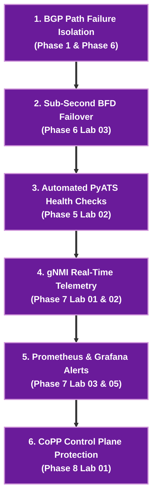

# 🤖 Site Reliability Engineer (SRE) — Network Track

> 🚀 **Production Reliability & Automated Operations**: Master production incident mitigation, sub-second BFD failover, gNMI real-time streaming telemetry, Prometheus anomaly detection, and automated PyATS health gate checks.

---

## 🎯 Target Roles & Target Companies
- **Target Roles**: Network SRE, Infrastructure SRE, Production Reliability Engineer, Production Operations Lead.
- **Target Employers**: Google, Meta, Apple, AWS, Microsoft, ByteDance, and High-Scale SaaS Platforms.

---

## 🧠 Core Network SRE Engineering Pillars

| SRE Pillar | Key Production Technologies | Engineering Objective |
|---|---|---|
| **Sub-Second Link Failover** | **BFD (Bidirectional Forwarding Detection)** | Sub-second link failure detection & hardware offload |
| **Real-Time Observability** | **gNMI / OpenConfig / Prometheus / Grafana** | High-cardinality time-series metric streaming & alerts |
| **Automated Testing** | **PyATS / Genie Assertions** | Automated pre-change and post-change gate checks |
| **Control Plane Resilience** | **CoPP (Control Plane Policing)** | Protecting switch routing engine CPUs under DDoS floods |
| **Error Budget & SLOs** | **SLO / SLA Budget Management** | Managing failure domains & blast radius containment |

---

## 🧪 Sequential Lab Roadmap



---

## 📁 Executable Local Lab Environment

```bash
# Clone repository & enter Telemetry & Observability lab
git clone https://github.com/etherhtun/netforge-labs.git
cd netforge-labs/labs/telemetry-lab

# Deploy gNMI streaming telemetry and Prometheus metrics
./run.sh --all
```
