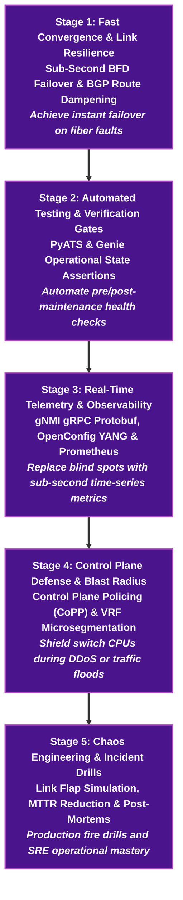

# 🤖 Network SRE & Observability Learning Path

> 🚀 **Production Reliability & Automated Operations**: Master production incident mitigation, sub-second BFD failover, gNMI real-time streaming telemetry, Prometheus anomaly detection, and automated PyATS health gate checks on real Arista cEOS fabrics.

---

## 📊 Learning Path Overview

| Metric | Target Specification |
|---|---|
| **Estimated Completion Time** | **30 – 35 Hours** (Hands-on lab driven, scenario-based) |
| **Milestone Stages** | **5 Progressive Stages** (Convergence $\rightarrow$ Automated Assertions $\rightarrow$ Telemetry $\rightarrow$ Control Plane Hardening $\rightarrow$ Incident Drills) |
| **Lab Framework** | **Containerlab + Arista cEOS** (Runs 100% locally on macOS OrbStack or Linux Docker) |
| **Target Roles** | Network SRE, Production Infrastructure Engineer, Network Observability Lead, Cloud Network SRE |
| **Target Employers** | Google, Meta, Apple, AWS, Microsoft, ByteDance, Netflix, Stripe, and High-Scale SaaS Platforms |

---

## 🧠 Core Network SRE Engineering Pillars

| SRE Pillar | Key Production Technologies | Engineering Objective |
|---|---|---|
| **Sub-Second Failover** | **BFD (Bidirectional Forwarding Detection)** | Detect optical/physical link drop in under 300ms without relying on slow IGP keepalives |
| **Push-Based Observability** | **gNMI / OpenConfig / Prometheus / Grafana** | Stream high-cardinality time-series metrics over gRPC HTTP/2 instead of legacy 5-min SNMP |
| **Automated Testing Gates** | **Cisco PyATS / Genie / Robot Framework** | Eliminate human error by running automated pre-change and post-change state assertions |
| **Control Plane Resilience** | **CoPP (Control Plane Policing) & Rate Limits** | Protect switch Supervisor engine / CPU from route table exhaustion and broadcast storms |
| **Error Budgets & SLOs** | **SLI/SLO Management & Blast Radius** | Define quantifiable availability targets (99.99%) and isolate failure domains |

---

## 🗺️ 5-Stage Progressive Milestone Roadmap



---

## 🧪 Detailed Milestone Curricula

### 📍 Stage 1: Fast Convergence & Link Resilience
- **Core Focus**: Eliminating downtime caused by silent link degradation or slow routing protocol keepalives.
- **Key Concepts**: BFD microsecond timers, hardware offload to ASICs, BGP route flap dampening, and graceful restart (RFC 4724).
- **Interactive Labs**:
    - [Phase 2: BGP Dual-Homed Internet Access](../courses/02-bgp-dia/index.md)
    - [Phase 6: Enterprise WAN Edge & BFD](../courses/06-hybrid-cloud/index.md)
- **Local Runner**:
    ```bash
    cd labs/wan-edge-lab
    ./run.sh --guided
    ```

### 📍 Stage 2: Automated Testing & Verification Gates
- **Core Focus**: Replacing manual CLI `show` commands with codified assertion suites that gate automated deployments.
- **Key Concepts**: PyATS testbeds, Genie parsers, comparing pre-change vs. post-change state diffs, and routing table integrity checks.
- **Interactive Labs**:
    - [Phase 5: Network Automation & CI/CD](../courses/05-netdevops/index.md)
    - [Lab 02: PyATS State Verification](../courses/05-netdevops/lab-02-pyats-verification.md)
- **Local Runner**:
    ```bash
    cd labs/netdevops-lab
    ./run.sh --guided
    ```

### 📍 Stage 3: Real-Time Telemetry & Observability
- **Core Focus**: Transitioning from passive, high-overhead SNMP polling to sub-second gRPC push streams.
- **Key Concepts**: gNMI Subscribe RPC (`STREAM`, `SAMPLE`, `ON_CHANGE`), OpenConfig interface and BGP schemas, Prometheus scraping, and Grafana dashboard visualization.
- **Interactive Labs**:
    - [Phase 7: Streaming Telemetry & Observability](../courses/07-telemetry/index.md)
    - [Telemetry Lab 01: gNMI Basics & OpenConfig](../courses/07-telemetry/lab-01-gnmi-openconfig.md)
    - [Telemetry Lab 02: pygnmi Python Integration](../courses/07-telemetry/lab-02-pygnmi-python.md)
    - [Telemetry Lab 03: Prometheus Metric Exporter](../courses/07-telemetry/lab-03-prometheus-time-series.md)
    - [Telemetry Lab 04: Real-Time Grafana Dashboards](../courses/07-telemetry/lab-04-grafana-observability.md)
- **Local Runner**:
    ```bash
    cd labs/telemetry-lab
    ./run.sh --guided
    ```

### 📍 Stage 4: Control Plane Defense & Blast Radius Isolation
- **Core Focus**: Ensuring that data plane traffic anomalies or malicious traffic cannot crash the device control plane.
- **Key Concepts**: CoPP MQC policies (classifying BGP, OSPF, SSH, ICMP), policing bandwidth limits, and hardware TCAM allocation.
- **Interactive Labs**:
    - [Phase 8: Network Security & Microsegmentation](../courses/08-security/index.md)
    - [Security Lab 01: Control Plane Policing (CoPP)](../courses/08-security/lab-01-copp-cpu-protection.md)
    - [Security Lab 02: VRF Microsegmentation](../courses/08-security/lab-02-vrf-route-leaking-acls.md)
- **Local Runner**:
    ```bash
    cd labs/security-lab
    ./run.sh --guided
    ```

### 📍 Stage 5: Chaos Engineering & Incident Drills
- **Core Focus**: Simulating real production outages to test monitoring alerts, automated failovers, and incident response playbooks.
- **Topics**: Injecting link degradation, simulating leaf switch reboots, analyzing BGP convergence delays, and writing blameless post-mortems.

---

## 🛠️ Executable Local Lab Environment

NetForge Labs uses automated step runners to let you immediately spin up and verify topologies locally.

```bash
# 1. Navigate to the Telemetry & Observability lab
cd labs/telemetry-lab

# 2. Launch the guided interactive runner
./run.sh --guided

# Or deploy the complete verified topology in one command
./run.sh --all
```

---

## 🎓 Career Defense: Portfolio Projects

1. **Sub-Second BFD Failover Fabric**:
   - Defend your design of BFD timers vs. CPU utilization trade-offs across 1,000+ peers.
2. **End-to-End gNMI Observability Pipeline**:
   - Demonstrate how you captured microsecond queue buffer congestion via gNMI that went completely undetected by SNMP.
3. **Automated CI/CD Maintenance Gate**:
   - Showcase a PyATS testbed that automatically aborts a router OS upgrade if packet drop occurs during traffic shift.
