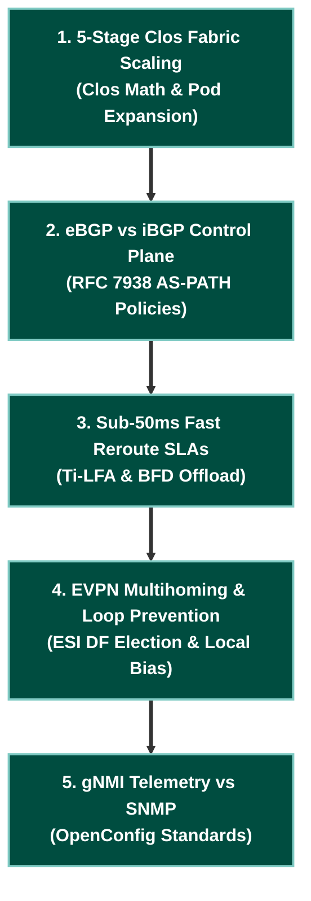

# 📋 Technical Program Manager (TPM) & System Design Track

> 🚀 **Hyperscale Architecture & Program Leadership**: Master 5-Stage Clos fabric scaling math, eBGP vs. iBGP trade-offs, blast radius containment, SLA / convergence budget calculations, and vendor RFPs.

---

## 🎯 Target Roles & Target Companies
- **Target Roles**: Technical Program Manager (TPM), Infrastructure Program Lead, Network Solutions Architect, Infrastructure Delivery Director.
- **Target Employers**: Google, Meta, Apple, AWS, Microsoft, Large Enterprise Financials, and Cloud Consultancies.

---

## 🧠 Core TPM Engineering & Leadership Pillars

| Program Domain | Key Architectural Decisions | Leadership & Program Function |
|---|---|---|
| **Fabric Scaling Math** | **5-Stage Clos vs 2-Tier Spine-Leaf** | ASIC port-density calculations & pod expansion planning |
| **Routing Protocol Selection** | **eBGP RFC 7938 vs iBGP + RRs** | Blast radius containment & BGP ASN allocation models |
| **Convergence SLAs** | **Sub-50ms Ti-LFA vs IGP Timers** | Establishing production availability & error budgets |
| **Telemetry vs Legacy** | **gNMI Streaming vs SNMP Polling** | Standardizing OpenConfig YANG schemas across vendors |

---

## 🧪 System Design & Architecture Roadmap

---

## 📁 System Design Drills & Reference

- **[Google & Hyperscale System Design Masterclass](../interview-prep/google-system-design.md)**: Scenario-based interview drills and architectural trade-offs.
- **[Curriculum Architecture Roadmap](../roadmap.md)**: Complete protocol dependency matrix across all 10 network phases.
