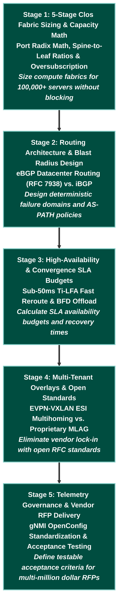

# 📋 Technical Program Manager (TPM) & System Design Learning Path

> 🚀 **Hyperscale Architecture & Technical Leadership**: Master 5-Stage Clos fabric scaling math, eBGP vs. iBGP architectural trade-offs, blast radius containment, SLA / convergence budget calculations, and multi-vendor RFP execution.

---

## 📊 Learning Path Overview

| Metric | Target Specification |
|---|---|
| **Estimated Completion Time** | **20 – 25 Hours** (Architectural analysis, system design drills, and case studies) |
| **Milestone Stages** | **5 Progressive Stages** (Clos Scaling Math $\rightarrow$ Routing Architecture $\rightarrow$ SLA & Convergence Budgets $\rightarrow$ Overlay Virtualization $\rightarrow$ Vendor RFPs & Telemetry) |
| **Target Roles** | Technical Program Manager (TPM) - Infrastructure, Network Solutions Architect, Infrastructure Program Lead, Engineering Director |
| **Target Employers** | Google, Meta, Apple, AWS, Microsoft, ByteDance, NVIDIA, Global Financial Institutions, and Cloud Infrastructure Consultancies |

---

## 🧠 Core TPM Engineering & Leadership Pillars

| Program Domain | Key Architectural Decisions | Leadership & Program Function |
|---|---|---|
| **Fabric Scaling Math** | **5-Stage Clos vs. 2-Tier Spine-Leaf** | ASIC port-density calculations, oversubscription ratios, and modular pod expansion planning |
| **Routing Protocol Selection** | **eBGP (RFC 7938) vs. iBGP + RRs** | Blast-radius containment, routing loop elimination, and global ASN allocation governance |
| **Convergence SLAs** | **Sub-50ms Ti-LFA vs. IGP Timers** | Establishing production availability budgets (99.999%), link failover SLAs, and error budgets |
| **Overlay Virtualization** | **EVPN-VXLAN ESI vs. Proprietary MLAG** | Decoupling physical underlay from tenant overlays and eliminating vendor hardware lock-in |
| **Telemetry Standardization** | **gNMI Streaming vs. SNMP Polling** | Standardizing multi-vendor OpenConfig schemas across Arista, Cisco, and whitebox switches |

---

## 🗺️ 5-Stage Progressive Milestone Roadmap

---

## 🧪 Detailed Milestone Curricula

### 📍 Stage 1: 5-Stage Clos Fabric Sizing & Capacity Math
- **Core Focus**: Translating business compute requirements into non-blocking or strictly-bounded oversubscribed network topologies.
- **Formulas & Trade-offs**:
    - Maximum leaves supported by $S$ spines: $N_{leaf} = S \times \text{uplinks per leaf}$.
    - Non-blocking server capacity given $k$-port switches: $N_{servers} = \frac{k^2}{2}$.
    - Calculating bandwidth oversubscription ratios ($1:1$, $2:1$, $3:1$) across Tier-1 (Leaf), Tier-2 (Spine), and Tier-3 (Super-Spine) layers.

### 📍 Stage 2: Routing Architecture & Blast Radius Design
- **Core Focus**: Selecting control plane protocols that prevent cascade failures across multi-pod datacenters.
- **Key Comparisons**:
    - **RFC 7938 eBGP**: Distinct ASN per tier/rack; AS-PATH automatically eliminates loops; routing policy applied at AS boundaries.
    - **iBGP + Route Reflectors**: Requires full IGP underlay; risk of route oscillations without careful cluster-id hierarchy.

### 📍 Stage 3: High-Availability & Convergence SLA Budgets
- **Core Focus**: Calculating downtime risk and defining strict architectural failover parameters for contractual SLAs.
- **Key Concepts**:
    - Sub-50ms Topology-Independent Loop-Free Alternate (Ti-LFA).
    - BFD timer aggregation vs. ASIC CPU load.
    - Establishing 99.99% ("four nines") vs. 99.999% ("five nines") quarterly error budgets.

### 📍 Stage 4: Multi-Tenant Overlays & Open Standards
- **Core Focus**: Avoiding vendor lock-in when evaluating multi-million dollar switch hardware procurement.
- **Key Concepts**:
    - Why proprietary multi-chassis link aggregation (Cisco vPC, Arista MLAG) creates fragile dual-control-plane bugs.
    - How RFC 8365/7432 EVPN-VXLAN with ESI (Ethernet Segment Identifier) provides multi-vendor, all-active multihoming.

### 📍 Stage 5: Telemetry Governance & Vendor RFP Delivery
- **Core Focus**: Writing technical specifications and automated validation gates for hardware RFPs and carrier acceptance.
- **Key Concepts**:
    - Mandating OpenConfig YANG schemas and gNMI streaming telemetry support in vendor contracts.
    - Requiring automated PyATS / Batfish pre-deployment gate checks before accepting network hardware delivery.

---

## 📁 System Design Drills & Reference

- **[Google & Hyperscale System Design Masterclass](../interview-prep/google-system-design.md)**: Scenario-based interview drills and architectural trade-offs.
- **[Curriculum Architecture Roadmap](../roadmap.md)**: Complete protocol dependency matrix across all 10 network phases.
- **[EVPN-VXLAN Clos Fabric Course](../courses/04-evpn/index.md)**: The underlying leaf-spine fabric implementation.
- **[Streaming Telemetry Course](../courses/07-telemetry/index.md)**: The gNMI/OpenConfig telemetry pipeline.

---

## 🎯 System Design Interview Drills for TPMs

### ❓ Question 1: How do you design a non-blocking fabric for 16,384 GPU servers using 64-port 800G switches?
**Answer:**
A 2-tier spine-leaf fabric using 64-port switches can connect at most $32 \times 32 = 1,024$ nodes non-blocking (each leaf has 32 downlinks to GPUs and 32 uplinks to spines). To scale to 16,384 GPUs, a **3-tier (5-stage Clos) architecture** is required:
1. **Tier-1 (Leaf / ToR)**: 512 leaf switches, each with 32 downlinks to GPUs (total 16,384 GPUs) and 32 uplinks to Tier-2 spines.
2. **Tier-2 (Spine / Fabric)**: Grouped into Pods. Each pod contains leaves connected to 32 spines.
3. **Tier-3 (Super-Spine / Core)**: Aggregates inter-pod traffic across the entire cluster, maintaining 1:1 non-blocking bisectional bandwidth.

### ❓ Question 2: Why do hyperscalers prefer eBGP (RFC 7938) over IGP+iBGP for datacenter fabric control planes?
**Answer:**
1. **Loop Prevention**: BGP uses `AS-PATH` as a built-in loop prevention mechanism. If an update circles back to an AS, it is instantly discarded without complex graph computations.
2. **Blast Radius Containment**: Route flapping in one rack or pod can be damped and filtered at AS boundaries, preventing full-fabric SPF recalculation storms that occur in link-state IGPs (OSPF/IS-IS).
3. **Multi-Vendor Uniformity**: BGP is universally supported with identical operational semantics across Arista, Cisco, Juniper, and whitebox SONiC platforms.
